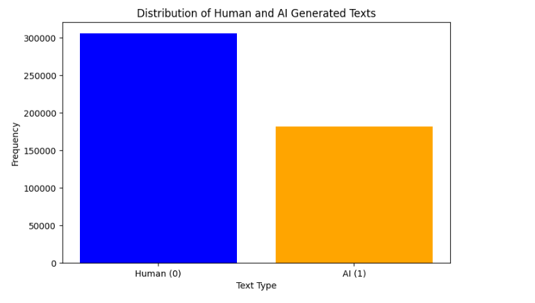
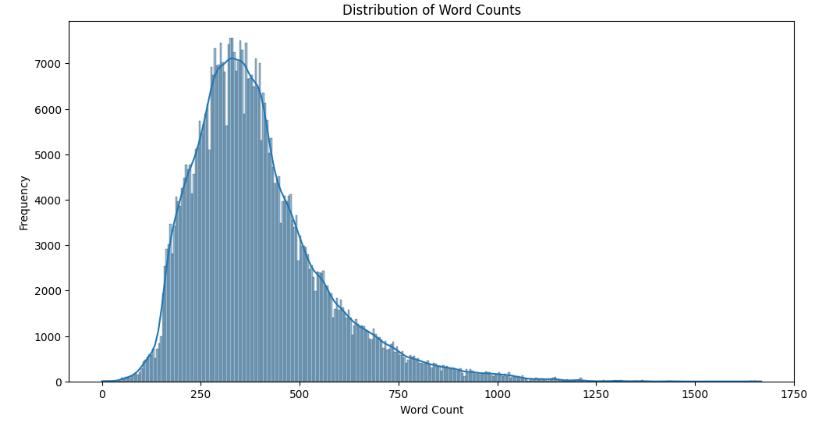
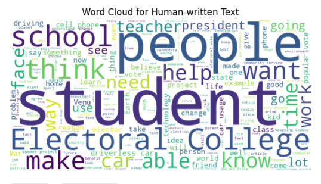
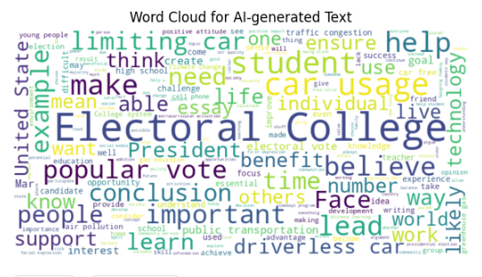
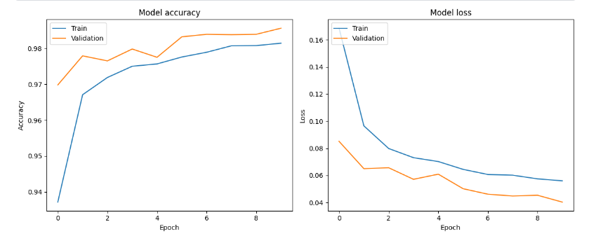
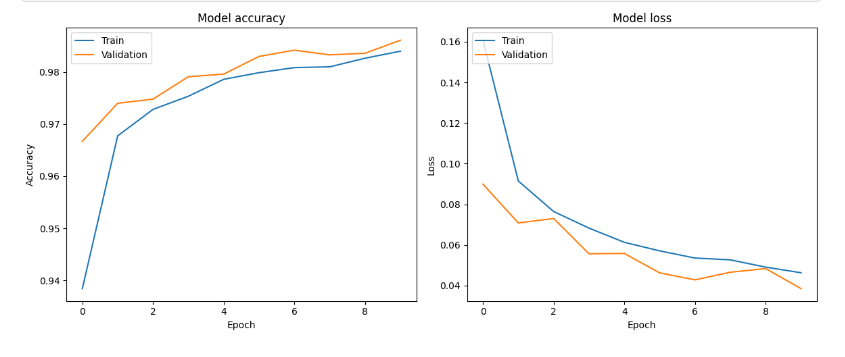

# AI vs Human Text Classification

**GOAL**

The aim of this project is to classify text into two categories: AI-generated or human-written. 

**DATASET**

[AI vs Human Text Dataset](https://www.kaggle.com/datasets/shanegerami/ai-vs-human-text)

**DESCRIPTION**

The dataset consists of text samples labeled as either AI-generated or human-written. It includes a balanced collection of text data representing both classes.

**WHAT I DID**

I conducted extensive data preprocessing tasks, including text cleaning and tokenization. Word2Vec was used for feature extraction from the text data. Subsequently, I split the dataset into training and testing sets and constructed both Artificial Neural Network (ANN) and Long Short-Term Memory (LSTM) models for classification.

**MODELS USED**

The models developed are:

1. Artificial Neural Network (ANN)
2. Long Short-Term Memory (LSTM)

**LIBRARIES NEEDED**

- pandas
- numpy
- matplotlib
- re
- nltk
- gensim
- keras

**Exploratory Data Analysis (EDA)**

### Distribution of Human & AI Generated Text

### Distribution of Text Lengths

### Distribution of Word Counts

### Word Cloud for Human-Written text

### Word Cloud for AI-Generated text

### Overall Data Description

### Conclusions from EDA

#### Text Length
- **Mean:** Average text length is approximately 2270 characters.
- **Range:** Text lengths vary widely, from 1 to 18,322 characters.

#### Word Count
- **Mean:** Average word count is 393 words.
- **Range:** Word counts range from 0 to 1668 words.

#### Average Word Length
- **Mean:** Average word length is about 4.76 characters.
- **Range:** Ranges from 1 to 126 characters, though extreme values likely indicate anomalies.

#### Punctuation Count
- **Mean:** Average punctuation count per text is 48.
- **Range:** Punctuation counts range from 0 to 388.

#### Lexical Diversity
- **Mean:** Average lexical diversity is 0.51.
- **Range:** Ranges from 0 (no unique words) to 1 (all words are unique).

**Model Performances**

### Model 1 (ANN Model) Performance Graphs

### Model 2 (LSTM MODEL) Performance Graphs

**CONCLUSION**

Both ANN and LSTM models were successfully built and trained to classify text as AI-generated or human-written. The LSTM model exhibited slightly better performance with an accuracy of around 87% on the test dataset. No transfer learning techniques were employed as satisfactory results were achieved using standard deep learning architectures.

**Connect with Me**

- [LinkedIn](https://www.linkedin.com/in/barrenkala-veera-venkata-karthik-b58b9a285/)
- [GitHub](https://github.com/Karthik110505)
