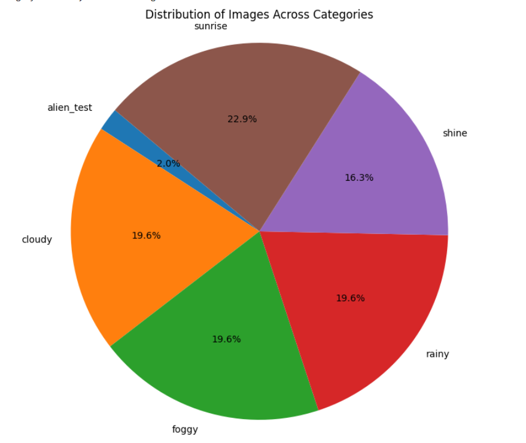
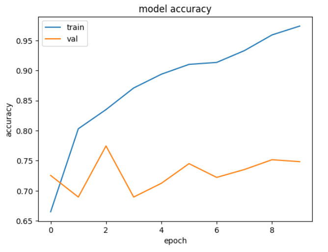
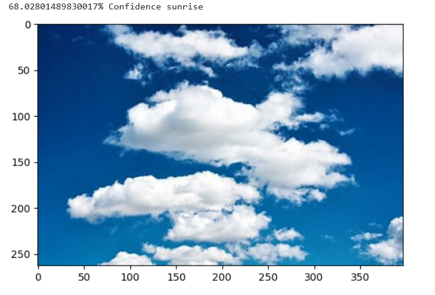

---

# Adverse Weather Classification

## 🎯 Goal

The primary objective of this project is to perform image classification to predict category of weather condition as well as leveraging pre-trained models such as VGG19, ResNet50, and Mobilenet. These models are trained to categorize images into classes, offering a versatile solution for various image processing tasks.

## 🖼️ Dataset

The dataset used for this project comprises images scattered across different conditions.

(https://www.kaggle.com/datasets/vijaygiitk/multiclass-weather-dataset/data)

## 🧾 Description

This project utilizes a VGG19, ResNet50, Custom CNN and Mobilenet for image classification. The chosen model are tailored to capture specific features of the dataset and models leverage transfer learning, enhancing the model's ability to generalize across diverse images.

## 🧮 What I Had Done

1. **Data Preprocessing**:
   - Resizing images to match the input size of the models (e.g.,180*180 pixels).
   - Normalization of pixel values to the range [0, 1].
   - Refering to dataset to find different paramters

2. **Model Architectures**:
   - VGG19: Leveraging the pre-trained VGG19 architecture.
   - ResNet50: Utilizing the pre-trained ResNet50 architecture.
   - MobileNetV2: Leveraging the powerful mobilenet model.

3. **Model Training**:
   - Training the models over the image dataset across 5 different classes
   - Evaluating the models on the validation set to monitor performance.

4. **Save Models**:
   Saving the trained models for future use and predictions.

## 📚 Libraries Needed

1. TensorFlow
2. Matplotlib
3. Numpy
4. Scikit-learn 

## 📊 Visualization Results

### Images Pie plot

### Accuracy Graph

### Sample Prediction using ResNet50

## 📈 Model Performance based on Accuracy Scores

| Model           | Accuracy |
|-----------------|----------|
| MobilenetV2     | 74       |
| ResNet50        | 90       |
| Custom CNN      | 76       |
| VGG19           | 87.25    |

## 📢 Conclusion And Result

The image classification project using different models demonstrates effective learning and categorization across 5 classes. The models achieve promising accuracy on both training and validation sets, showcasing their potential for various image processing applications. Our ResNet50 scored the highest with 90% accuracy, while MobileNet scored the lowest with 74%.
This project will aid others to use this this technology to classifiy weather conditions even in adverse times so as to prevent accidents.

##✒️Your Signature  
  Keshav Arora

--- 
