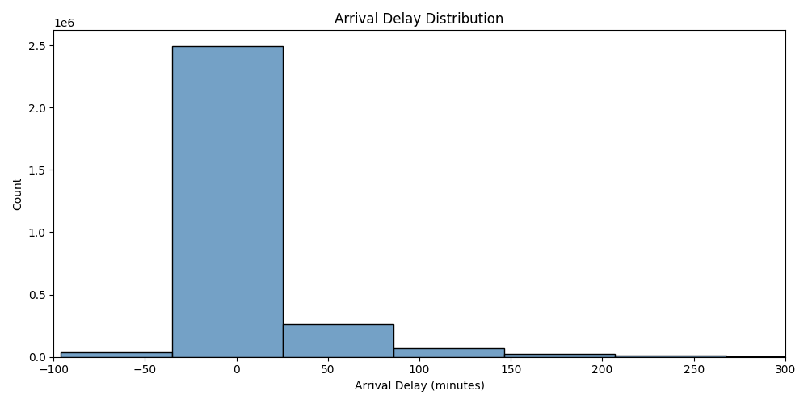
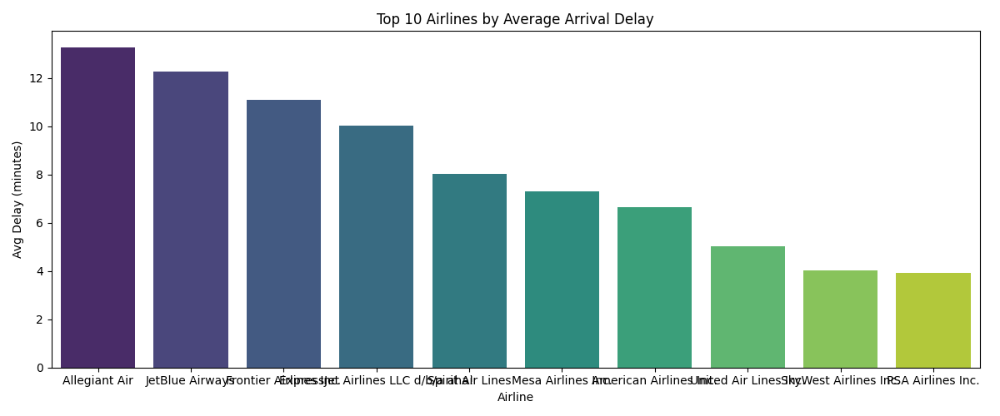
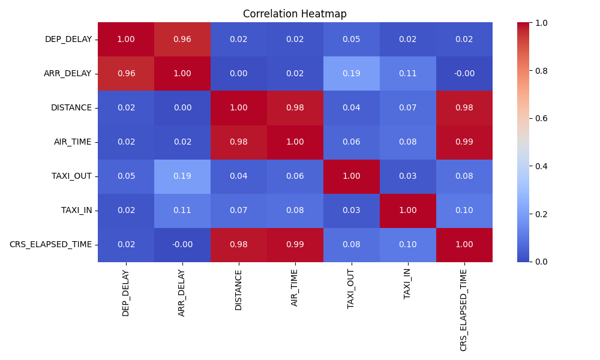
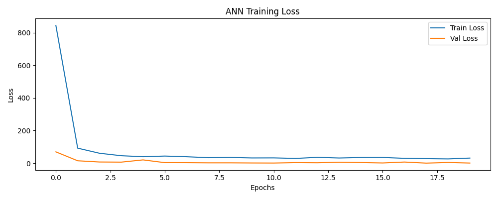
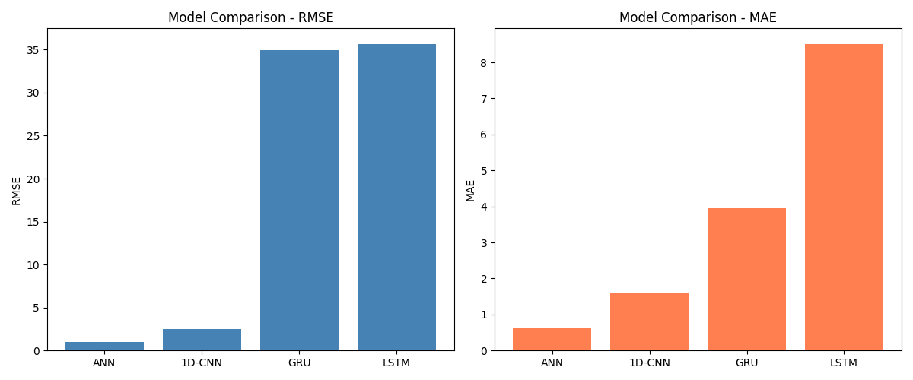

# Airlines Delay Prediction using Deep Learning
## 🎯 Goal
The goal of this project is to predict flight arrival delays using deep learning models trained on historical flight data from 2019-2023.

## 🧵 Dataset
Dataset: Flight Delay and Cancellation Dataset (2019-2023)  
Source: https://www.kaggle.com/datasets/patrickzel/flight-delay-and-cancellation-dataset-2019-2023

## 🧾 Description
This project implements and compares four deep learning models — ANN, LSTM, GRU, and 1D-CNN — to predict airline arrival delays based on features like departure delay, distance, air time, taxi time, and day of week.

## 🧮 What I had done!
1. Loaded and explored the dataset (3M rows, 32 columns)
2. Performed EDA — delay distributions, airline comparisons, day-of-week analysis, correlation heatmap
3. Preprocessed data — handled missing values, encoded categorical features, applied StandardScaler
4. Trained and evaluated 4 deep learning models
5. Compared all models using RMSE and MAE metrics

## 🚀 Models Implemented
- Artificial Neural Network (ANN)
- Long Short-Term Memory (LSTM)
- Gated Recurrent Unit (GRU)
- 1D Convolutional Neural Network (1D-CNN)

## 📚 Libraries Needed
- pandas
- numpy
- matplotlib
- seaborn
- scikit-learn
- tensorflow
- keras

## 📊 Exploratory Data Analysis Results
- Most flights have arrival delays between -50 and +150 minutes
- Allegiant Air has the highest average arrival delay (~13 mins)
- Delay patterns are fairly consistent across days of the week
- DEP_DELAY and ARR_DELAY have very high correlation (0.96)

## 📈 Performance of the Models

| Model  | RMSE  | MAE  |
|--------|-------|------|
| ANN    | 1.01  | 0.61 |
| 1D-CNN | 2.51  | 1.58 |
| GRU    | 34.94 | 3.94 |
| LSTM   | 35.69 | 8.52 |

## 📉 EDA Visualizations

### Arrival Delay Distribution

### Top 10 Airlines by Average Delay

### Correlation Heatmap

### ANN Training Loss

### Model Comparison

## Conclusion
ANN achieved the best performance with RMSE of 1.01 and MAE of 0.61, making it the most suitable model for Airlines Delay Prediction on tabular flight data. LSTM and GRU underperformed as this dataset lacks true sequential temporal patterns that these models are designed for. 1D-CNN performed as a solid second choice.

## Author
Rudrani Mukherjee  
GitHub: https://github.com/Rudrani-Mukherjee  
GSSoC 2026 Contributor