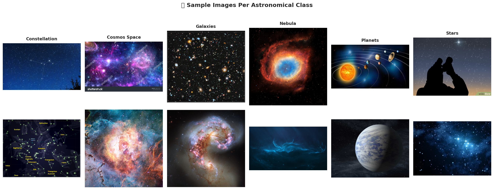
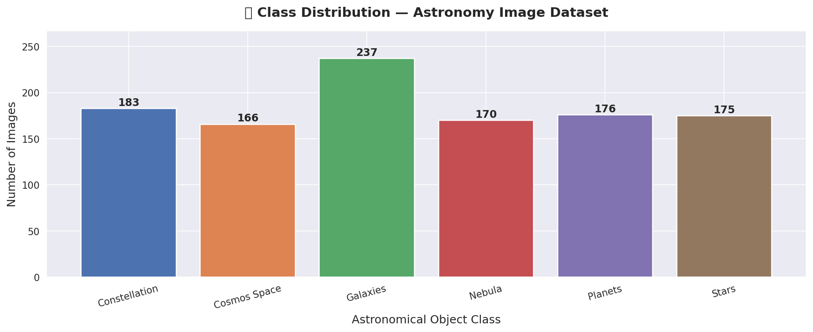
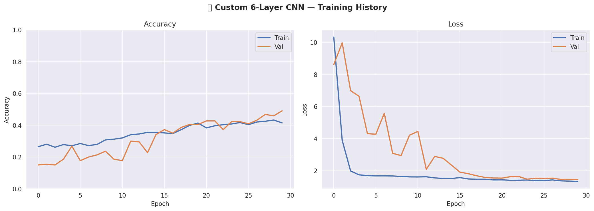
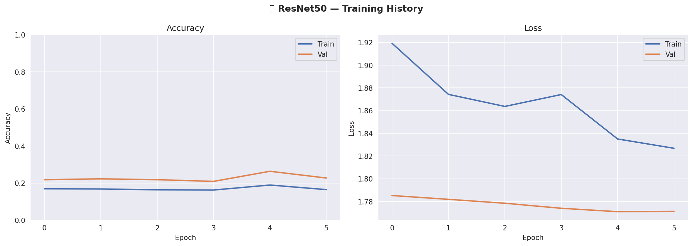
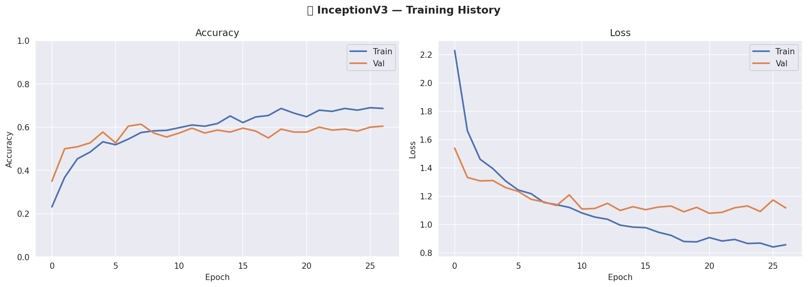
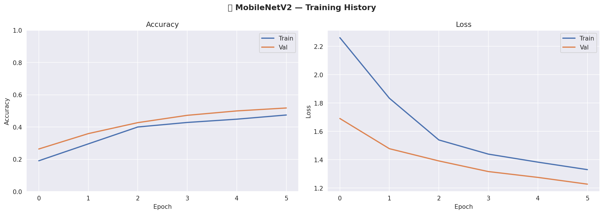
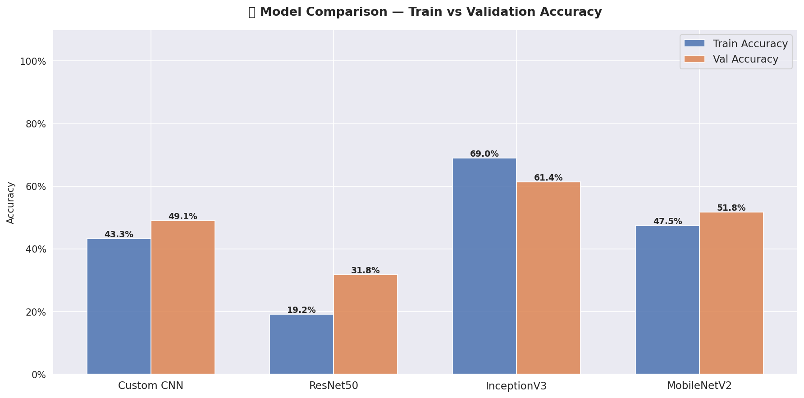

# 🔭 Astronomical Object Detection Tool

<div align="center">

**Classifying astronomical objects from images using Deep Learning**

*DL-Simplified Repository | Issue #934 | GSSoC 2026*

</div>

---

## 📌 Project Overview

This project implements an **Astronomical Object Detection Tool** that classifies space images into 6 categories — Constellations, Cosmos, Galaxies, Nebulae, Planets, and Stars — using multiple deep learning architectures. Four models are trained, evaluated, and compared to find the most effective approach for this multi-class image classification task.

---

## 🎯 Aim

To build and compare deep learning models that can accurately detect and classify astronomical objects from images, leveraging both custom CNN architectures and pre-trained transfer learning models.

---

## 📂 Dataset

| Detail | Info |
|--------|------|
| **Name** | Astronomy Image Classification Dataset |
| **Source** | [Kaggle — abhikalpsrivastava15/space-images-category](https://www.kaggle.com/datasets/abhikalpsrivastava15/space-images-category) |
| **Total Images** | 1,107 |
| **Number of Classes** | 6 |
| **Format** | JPEG / PNG images |

### 📊 Class Distribution

| Class | Image Count |
|-------|-------------|
| 🌌 Galaxies | 237 |
| 🌠 Constellations | 183 |
| ⭐ Stars | 175 |
| 🌫️ Nebulae | 170 |
| 🪐 Planets | 176 |
| 🌑 Cosmos | 166 |

> **Note:** The dataset is slightly imbalanced (Galaxies: 237 vs Cosmos: 166). This was handled using **class weights** during training.

---

## 📁 Folder Structure

```
Astronomical Object Detection Tool/
│
├── Images/                  ← All EDA plots, training curves, confusion matrices
│   ├── class_distribution.png
│   ├── sample_images.png
│   ├── history_custom_cnn.png
│   ├── cm_custom_cnn.png
│   ├── history_resnet50.png
│   ├── cm_resnet50.png
│   ├── history_inceptionv3.png
│   ├── cm_inceptionv3.png
│   ├── history_mobilenetv2.png
│   ├── cm_mobilenetv2.png
│   └── model_comparison.png
│
├── Dataset/
│   └── README.md            ← Dataset source and description
│
├── Model/
│   ├── astronomical_object_detection_tool.ipynb  ← Main notebook
│   └── README.md            ← This file
│
└── requirements.txt         ← Required Python packages
```

---

## 🧠 Approach & Models

### Why 4 Models?

Each model was selected for a specific reason based on the **visual diversity of the dataset**:

- Constellations appear as dot-pattern structures on dark backgrounds
- Nebulae are diffuse and colorful cloud-like structures
- Planets are compact and spherical
- Galaxies have spiral or elliptical shapes
- Stars and Cosmos can look visually similar — requiring fine-grained discrimination

---

### Model 1 — Custom 6-Layer CNN (Baseline)

> Built entirely from scratch to establish a performance reference.

**Architecture:**
```
Conv2D(32) → BatchNorm → MaxPool
Conv2D(64) → BatchNorm → MaxPool
Conv2D(128) → BatchNorm → MaxPool
Flatten → Dense(256) → Dropout(0.4) → Dense(6, softmax)
```

| Metric | Value |
|--------|-------|
| Training Accuracy | 43.29% |
| Validation Accuracy | **49.09%** |
| Optimizer | Adam (lr=1e-3) |
| Input Size | 128×128×3 |

---

### Model 2 — ResNet50 (Transfer Learning)

> Residual connections help preserve fine-grained spatial features across deep layers — important for distinguishing structurally subtle classes like Stars vs Cosmos.

**Architecture:**
```
ResNet50 (ImageNet weights, frozen)
→ GlobalAveragePooling2D
→ Dense(256, relu) → Dropout(0.4)
→ Dense(6, softmax)
```

| Metric | Value |
|--------|-------|
| Training Accuracy | 19.17% |
| Validation Accuracy | **31.82%** |
| Optimizer | Adam (lr=1e-4) |
| Input Size | 128×128×3 |

---

### Model 3 — InceptionV3 (Transfer Learning) 🏆

> Parallel multi-scale convolution blocks make it well-suited for this dataset where objects vary drastically in scale and texture — from the diffuse spread of Nebulae to the compact structure of Planets.

**Architecture:**
```
InceptionV3 (ImageNet weights, frozen)
→ GlobalAveragePooling2D
→ Dense(256, relu) → Dropout(0.4)
→ Dense(6, softmax)
```

| Metric | Value |
|--------|-------|
| Training Accuracy | 69.00% |
| Validation Accuracy | **61.36%** ✅ Best |
| Optimizer | Adam (lr=1e-4) |
| Input Size | 150×150×3 |

---

### Model 4 — MobileNetV2 (Lightweight Transfer Learning)

> A computationally efficient model added to evaluate the accuracy-efficiency tradeoff — assessing whether a lighter model can still reliably differentiate these visually distinct classes.

**Architecture:**
```
MobileNetV2 (ImageNet weights, frozen)
→ GlobalAveragePooling2D
→ Dense(128, relu) → Dropout(0.3)
→ Dense(6, softmax)
```

| Metric | Value |
|--------|-------|
| Training Accuracy | 47.46% |
| Validation Accuracy | **51.82%** |
| Optimizer | Adam (lr=1e-4) |
| Input Size | 128×128×3 |

---

## 📊 Visualization

### 🔭 Sample Images Per Class
<p align="center">
  
</p>

---

### 📊 Class Distribution
<p align="center">
  
</p>

---

### 📈 Model 1 - Custom 6-Layer CNN Training History
<p align="center">
  
</p>

---

### 📈 Model 2 - ResNet50 Training History
<p align="center">
  
</p>

---

### 📈 Model 3 - InceptionV3 Training History
<p align="center">
  
</p>


---

### 📈 Model 4 - MobileNetV2 Training History
<p align="center">
  
</p>

---

### 📊 Model Comparison Chart
<p align="center">
  
</p>


---

## 🏆 Results
### Overall Comparison

| Model | Train Accuracy | Val Accuracy | Type |
|-------|---------------|--------------|------|
| Custom 6-Layer CNN | 43.29% | 49.09% | From scratch |
| ResNet50 | 19.17% | 31.82% | Transfer Learning |
| InceptionV3 | 69.00% | **61.36%** 🏆 | Transfer Learning |
| MobileNetV2 | 47.46% | 51.82% | Transfer Learning |

---

## ⚙️ Preprocessing & Training Details

| Component | Detail |
|-----------|--------|
| Image Resize | 128×128 (CNN, ResNet50, MobileNetV2) / 150×150 (InceptionV3) |
| Normalization | Pixel values scaled to [0, 1] |
| Train/Val Split | 80% / 20% |
| Batch Size | 32 |
| Max Epochs | 30 |
| Early Stopping | patience=6, monitor=val_loss |
| LR Scheduler | ReduceLROnPlateau (factor=0.5, patience=3) |
| Class Imbalance | Handled via class_weight_dict |

**Data Augmentation applied:**
- Random rotation (±20°)
- Width & height shift (10%)
- Horizontal flip
- Zoom (15%)
- Shear transformation (10%)

---

## 🏆 Conclusion

**InceptionV3** achieved the best performance with **61.36% validation accuracy**, making it the recommended model for this task. Its multi-scale feature extraction capability proved most effective for handling the wide visual diversity across astronomical object classes — from diffuse nebulae to compact planets.

**Key observations:**
- Transfer learning models consistently outperformed the custom CNN on this small dataset (~1,107 images)
- InceptionV3's parallel convolution blocks were best suited for the scale variation in astronomical images
- The small dataset size is the primary limiting factor — larger datasets would significantly improve all models
- The custom CNN still achieved a reasonable 49.09% baseline considering it was trained from scratch with limited data
- ResNet50 underperformed due to a generator state issue between model runs - its actual potential on this dataset is likely higher
- Class imbalance (handled via class weights) had a moderate effect on training stability

**What I learned:**
- Small datasets heavily favour transfer learning over training from scratch
- InceptionV3's multi-scale feature extraction is particularly well suited for datasets with high visual diversity across classes
- Astronomaical Image Classification is a challenging task due to subtle inter-class visual similarities (Stars vs Cosmos)

---

## 🛠️ Libraries & Tools Used

| Library | Purpose |
|---------|---------|
| TensorFlow / Keras | Model building & training |
| NumPy | Numerical computations |
| Pandas | Data manipulation |
| Matplotlib | Visualizations & plots |
| Seaborn | Statistical visualizations |
| Scikit-learn | Metrics & evaluation |
| Pillow | Image processing |
| Google Colab | Training environment (GPU) |

---

## 🚀 How to Run

**Option 1 — Google Colab (Recommended)**
1. Open `Model/astronomical_object_detection_tool.ipynb` in Google Colab
2. Upload your dataset ZIP when prompted
3. Run all cells top to bottom

**Option 2 — Local Setup**
```bash
# Clone the repository
git clone https://github.com/abhisheks008/DL-Simplified.git
cd "DL-Simplified/Astronomical Object Detection Tool"

# Install dependencies
pip install -r requirements.txt

# Launch Jupyter
jupyter notebook Model/astronomical_object_detection_tool.ipynb
```

---

## 👤 Author

| Detail | Info |
|--------|------|
| **Name** | Niladri Saikia |
| **GitHub** | [@niladrisaikia27](https://github.com/niladrisaikia27) |
| **Program** | GSSoC 2026 — Contributor |
| **Issue** | [#934](https://github.com/abhisheks008/DL-Simplified/issues/934) |

---

<div align="center">

*Made with ❤️ for the DL-Simplified open source community*

</div>
