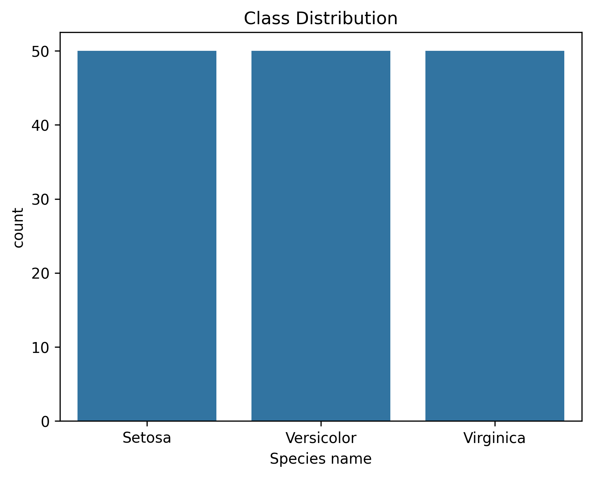
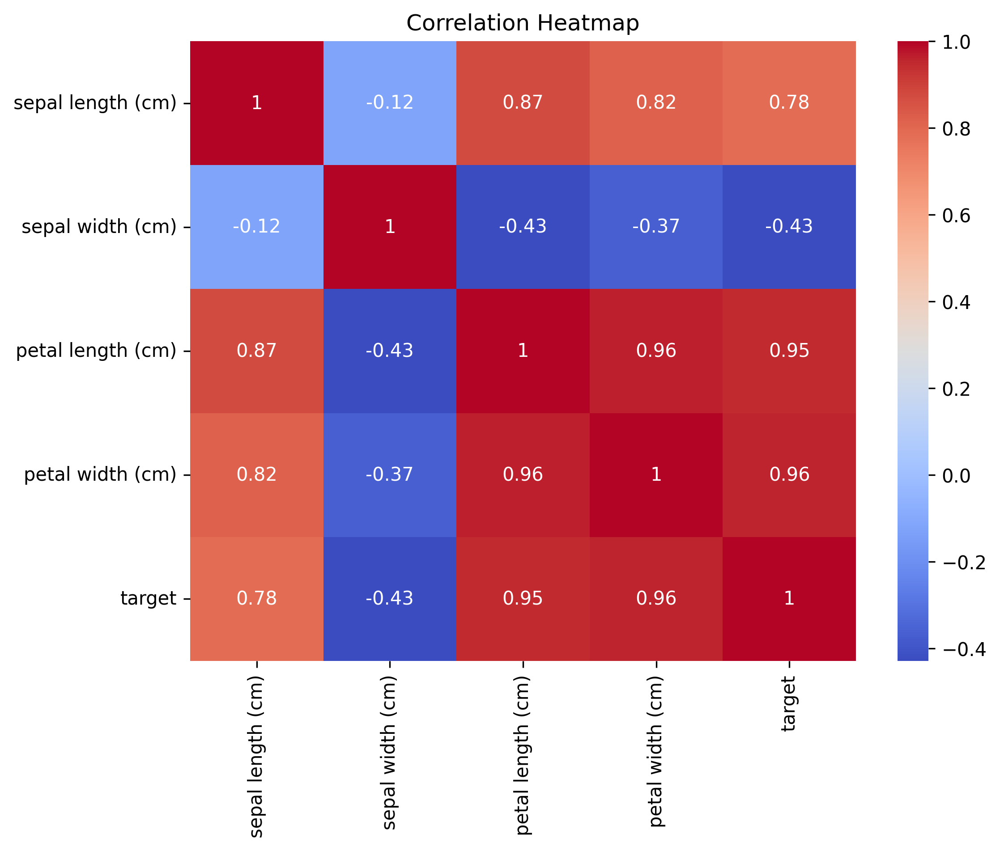
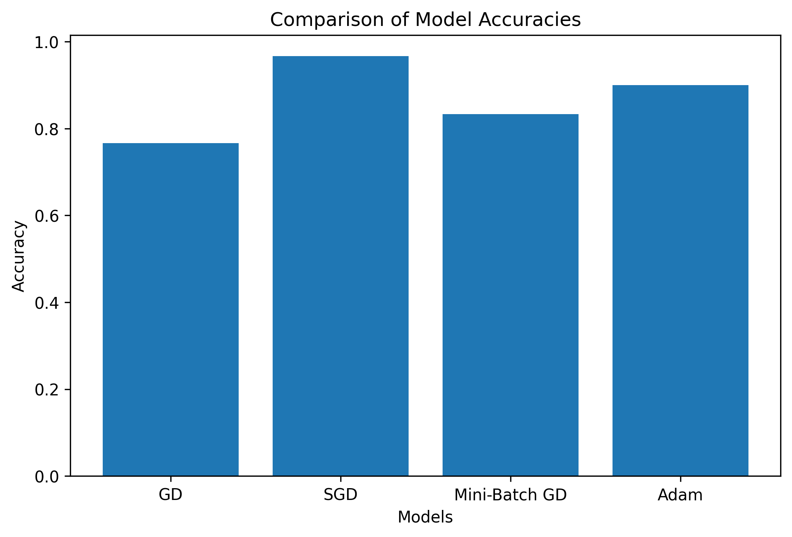
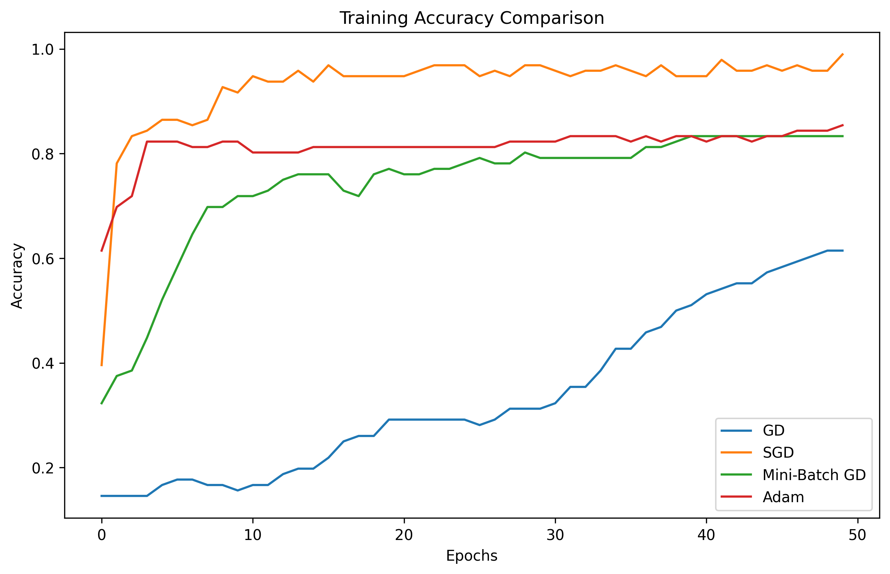
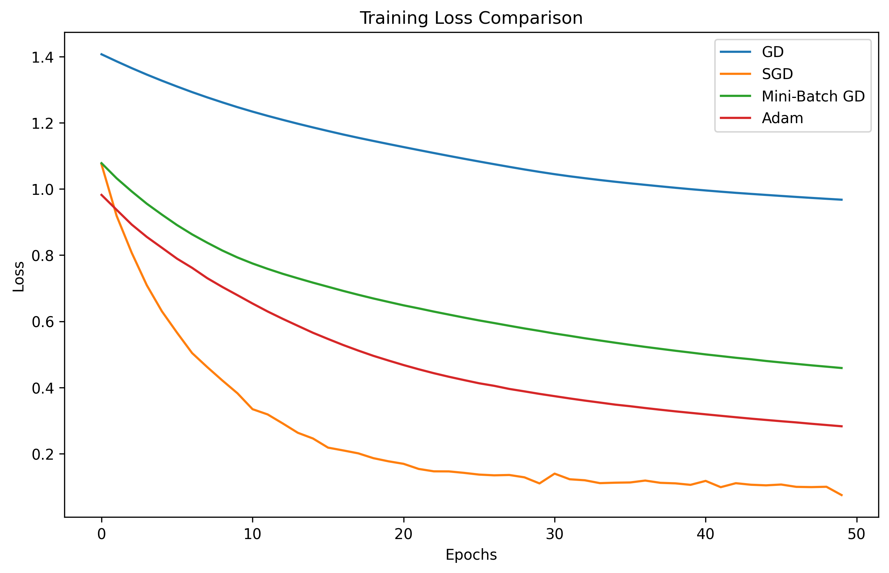
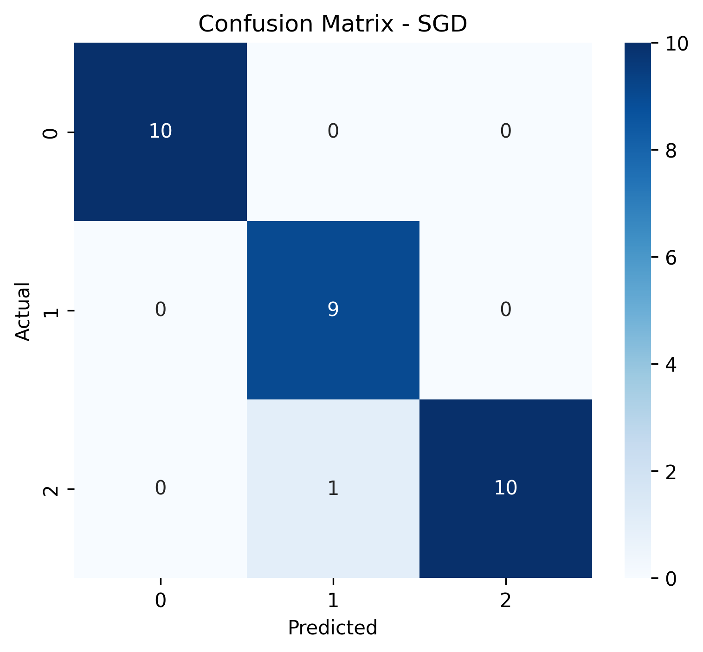

# Backpropagation in Neural Networks

## Overview
This project demostrates the implementation of Backpropagation in Neural Networks using Iris Dataset. Different optimization techiques are compared to analyse their effect on model performance and convergence.

## Dataset
Dataset: Iris Dataset

Features:
- Sepal Length
- Sepal Width
- Petal Length
- Petal Width

Classes:
- Setosa
- Versicolor
- Virginica

## Exploratory Data Analysis(EDA)

### Class Distribution

### Correalation Heatmap

### Pairplot

## Data Preprocessing

- Checked for missing values
- Label Encoding of target variable
- Feature Scaling using StandardScaler
- Train-Test split (80:20)

## Neural Network Architecture

Input Layer: 4 neurons

Hidden Layer:
- Dense layer
- ReLU Activation

Output Layer:
- 3 neurons
- SoftMax Activation

Loss Function:
- Sparse Categorical Crossentropy

Epochs:
- 50

## Optimizers Compared

1. Gradient Descent(GD)
2. Stochastic Gradient Descent(SGD)
3. Mini-Batch Gradient Descent(MBGD)
4. Adam Optimizer

## Results

### Accuracy Comparison

### Training Accuracy Comparison

### Training Loss Comparison

### Confusion Matrix 

## Performance Summary
- GD = 80%
- SGD = 100%
- Mini-Batch GD = 93%
- Adam = 97%

## Conclusion
- SGD achieved the highest accuracy and lowest loss.
- Adam showed stable and efficient convergence.
- Mini-Batch GD provided balanced performance.
- GD converged slowly and achieved the lowest accuracy.

Therefore, Stochostic Gradient Descent(SGD) is the best optimizer for the Iris classification task.