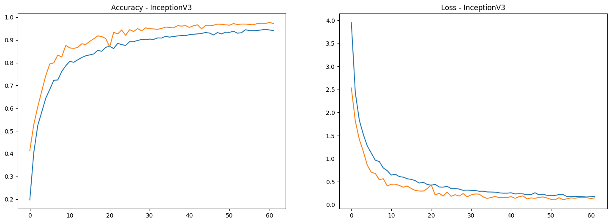
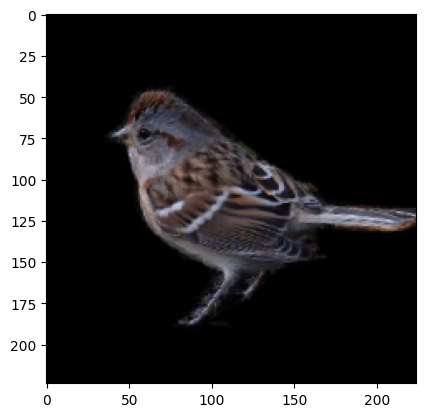
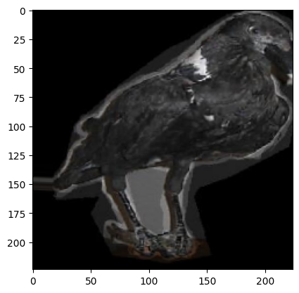
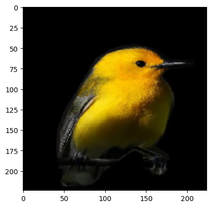

**Bird Species Classification Using Deep Learning**

**🎯 Goal**

The primary goal of this project is to build a robust bird species classification system using deep learning models. The system is designed to classify images of birds into one of 200 species, providing an efficient and accurate solution for wildlife monitoring and research.

**🧵 Dataset**

The dataset used for this project is available on Kaggle: 200 Bird Species Dataset. It contains 11,788 images, divided into 200 different bird species.

Link: https://www.kaggle.com/datasets/veeralakrishna/200-bird-species-with-11788-images

**🧾 Description**

This project implements several deep learning models to classify bird species based on images. The project explores the capabilities of modern Convolutional Neural Networks (CNNs), focusing on models like InceptionResNetV2, InceptionV3, and VGG16. Each model is fine-tuned using the bird species dataset to achieve optimal performance. The results from each model are compared to determine the most accurate model for this classification task.

**🧮 What I had done!**

	1.	Data Collection: Downloaded the bird species dataset from Kaggle.
	2.	Data Preprocessing:
		•	Resized the images to a uniform size for consistency across models.
		•	Augmented the dataset with transformations (e.g., rotation, flipping) to enhance the model’s generalization.
	3.	Model Selection: Selected four CNN architectures — InceptionResNetV2, InceptionV3, and VGG16.
	4.	Model Training:
		•	Fine-tuned each model on the bird species dataset.
		•	Utilized ImageNet pretrained weights as a baseline, followed by further training on the dataset.
	5.	Evaluation: Evaluated each model based on accuracy.
	

**🚀 Models Implemented**

	1.	InceptionResNetV2:
		•	Combines Inception modules and residual connections for high accuracy.
		•	Chosen for its ability to handle complex image classification tasks.
	2.	InceptionV3:
		•	Selected for its efficient use of factorized convolutions, which reduce computational complexity.
	3.	VGG16:
		•	A classical CNN architecture that is known for its deep and uniform layer structure, making it effective for image recognition.

Each of these models was chosen based on their proven track record in image classification and their ability to handle the complexity of the bird species dataset.

**📚 Libraries Needed**

	•	TensorFlow
	•	NumPy
	•	Matplotlib
	•	scipy
	•	Pandas

**📊 Exploratory Data Analysis Results**

Below are some visualizations derived from the dataset (example EDA images must be included here):

- Inception_resnet_v2 Accuracy
	
- Inception_v3 Accuracy
	
- Masked Bird Images using Segmentation Images from dataset
	- 
	- 
	- 

**📈 Performance of the Models based on the Accuracy Scores**

Model	| Accuracy
--- | --- 
InceptionResNetV2	| 97.07%
InceptionV3	| 97.38%
VGG16	| 98.78%

The table above shows the performance of each model based on the key metric.

**📢 Conclusion**

From the results, it is evident that VGG16 performs the best among all models, achieving the highest accuracy (98.78%), while InceptionResNetV2 and InceptionV3, perform similar.

In conclusion, VGG16 is the best-fitted model for this bird species classification task, based on the achieved accuracy.

**✒️ Your Signature**

Vivek Prakash
GitHub: https://github.com/IkkiOcean
LinkedIn: https://www.linkedin.com/in/vivek-prakash-b46830283/
