# BLOOD DISEASE DETECTION

**GOAL**
To make a CNN to classify different type of blood disease.
 

**DATASET**
https://www.kaggle.com/datasets/paultimothymooney/blood-cells
 

**DESCRIPTION**
This dataset contains 12,500 (320x240 rgb) augmented images of blood cells (JPEG) with accompanying cell type labels (CSV). There are approximately 3,000 images for each of 4 different cell types grouped into 4 different folders (according to cell type). The cell types are Eosinophil, Lymphocyte, Monocyte, and Neutrophil.

There are 2 folders namely dataset-master and dataset2-master. dataset-master contains the original (with no augmentation) 410 images of the different cell types. Where as the dataset2-master contains 3000 augmented images for each cell types, with different folders for training, testing and validation (test_simple).
 

**BRIEF EXPLINATION**
I have created an input pipeline using `tf.keras.utils.image_dataset_from_directory`. It eases the process of creating traing, testing and validation datasets with the use of a simple folder structure. More on it [image_dataset_from_directory](https://www.tensorflow.org/api_docs/python/tf/keras/utils/image_dataset_from_directory).

Then the datasets are passed to the model for training. The CNN consists of 4 `2D Convolution` and `Pooling` layers with different number of filters, two `Dense` layers with a `Dropout` of 10% between them.
 

**MODELS USED**
List out all the algorithms or models used in this project Why have you choosed that algorithms should also be stated
Summary of the model -
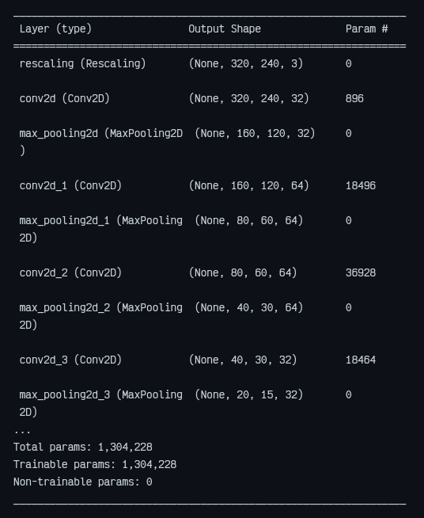

The model is trained with various parameter combinations.

| OPTIMIZER |          LOSS FUNCTION          | ACTIVATION FUNCTION |                    
____ ACCURACY ____
           |         
_______ LOSS _______
                          |
|:---------:|:-------------------------------:|:-------------------:|:--------------------------------------------------------------------:|----------------------------------------------------------------------|
| adadelta  | sparse categorical crossentropy | relu                | 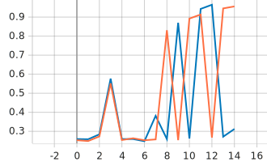                | 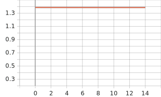                        |
| adagrad   | sparse categorical crossentropy | relu                | 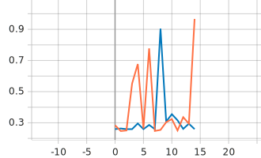                 | 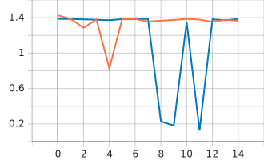                         |
| adam      | sparse categorical crossentropy | relu                | 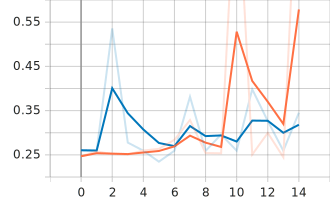                    | 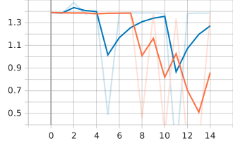                            |
| rmsprop   | sparse categorical crossentropy | relu                | 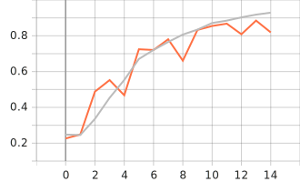                 | 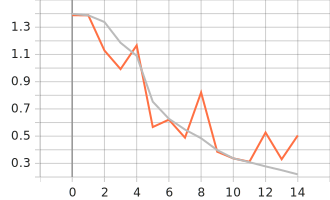                         |
| sgd       | sparse categorical crossentropy | relu                | 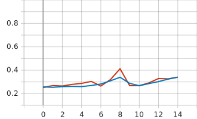                     | 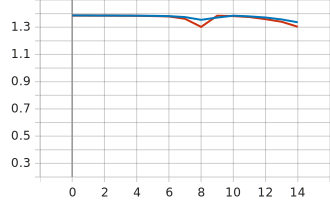                             |
 

###### From the above reults we can deduce that our model works best with the RMSPROP(Root Mean Squared Propagation) optimizer.
The below image is the graph of all the accuracies and losses combined.
|  ___________ ACCURACY ___________                            | ______________ LOSS ______________                                                  |
|:------------------------------------------------------------:|:-----------------------------------------------------:|
|  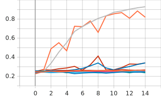   | 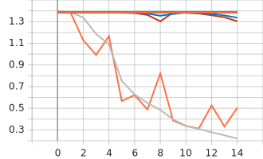 |

View it on [TENSORBOARD](https://tensorboard.dev/experiment/tw0dn4WIQYa6upR0v1oXug/)
One thing to take note is that RMSPROP may not always show this kind of performance on evry model, it depends on various factors. Some (optimizers) may perform better in different situations.
 

###### Now we experiment how the accuracy and loss (both training and validation) are affected when we change the number of dense layers and the neurons in them.
 

**LIBRARIES NEEDED**
matplotlib == 3.5.1
numpy == 1.22.3
Pillow == 9.2.0
protobuf == 4.21.5
tensorboard == 2.9.1
tensorflow == 2.9.1
 

**VISUALIZATION**
Differnet Cell types
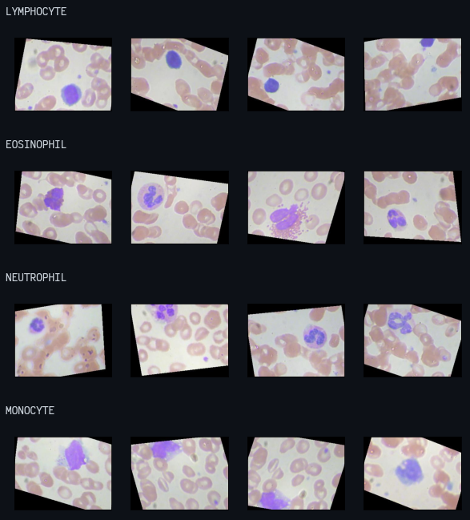

**CONCLUSION**
Based on the optimizer used, we get different accuracies for the same model. Some optimizers for example SGD (Stochastic Gradient Descent) because of a slower convergance need more epochs to reach the minimum when compared to optimizers like RMSPROP (Root Mean Squared Propagation).

# Uttkarsh Patel

Connect with me on Linkedin: https://www.linkedin.com/in/uttkarsh-patel-62b011218/

Check out my Github profile: https://github.com/Uttkarsh09
