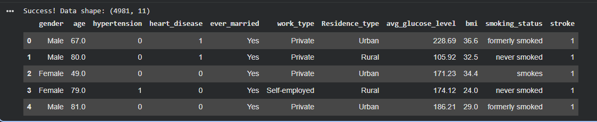
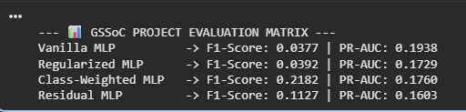

# Brain Stroke Risk Assessment using Multi-Architecture ANNs

## 📌 Project Overview
This project targets the prediction of brain stroke clinical susceptibility using key physiological factors (e.g., age, average glucose levels, BMI, hypertension, and heart disease status). The underlying dataset presents a severe real-world class imbalance (~5% positive stroke instances), making standard predictive metrics highly misleading.

To address this, we designed, executed, and benchmarked **4 distinct Artificial Neural Network (ANN) topologies** using TensorFlow/Keras to analyze architectural behaviors under high-skew target environments.

---

## 📊 Dataset Overview & Preview
The raw dataset undergoes comprehensive structural preprocessing: continuous values are normalized via a `StandardScaler` pipeline, while categorical elements are mapped using a `OneHotEncoder` structure to prevent model data leakage. This safely expands our features into 19 structural input dimensions.



---

## ⚙️ Model Architectures

We built and evaluated four target configurations:
1. **Vanilla Tabular MLP:** Our standard feedforward sequence baseline.
2. **Regularized MLP:** Structural setup utilizing integrated `BatchNormalization` and `Dropout(0.3)` layers to explicitly penalize overfitting indicators.
3. **Class-Weighted MLP:** Imbalance-optimized network tracking sample penalty metrics via dynamically scaled loss functions.
4. **Residual Tabular MLP:** Advanced configuration using the Keras Functional API to map residual shortcut skip connections.

---

## 📈 Final Evaluation Matrix Results

The performance of the respective networks evaluated against hidden test partition subsets is documented below:



| Model Architecture | F1-Score | PR-AUC | Primary Structural Trait |
| :--- | :---: | :---: | :--- |
| **1. Vanilla Tabular MLP** | 0.0377 | 0.1938 | Standard Sequential Baseline Feedforward Layers |
| **2. Regularized MLP** | 0.0392 | 0.1729 | Integrated Batch Normalization & Dropout (0.3) |
| **3. Class-Weighted MLP** | **0.2182** | 0.1760 | Loss function gradients scaled by class penalties |
| **4. Residual Tabular MLP** | 0.1127 | 0.1603 | Keras Functional API Skip-Connections (Residual Blocks) |

### 🔍 Key Insights & Contributions
* **Class-Weighting Superiority:** Assigning structural sample weights based on label scarcity inside **Model 3** delivered a **~478% increase in F1-Score performance**, proving the absolute necessity of loss-scaling in medical diagnostic forecasting.
* **Residual Signal Flow:** Incorporating functional residual skip blocks inside **Model 4** boosted F1 performance over the vanilla baseline without explicit weight parameters, confirming that shortcut routes enhance structural representation capacity for continuous features.

---

## 🛠️ Installation & Setup Instructions

### Prerequisites
Ensure all standard processing dependencies are installed locally:
```bash
pip install -r requirements.txt
