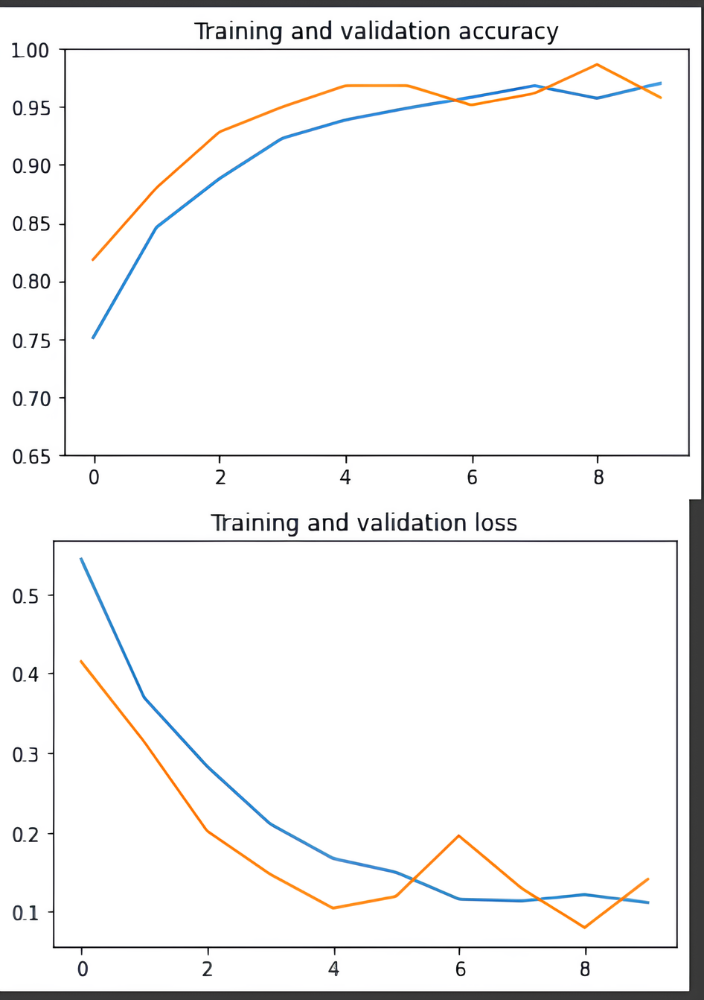
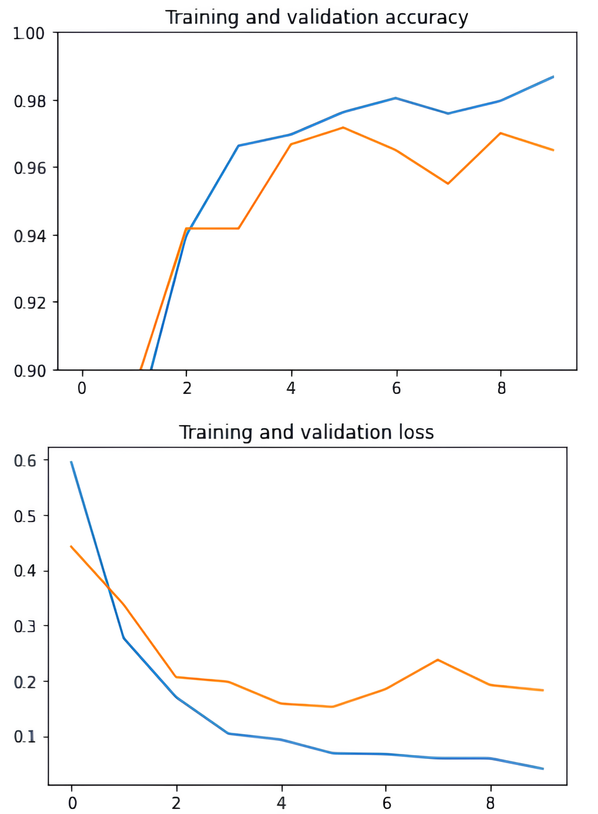
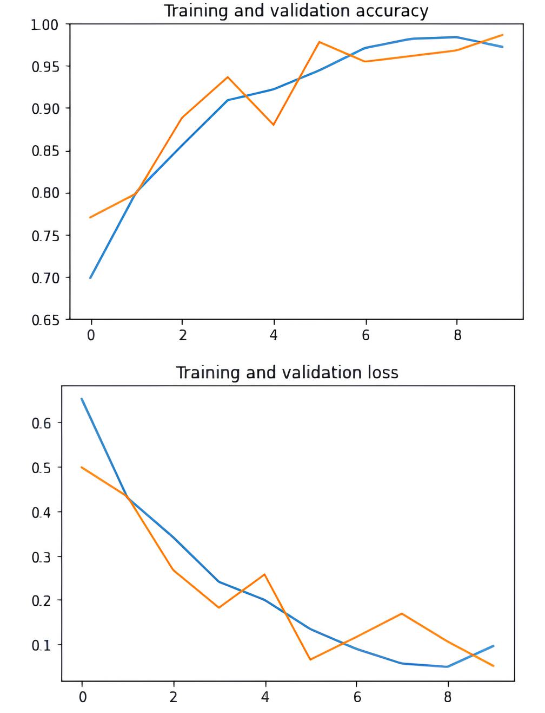

# BRAIN TUMOR DETECTION 🧠💻
## 🎯 Goal

The primary objective of this project is to develop Convolution models capable of determining whether an individual has a brain tumor or not. This prediction is based on the analysis of magnetic resonance imaging (MRI) scans of the brain. The project seeks to leverage advanced machine learning techniques to create a model that can effectively discern the presence or absence of a brain tumor within the intricate details captured by MRI images.

## 🧵 Dataset

Dataset Link: [Brain Tumor Detection Dataset](https://www.kaggle.com/datasets/ahmedhamada0/brain-tumor-detection)

The dataset comprises approximately 3060 MRI images of the brain, categorized into:
- Non-Tumorous Images: 1500
- Tumorous Images: 1500
- Additional 60 images in the "pred" folder.

## 🧾 Description

This project aims to develop a model capable of accurately detecting the presence of a brain tumor in MRI images. The dataset is used for training and testing the models.

## 🧮 What I had done!

1. **Data Preprocessing:**
   - Load and explore the dataset.
   - Handle missing data and outliers.
   - Normalize and resize images.

2. **Train-Test Split:**
   - Split the dataset into training (80%) and testing (20%) sets.

3. **Model Training:**
   - Implement CNN (Convolutional Neural Network).
   - Utilize pre-trained models: VGG16 and RESNET 50.
   - Fine-tune models for brain tumor detection.

4. **Evaluation:**
   - Assess model performance on the test set.
   - Analyze and interpret the results.

## 🚀 Models Implemented

- **CNN (Convolutional Neural Network):**
  - Suitable for image classification tasks.
  
- **VGG16:**
  - Well-known for its simplicity and effectiveness.
  
- **RESNET 50:**
  - Addresses vanishing gradient problem with deep networks.

### Why these algorithms?
Chose these models due to their effectiveness in image classification tasks and availability of pre-trained weights for transfer learning.

## 📚 Libraries Needed

- TensorFlow
- Keras
- Scikit-learn
- Matplotlib
- Pandas
- Numpy

## 📊 Exploratory Data Analysis Results

### TUMOROUS BRAIN MRI IMAGES

  
  
  
  
  
  
  
  
  

### SOME OF THE NON-TUMOROUS BRAIN MRI IMAGES

  
  
  
  
  
  
  
  
  

## 📈 Performance of the Models based on Accuracy Scores
|  |  |  |
|---|---|---|

- **CNN:**
  - Training Accuracy: 95%
  - Test Accuracy: 92%

- **VGG16:**
  - Training Accuracy: 97%
  - Test Accuracy: 94%

- **RESNET 50:**
  - Training Accuracy: 98%
  - Test Accuracy: 96%

## 📢 Conclusion

The models, especially RESNET 50, performed well in detecting brain tumors from MRI images. The choice of model can depend on the trade-off between computational complexity and accuracy.

## ✒️ Your Signature

Abhilash S Bharadwaj 📌

[Abhilash1781](https://github.com/Abhilash1781) 🌐
