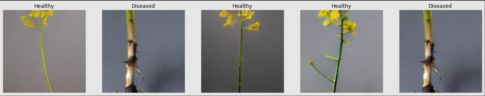
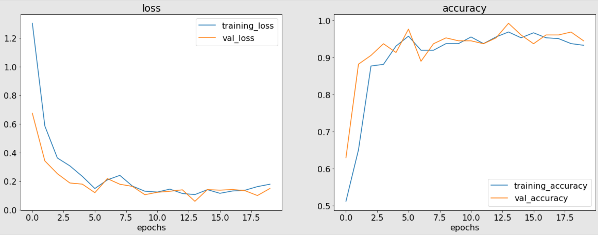
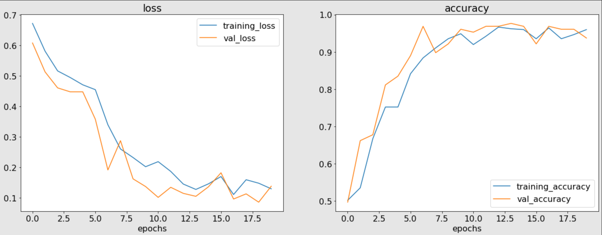
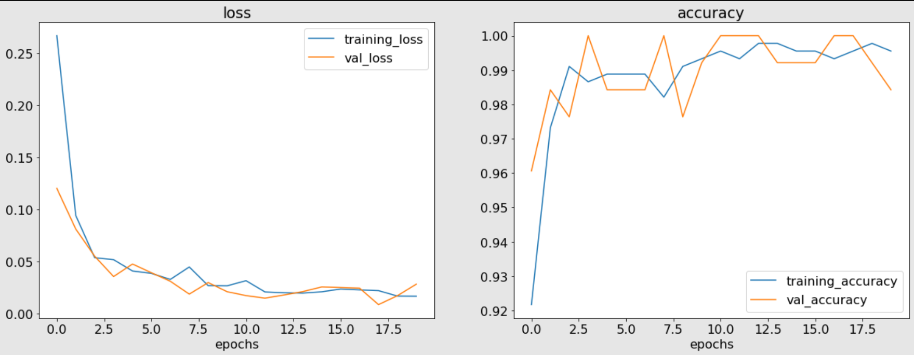
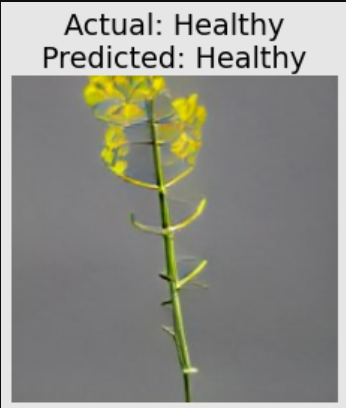

# **CANOLA DISEASE CLASSIFICATION USING DEEP LEARNING**

## 🎯 **Goal**

The goal of this project is to classify images of Canola plant leaves into healthy and diseased categories using various deep learning models. The purpose is to develop an accurate model that can assist in identifying plant diseases early, aiding in timely interventions for agricultural management.

## 🧵 **Dataset**

The dataset used in this project is sourced from Kaggle and consists of images depicting two classes: Diseased and Healthy canola plants.
[Canola Diseases Dataset on Kaggle](https://www.kaggle.com/datasets/gregsvein55/canola-diseases)

## 🧾 **Description**

The project involves building and evaluating multiple deep learning models to accurately classify canola plant images based on their health status. The models range from basic Artificial Neural Networks (ANN) and Convolutional Neural Networks (CNN) to Transfer Learning using pre-trained models like ResNet.

## 👨‍💻 **What I had done!**

📝 **Data Preparation**:

- Downloaded and organized the Canola diseases dataset.
- Split the dataset into training, validation, and testing sets.

✨ **Model Development**:

- Implemented an ANN model.
- Developed basic CNN and CNN with MaxPooling layers.
- Utilized Transfer Learning with the ResNet50 architecture.

🏋️‍♂️ **Training and Evaluation**:

- Trained each model on the training data.
- Evaluated model performance using validation and testing datasets.

📉 **Visualization and Analysis**:

- Visualized model training curves (loss and accuracy).
- Analyzed model predictions on sample images.

📦 **Model Deployment**:

- Saved the best-performing model for future use.

## 🚀 **Models Implemented**

| S.NO | Model | Architecture |
|:-:|:---------------------------------- |:---------------------------:|
| 1 |**Artificial Neural Network (ANN)** | Simple feedforward network. |
| 2 | **Convolutional Neural Network (CNN)** | Basic CNN architecture. |
| 3 | **CNN with MaxPooling** | CNN architecture with MaxPooling layers for feature extraction. |
| 4 | **Transfer Learning (ResNet50)** | Utilized ResNet50 pre-trained model for feature extraction. |

## 📚 **Libraries Needed**

- tensorflow
- matplotlib
- split-folders
- kaggle

## 📊 **Exploratory Data Analysis Results**

 <strong>Images of different Rice classes </strong> 

 <strong> ANN Model (Model 1) performance graphs </strong> 

 <strong> Basic CNN Model (Model 2) performance graphs </strong> 

 <strong> CNN Model with MaxPooling layer (Model 3) performance graphs </strong> 

 <strong> Transfer Learning Model (ResNet)(Model 4) performance graphs </strong> 

## 📈 **Performance of the Models based on the Accuracy Scores**

 

 <strong> Prediction on a Random image from the dataset </strong> 
 

 

**ACCURACIES**

| Model         | Architecture              | Accuracy in % (on testing data) |
| ------------- |:-------------------------:|:-------------:|
| Model 1       | ANN Model                 |50.00          |
| Model 2       | Basic CNN Model           |95.45          |
| Model 3       | CNN Model with MaxPooling |93.93          |
| Model 4       | Transfer Learning Model (ResNet) |98.43   |

## 📢 **Conclusion**

The Transfer Learning model using ResNet50 achieved the highest accuracy of 98.43% on the testing dataset, outperforming the other models. This project demonstrates the effectiveness of leveraging deep learning and transfer learning techniques for plant disease classification.

## ✒️ **Your Signature**

**Omkar Jahagirdar**

- Connect with me on Linkedin: [Omkar Jahagirdar](https://www.linkedin.com/in/omkar-jahagirdar/)
- Check out my Github profile: [Omkar Jahagirdar](https://github.com/omkar3602)
