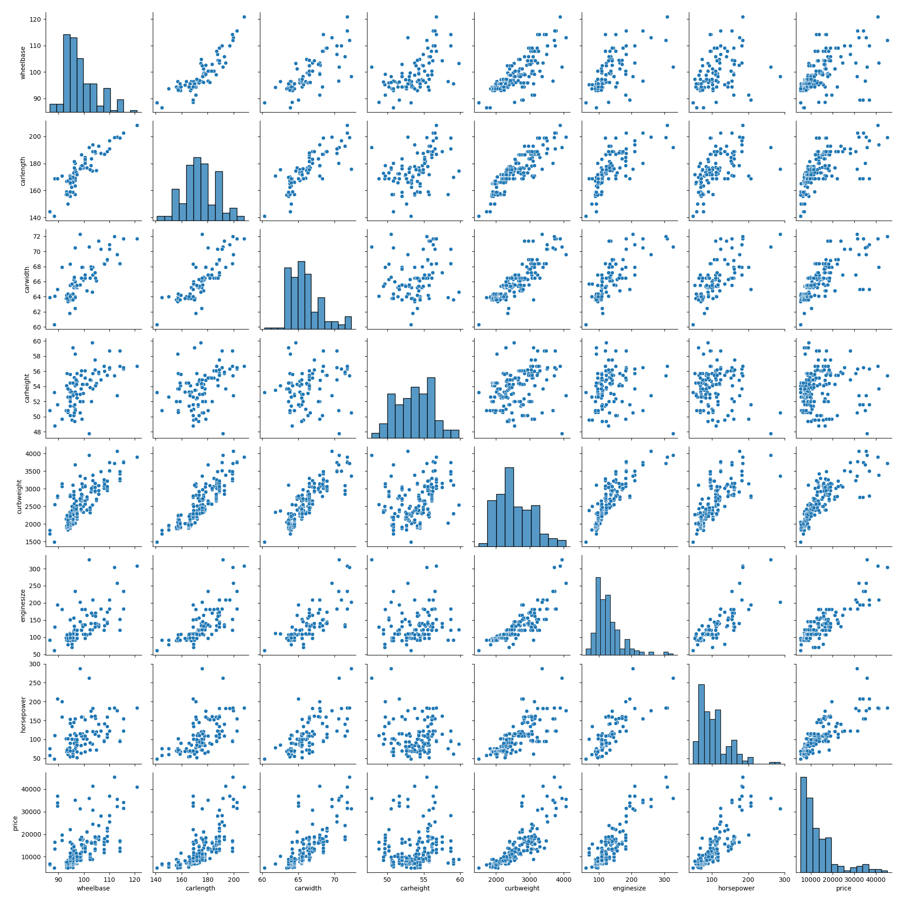
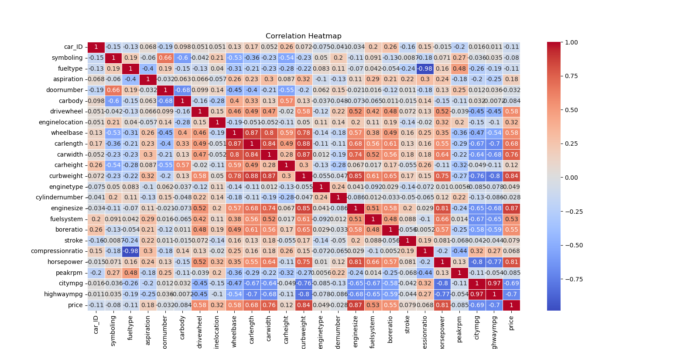
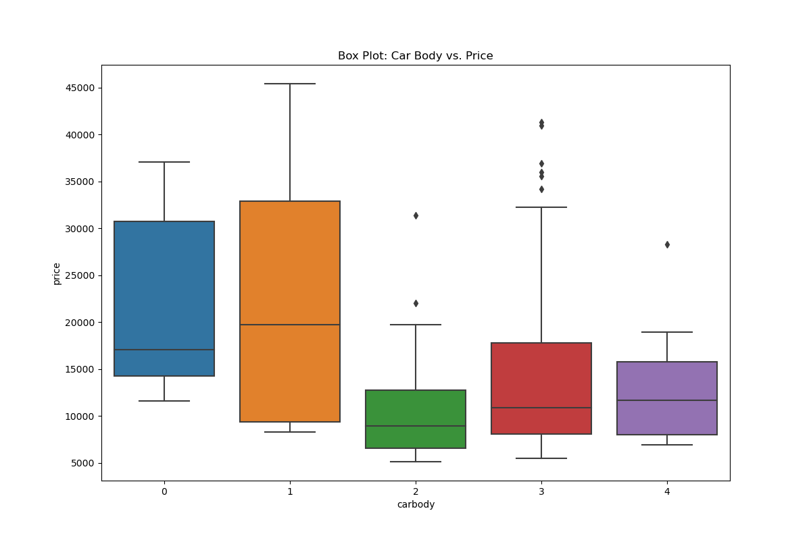
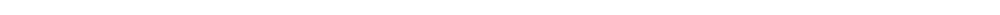
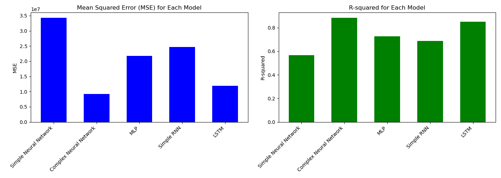
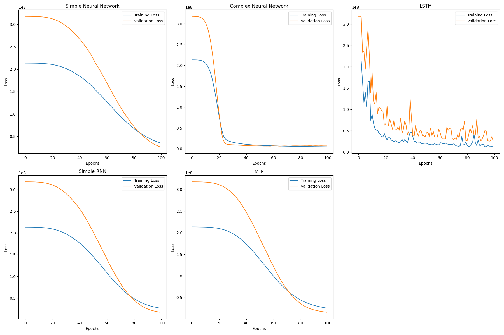
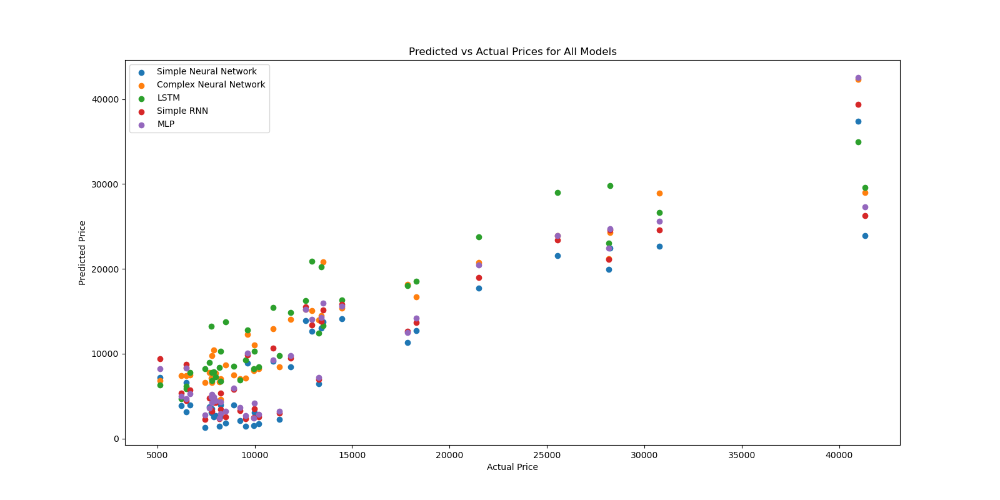

# Car Price Prediction using Deep Learning

This project aims to predict car prices using a deep learning model. The dataset used in this project contains various features of cars, including both categorical and numerical variables. It uses different DL models for the task, then chooses the best model based on the accuracy scores.

## Table of Contents

- Installation
- Usage
- Visualizations
- Model
- Results
- Conclusions

## Installation

The required libraries for this project are listed in the `requirements.txt` file. To install these libraries, use the following command:

```bash
pip install -r requirements.txt
```

## Usage
All the codes are provided in the 'CarPricePrediction.py' file.

## Visualizations

### This project includes several visualizations to understand the data better:

#### Pair plot for numerical features



Correlation heatmap


Box plot for car body vs. price


Interactive 3D scatter plot for curb weight, horsepower, and price


Error Values Comparison Bar Plot


Training History Plot


Predicted vs Actual Price Scatter Plot


## Model
Different DL models were used to predict the car prices, then the best one was chosen.

Simple Neural Network:

Architecture: One input layer, one hidden layer with 64 neurons and ReLU activation, one hidden layer with 32 neurons and ReLU activation, and one output layer with linear activation.
Compilation: Adam optimizer, mean squared error loss function.

Complex Neural Network:

Architecture: One input layer, one hidden layer with 128 neurons and ReLU activation, one hidden layer with 64 neurons and ReLU activation, one hidden layer with 32 neurons and ReLU activation, and one output layer with linear activation.
Compilation: Adam optimizer, mean squared error loss function.

Simple RNN (Recurrent Neural Network):

Architecture: One input layer, one hidden layer with 64 neurons and ReLU activation, one hidden layer with 32 neurons and ReLU activation, and one output layer with linear activation.
Compilation: Adam optimizer, mean squared error loss function.

MLP (Multi-Layer Perceptron):

Architecture: One input layer, one hidden layer with 64 neurons and ReLU activation, one hidden layer with 32 neurons and ReLU activation, and one output layer with linear activation.
Compilation: Adam optimizer, mean squared error loss function.

LSTM (Long Short-Term Memory):

Architecture: One input layer, one LSTM layer with 64 neurons and ReLU activation, and one output layer with linear activation.
Compilation: Adam optimizer, mean squared error loss function.

## Results

Simple Neural Network MSE: 34290440.002507746, R-squared: 0.5656360086499759
Complex Neural Network MSE: 9222450.53118023, R-squared: 0.883177339734963
MLP MSE: 21686974.238817435, R-squared: 0.7252866778615561
Simple RNN MSE: 24707967.891473647, R-squared: 0.6870191356336094
LSTM MSE: 11925410.305463398, R-squared: 0.8489383974545393

## Conclusions
As the results show, based on the lowest MSE or Higest R-Squared value, Complex Neural Network is the best model.
