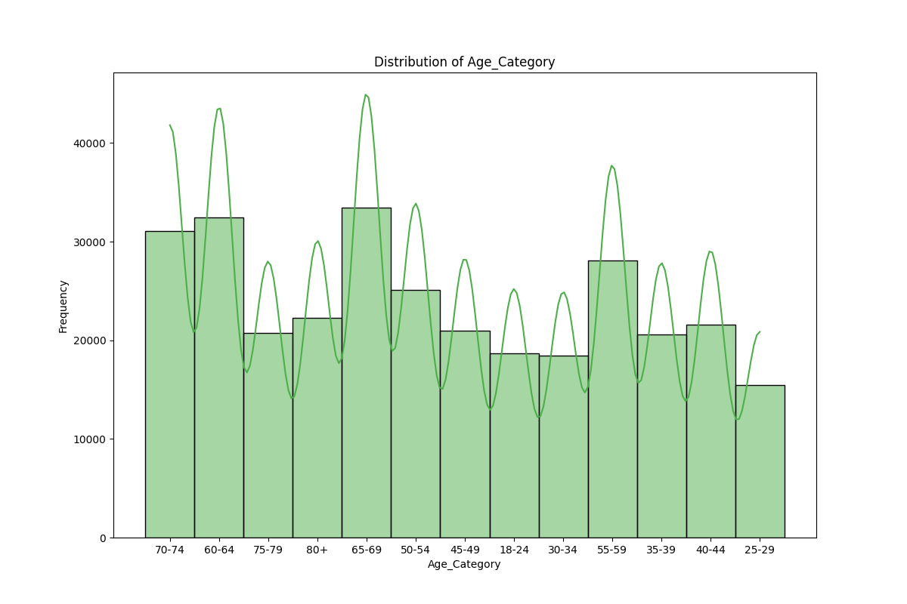
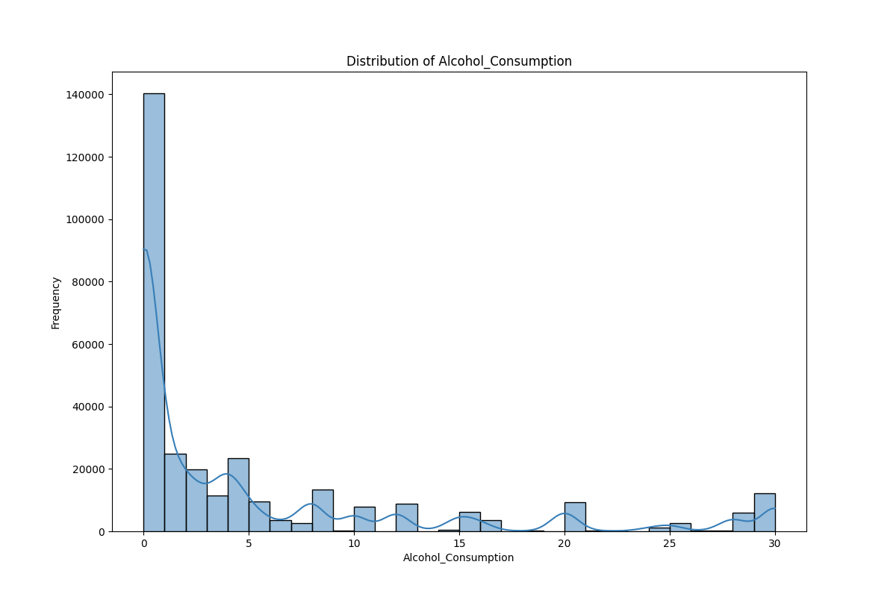
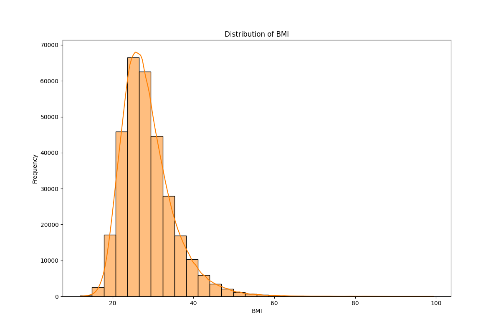
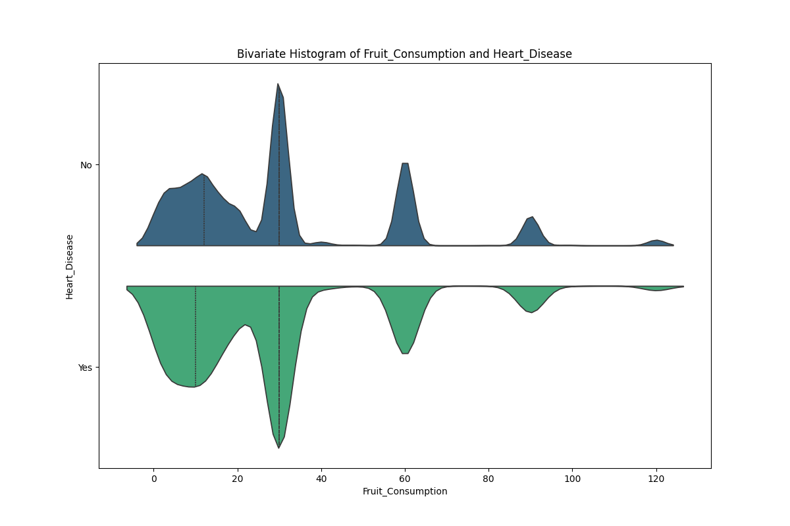
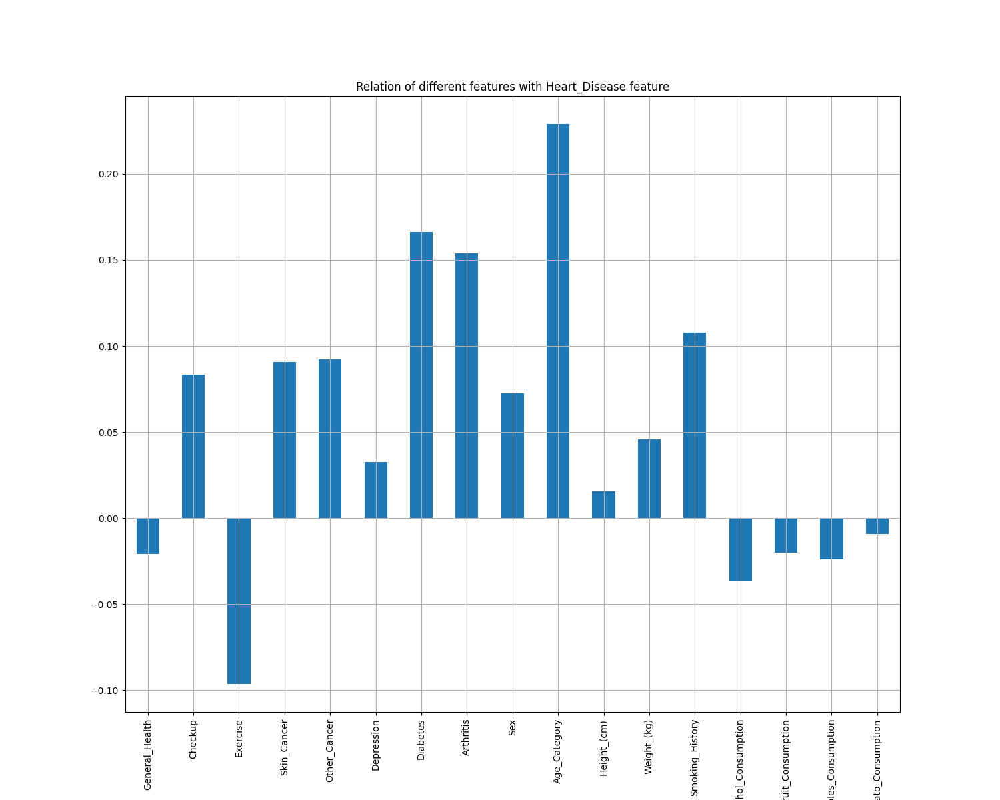
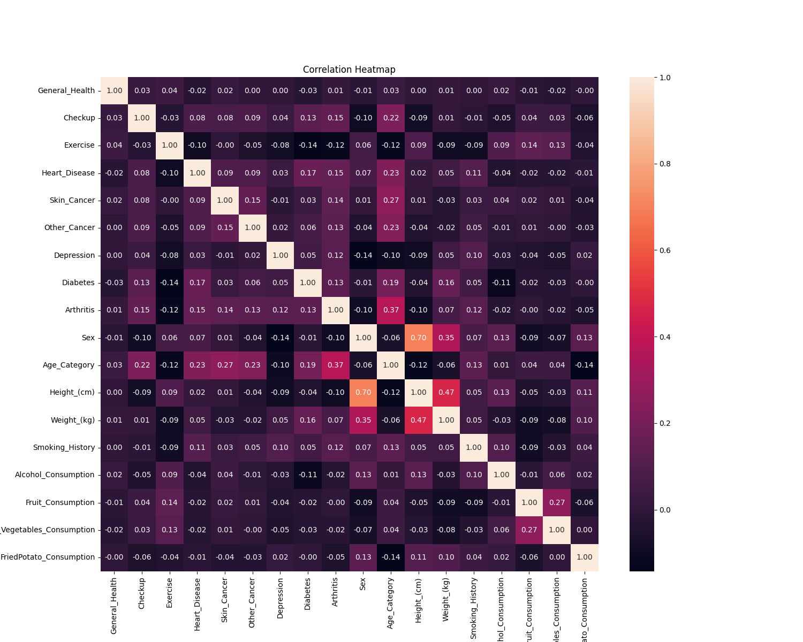
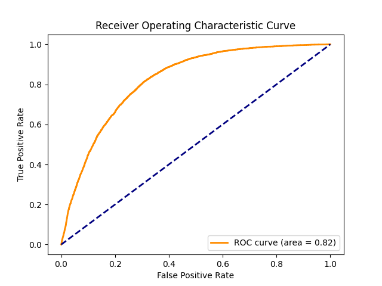
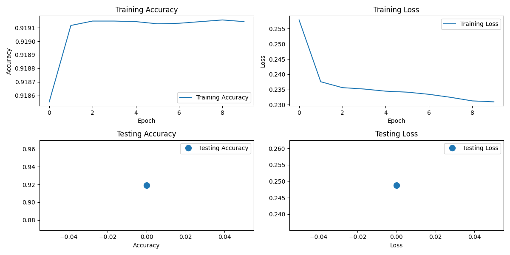
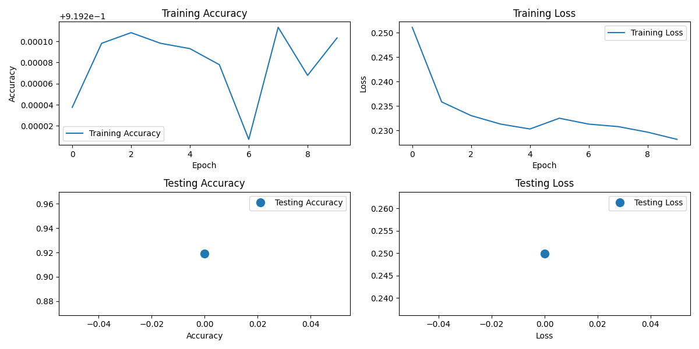
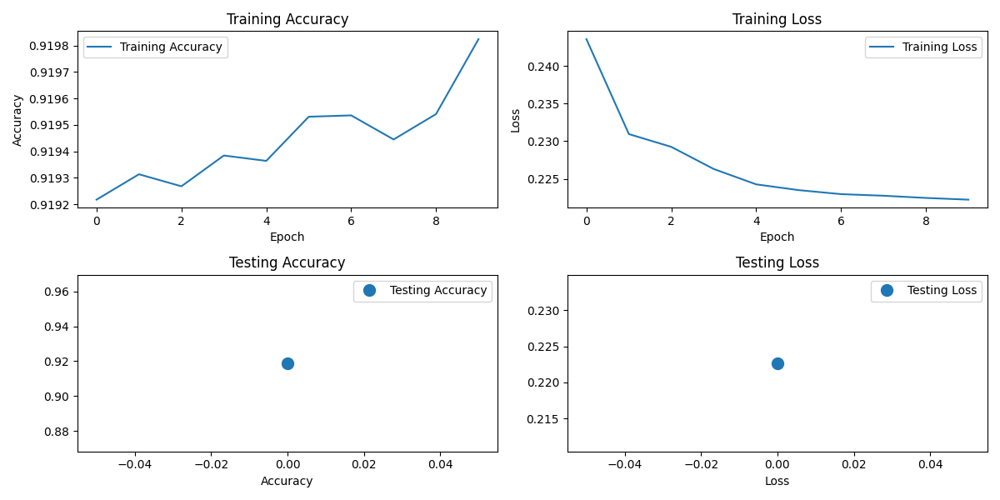

# Cardiovascular Disease Risk Prediction Model 

**GOAL**

The aim of the project is to analyze and predict whether the person having the chances of CVD.

**DATASET**

https://www.kaggle.com/datasets/alphiree/cardiovascular-diseases-risk-prediction-dataset

**DESCRIPTION**

There are 19 features and 308854 entries in this dataset.

- **`General_Health`** - Would you say that in general your health is?
- **`Checkup`** - About how long has it been since you last visited a doctor for a routine checkup?
- **`Exercise`** - During the past month, other than your regular job, did you participate in any physical activities or exercises such as running, calisthenics, golf, gardening, or walking for exercise?
- **`Heart_Disease`** - Respondents that reported having coronary heart disease or mycardialinfarction
- **`Skin_Cancer`** - Respondents that reported having skin cancer
- **`Other_Cancer`** - Respondents that reported having any other types of cancer
- **`Depression`** - Respondents that reported having a depressive disorder (including depression, major depression, dysthymia, or minor depression)
- **`Diabetes`** - Respondents that reported having a diabetes. If yes, what type of diabetes it is/was.
- **`Arthritis`** - Respondents that reported having an Arthritis
- **`Sex`** - Respondent's Gender

**WHAT I HAD DONE**

* First I imported all the required libraries and dataset for this project.
* Perfoming the EDA on the whole dataset.
* Removing the unnecessary variables.
* Performing label encoding on object features and converting them into integer datatype.
* Visualizing the dataset distribution in univariate and bivariate with target feature.
* Watching the correlation of different features by plotting Heatmap.
* Keep the necessary features for further processing and splitting the dataset into training and testing set.
* Then, i have developed 3 deep learning models and classify whether person will have Cardio vascular diesease or not.
* Finally plotting the graph of visualizing how the model is trained on training set and testing set.

**MODELS USED**

The models are:

1. Deep Neural Network (DNN)
2. Recurrent Neural Network (RNN)
3. Long short-term memory (LSTM)

**LIBRARIES NEEDED**

* kaggle
* tensorflow
* matplotlib
* seaborn
* numpy
* pandas

**VISUALIZATION**

### Univariate Analysis

### Bivariate Analysis

_bivariant_distribution.png)

### Correlation with target feature 

### Predictive Analysis 

### Prediction

**ACCURACIES**

| Model         | Architecture        | Accuracy in % (on testing data) |
| ------------- |:-------------------:|:-------------------------------:|
| Model 1       | DNN Model           |50.00                            |
| Model 2       | RNN Model           |95.45                            |
| Model 3       | LSTM Model          |93.93                            |

**CONCLUSION**

I was successfully able to develop a Deep Learning model that can predict the risk of CVD in probability or percentage.

*Avdhesh Varshney*

  

