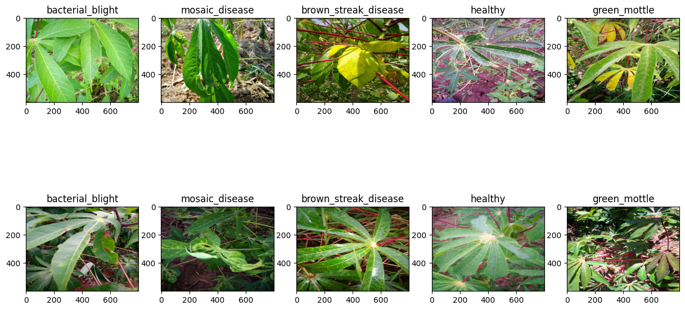
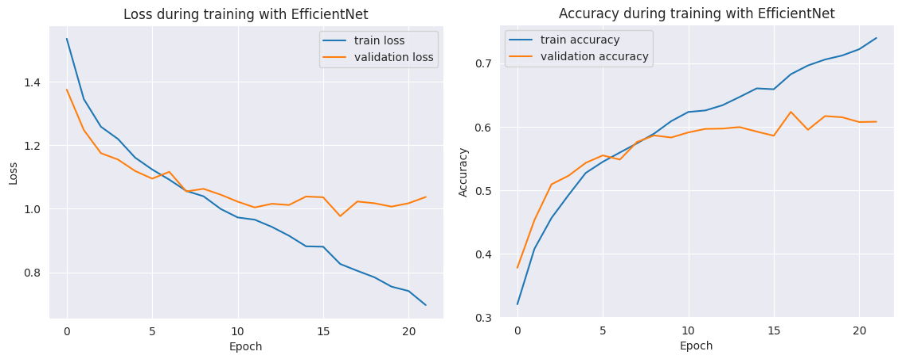
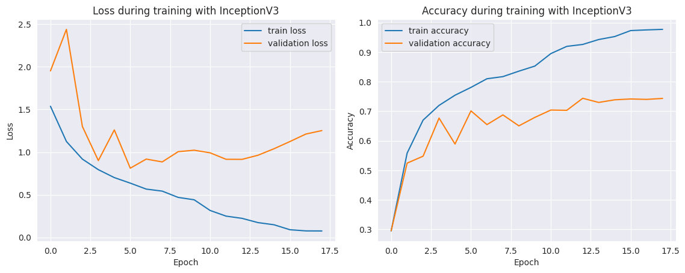
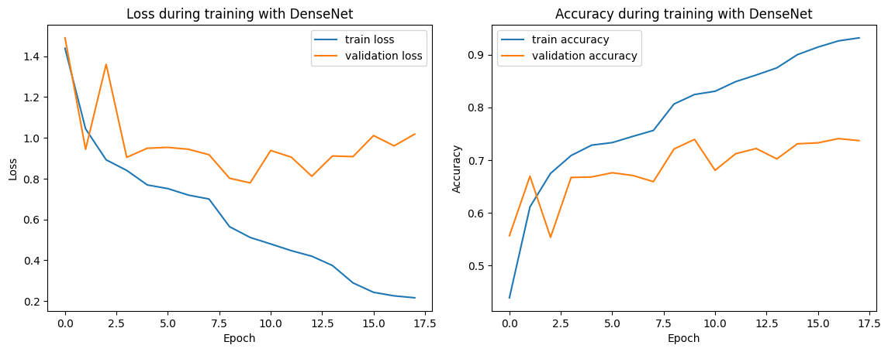
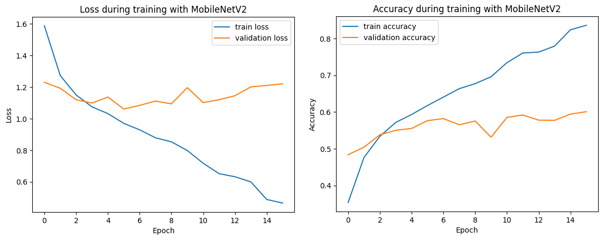
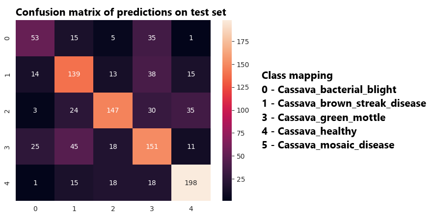
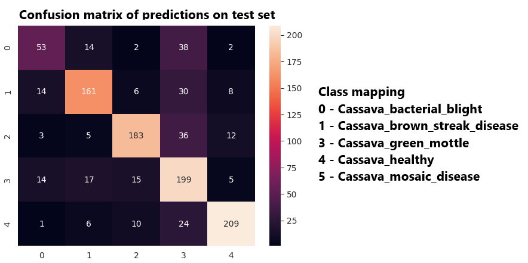
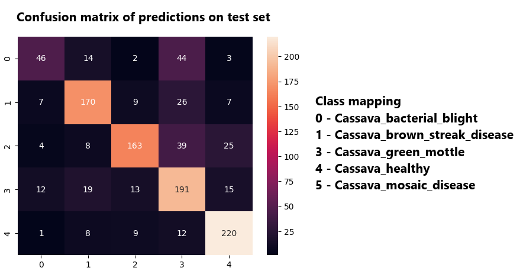
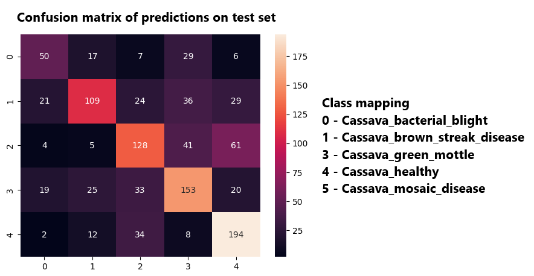
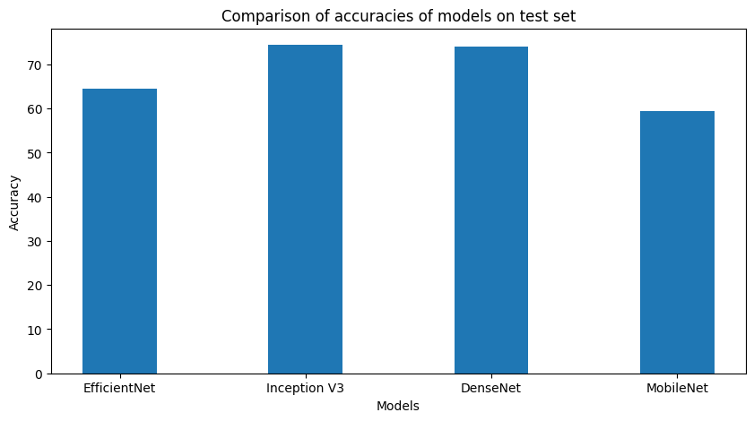

# <h1 align = "center"> Cassava Leaf Disease Classification</h1>
## Aim of the project: 
The aim of this project is to identify the defected leaf of the Cassava plant using Computer Vision and image processing methods.

##  Libraries and Frameworks used:
1. Pandas
2. Numpy 
3. Matplotlib
4. Seaborn
5. Tensorflow
6. Scikit-Learn
7. OpenCV

## Deep Learning Algorithms used:
1. EfficientNetB1
2. InceptionV3
3. DenseNet121
4. MobileNetV2

## Accuracy and training time comparison of all the Deep Learning Algorithms

|                |   Accuracy    |
|----------------|---------------|
| EfficientNetB1 |     90%       |
| InceptionV3    |     92%       |  
| DenseNet121    |     81%       |     
| MobileNetV2    |     86%       |

# Representation of types of cells

# Accuracy and loss plots of all models

## EfficientNetB1

## InceptionV3

## DenseNet121

## MobileNetV2

# Confusion Matrices of all models

## EfficientNetB1

## InceptionV3

## DenseNet121

## MobileNetV2

# Conclusion
As evident from the plot below, InceptionV3 model performs better comparative to other models used on the above dataset with an accuracy of 74.4% on the test set.
