# Celebrity Faces Detection Model 

**GOAL**

The aim of this project is to detect the faces of the celebs based on the dataset.

**DATASET**

https://www.kaggle.com/datasets/jessicali9530/celeba-dataset

**DESCRIPTION**

There are 40 features and 202599 entries in this dataset.

0. 5_o_Clock_Shadow
1. Arched_Eyebrows
2. Attractive
3. Bags_Under_Eyes
4. Bald
5. Bangs
6. Big_Lips
7. Big_Nose
8. Black_Hair
9. Blond_Hair
10. Blurry
11. Brown_Hair
12. Bushy_Eyebrows
13. Chubby
14. Double_Chin
15. Eyeglasses
16. Goatee
17. Gray_Hair
18. Heavy_Makeup
19. High_Cheekbones
20. Male
21. Mouth_Slightly_Open
22. Mustache
23. Narrow_Eyes
24. No_Beard
25. Oval_Face
26. Pale_Skin
27. Pointy_Nose
28. Receding_Hairline
29. Rosy_Cheeks
30. Sideburns
31. Smiling
32. Straight_Hair
33. Wavy_Hair
34. Wearing_Earrings
35. Wearing_Hat
36. Wearing_Lipstick
37. Wearing_Necklace
38. Wearing_Necktie
39. Young

**WHAT I HAD DONE**

* First I imported all the required libraries and dataset for this project.
* Perfoming the EDA on the whole dataset.
* Chosing 1 target feature i.e., Attractiveness.
* Converting all -1 values into 0 values as negative instances.
* Visualizing the dataset distribution in univariate and bivariate with target feature.
* Splitting the dataset into training, validation and testing set as given in `list_eval_partition.csv` file.
* Due to high amount of dataset and uniform distribution of dataset for training, i will chose small amount from it for training, validation and testing purpose.
* Pre-processing the images i.e., Data augmentation so that model will able to predict easily on any dimension of image like inverted, or at any angle of rotation, etc.
* Finally, build a inceptionv3 model and import the weights already present on kaggle for training and freeze the starting some of the layers of the model and finally creating fully connected layer by own for training the model.
* Train the model and plot the accuracy and loss of the model on test dataset.

**MODELS USED**

| Models Used  | Accuracy |
|--------------|----------|
| Inception V3 | 68.80%   |
| ResNet50     | 50.20%   |
| ResNet101V2  | 62.13%   |

**LIBRARIES NEEDED**

* tensorflow
* matplotlib
* seaborn
* numpy
* pandas
* keras
* PIL
* cv2

**VISUALIZATION**

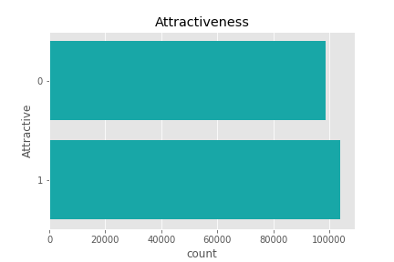
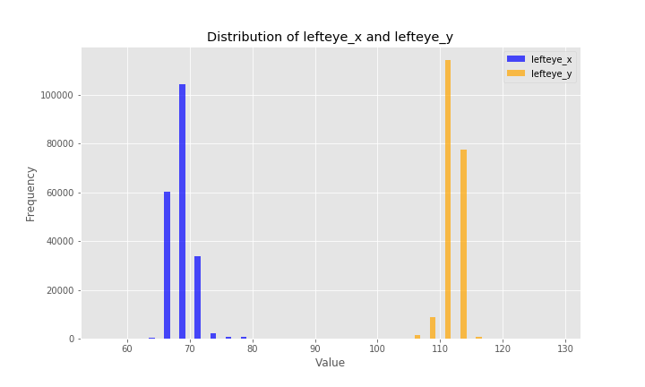
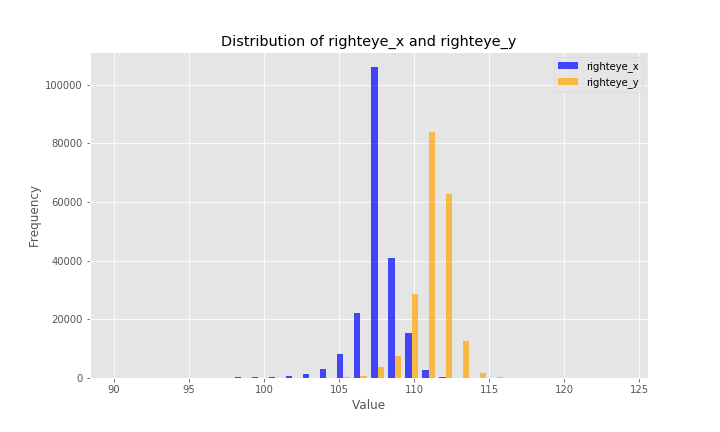
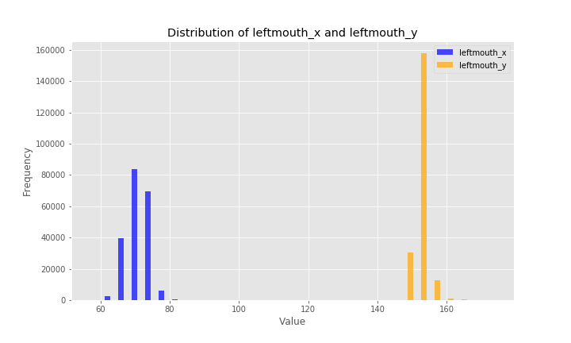

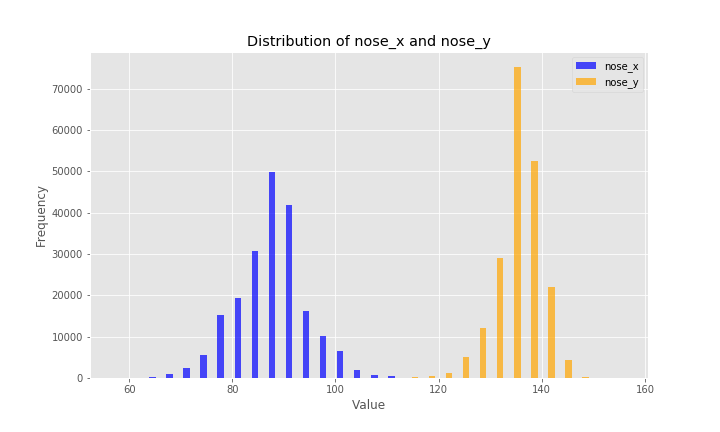
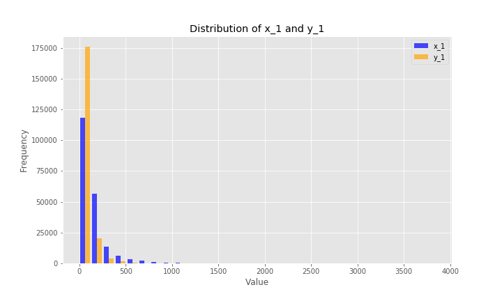
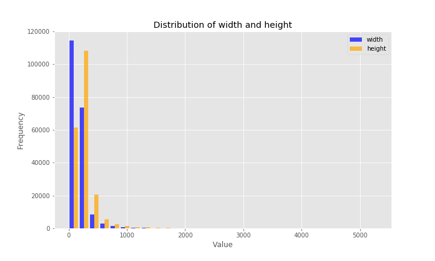
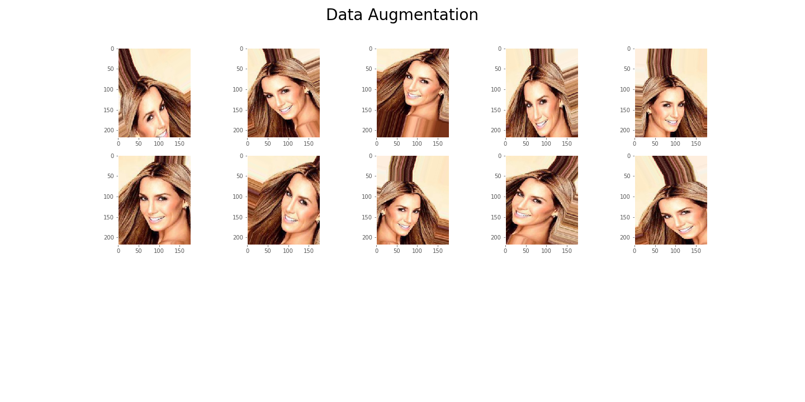

### Prediction Analysis 

#### InceptionV3

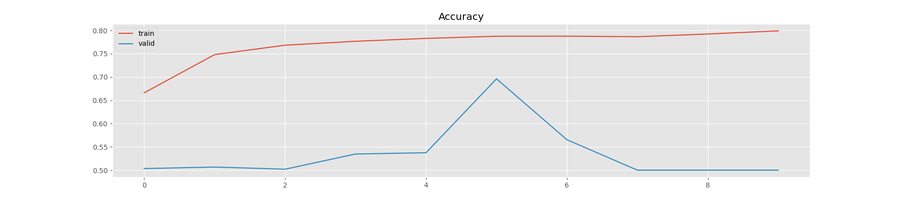
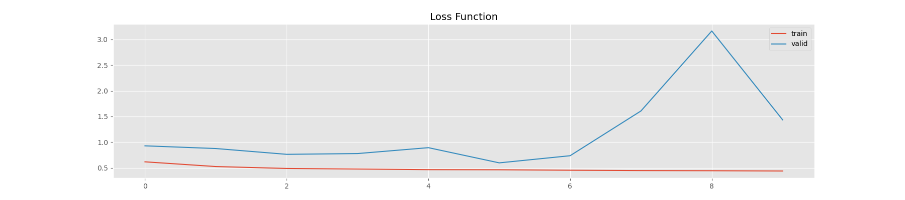

#### ResNet50

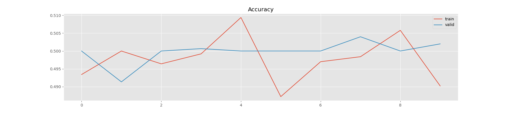
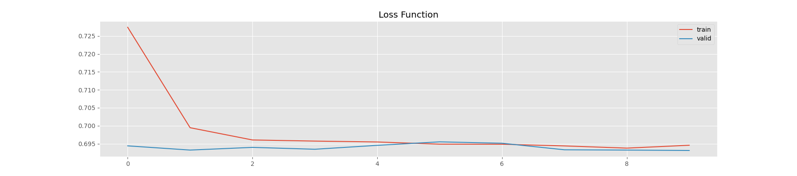

#### ResNet101V2

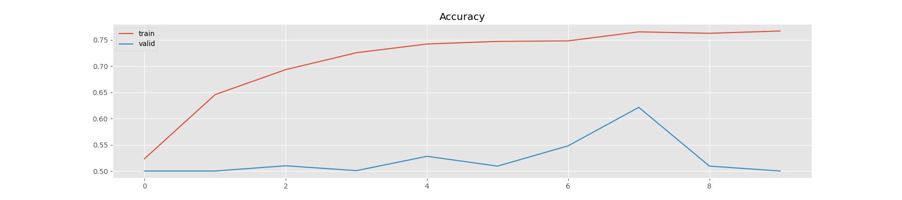
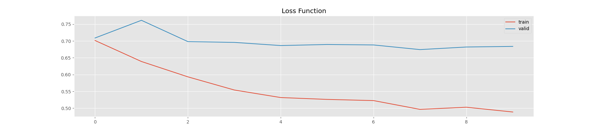

**ACCURACIES**

- Inception V3 gives somewhat promising performance rather than ResNet50 and ResNet101V2 Models.
- Accuracy of this model is comes around 68.80%.

**CONCLUSION**

I was successfully able to develop a Deep Learning model that can predict the celebrity faces in probability or percentage.

*Avdhesh Varshney*

  

