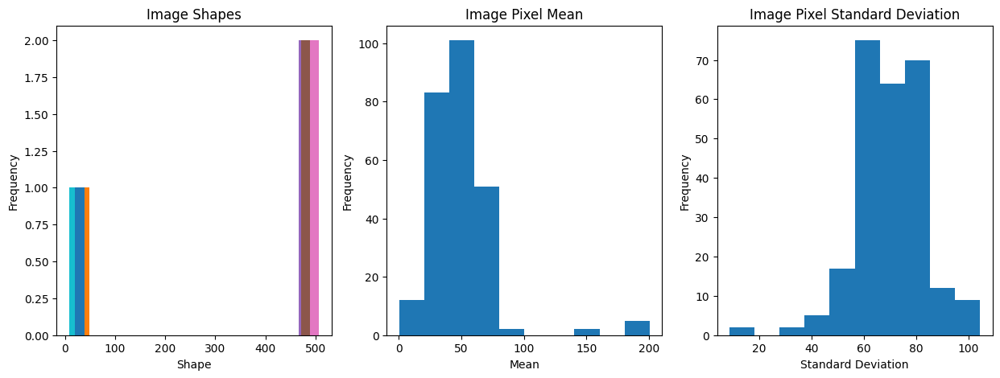
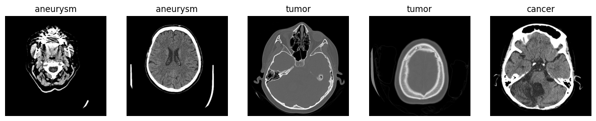

# Computed Tomography Analysis using DL

## 🎯 Goal

The primary objective of this project is to accurately classify medical diseases including tumors, cancer, and aneurysms from CT scan images by applying deep learning algorithms. The goal is to make it easier for medical practitioners to diagnose and treat patients.

## 🧵 Dataset

The dataset used in this project is sourced from Kaggle and can be accessed via the following link: [Computed Tomography (CT) of the Brain Dataset](https://www.kaggle.com/datasets/trainingdatapro/computed-tomography-ct-of-the-brain).

## 🧾 Description

This project involves the development of deep learning models to analyze CT scan images of the brain and classify them into specific categories based on medical conditions detected.

## 🧮 What I Had Done!

- Data collection and preprocessing.
- Exploratory data analysis to gain insights into the dataset.
- Implementation of deep learning models, including VGG16, ResNet50, and EfficientNetB7.
- Evaluation of model performance on training, validation, and test datasets.
- Comparison of model accuracies and selection of the best-performing model.

## 🚀 Models Implemented

- VGG16: Chosen for its simplicity and effectiveness in image classification tasks.
- ResNet50: Selected for its ability to handle deep networks without vanishing gradient problems.
- EfficientNetB7: Chosen for its balance of model depth, width, and resolution for optimal performance.

## 📚 Libraries Needed

- TensorFlow
- Keras
- Pandas
- Matplotlib
- Seaborn

## 📊 Exploratory Data Analysis Results

#### visualizations of the exploratory data analysis results 

## 📈 Performance of the Models based on the Accuracy Scores

- **VGG16:**
  - Accuracy: 100%
- **ResNet50:**
  - Accuracy: 100%
- **EfficientNetB7:**
  - Accuracy: 100%

## 📢 Conclusion

In summary, all models successfully classified CT scan pictures into the designated categories with an amazing 100% accuracy rate. Since every model worked just as well for this project, it is not required to select the one that fits the data the best.

## ✒️ Your Signature

Jaya Prakash Sangem

[LinkedIn](https://www.linkedin.com/in/sangemjayaprakash)   
[GitHub](https://github.com/Jaya-Prakash-17)

