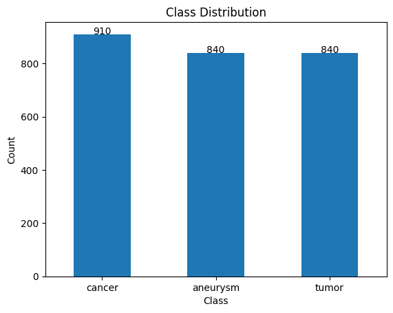
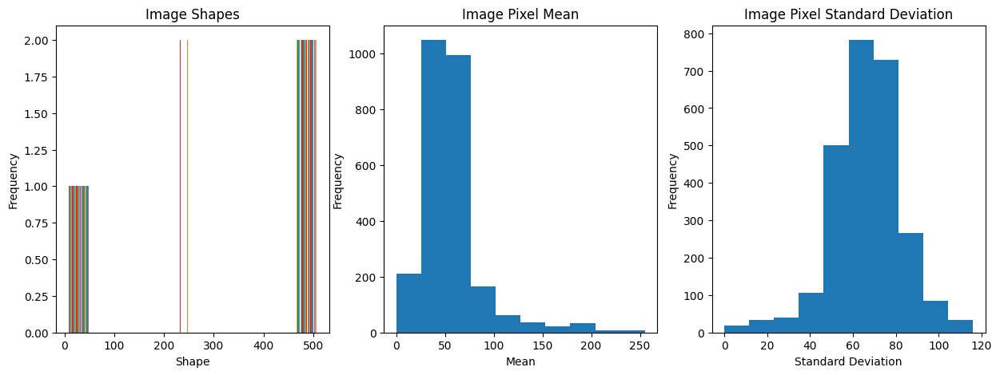
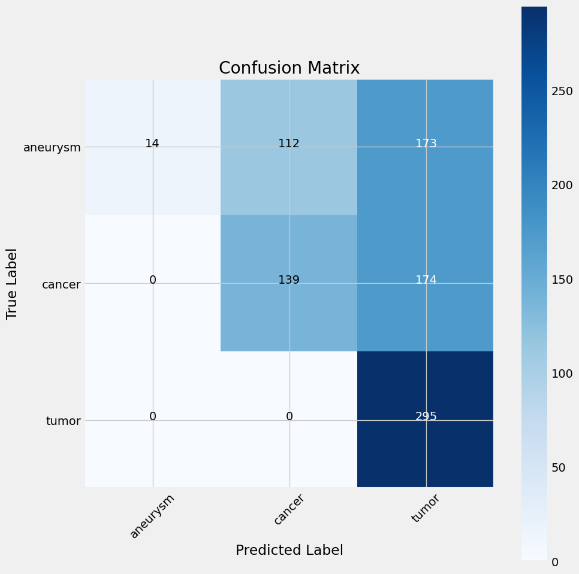
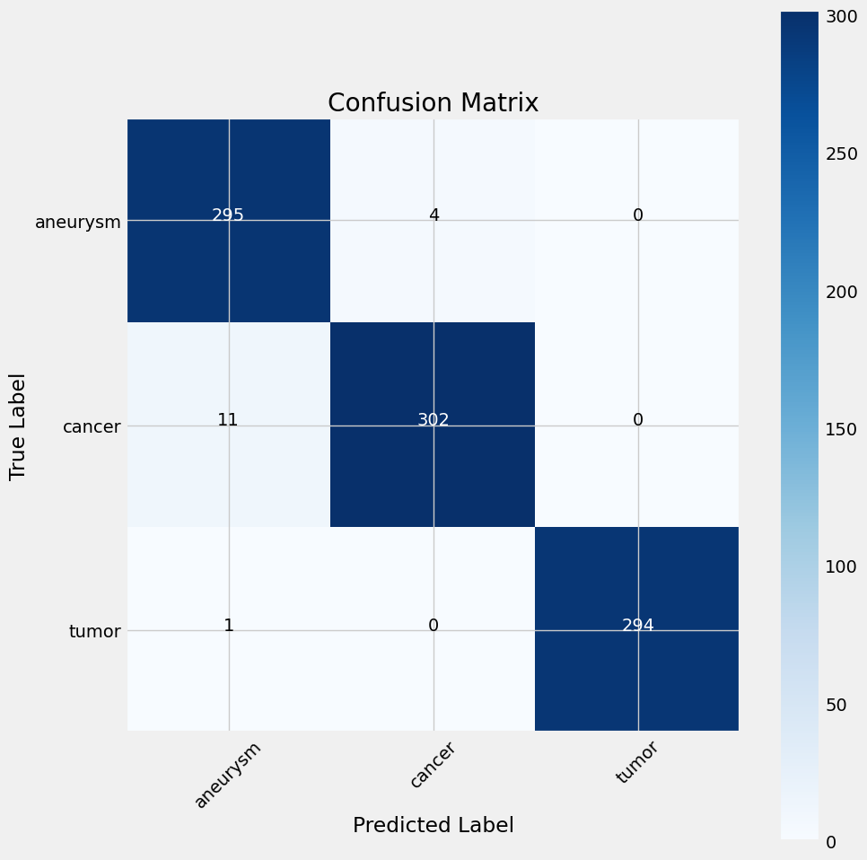
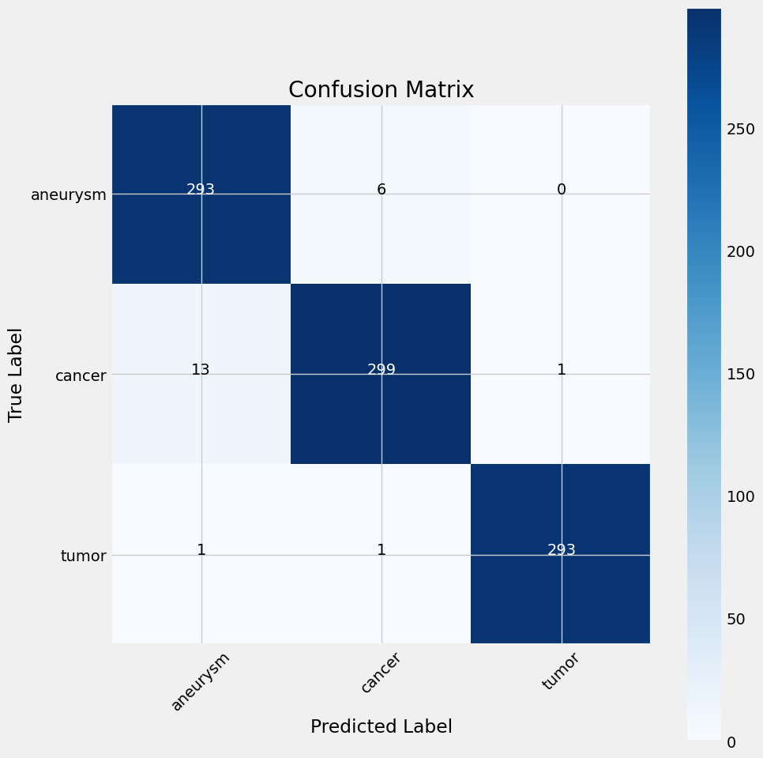

# Computed Tomography Analysis using DL

## 🎯 Goal

The primary objective of this project is to accurately classify medical diseases including tumors, cancer, and aneurysms from CT scan images by applying deep learning algorithms. The goal is to make it easier for medical practitioners to diagnose and treat patients.

## 🧵 Dataset

The dataset used in this project is sourced from Kaggle and can be accessed via the following link: [Computed Tomography (CT) of the Brain Dataset](https://www.kaggle.com/datasets/trainingdatapro/computed-tomography-ct-of-the-brain).

## 🧾 Description

This project involves the development of deep learning models to analyze CT scan images of the brain and classify them into specific categories based on medical conditions detected.

## 🧮 What I Had Done!

- Data collection and preprocessing.
- Exploratory data analysis to gain insights into the dataset.
- Implementation of deep learning models, including VGG16, ResNet50, and EfficientNetB7.
- Evaluation of model performance on training, validation, and test datasets.
- Comparison of model accuracies and selection of the best-performing model.

## 🚀 Models Implemented

- VGG16: Chosen for its simplicity and effectiveness in image classification tasks.
- ResNet50: Selected for its ability to handle deep networks without vanishing gradient problems.
- EfficientNetB7: Chosen for its balance of model depth, width, and resolution for optimal performance.

## 📚 Libraries Needed

- TensorFlow
- Keras
- Pandas
- Matplotlib
- Seaborn

## 📊 Exploratory Data Analysis Results

#### Visualizations of the exploratory data analysis results 

## 📈 Performance of the Models based on the Accuracy Scores

- **VGG16:**
  - Train Accuracy: 47.6%
  - Validation Accuracy: 48.8%
  - Test Accuracy: 49.4%
  - 
  
- **ResNet50:**
  - Train Accuracy: 99.4%
  - Validation Accuracy: 97.7%
  - Test Accuracy: 98.2%
  - 
  
- **EfficientNetB7:**
  - Train Accuracy: 99.3%
  - Validation Accuracy: 96.9%
  - Test Accuracy: 97.6%
  - 
 
## 📢 Conclusion

In summary, ResNet50 and EfficientNetB7 outperformed VGG16 in this project. ResNet50 achieved the highest test accuracy of 98.2%, making it the best-performing model for classifying CT scan images into the designated categories. EfficientNetB7 followed closely with a test accuracy of 97.6%, while VGG16 showed significantly lower performance with a test accuracy of 49.4%.

## ✒️ Your Signature

Jaya Prakash Sangem

[LinkedIn](https://www.linkedin.com/in/sangemjayaprakash)   
[GitHub](https://github.com/Jaya-Prakash-17)
