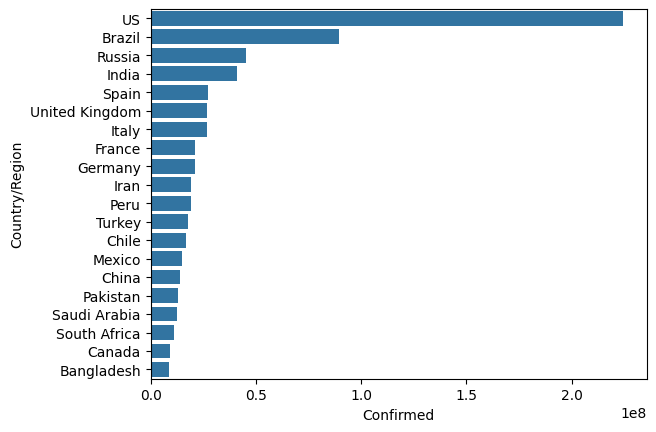
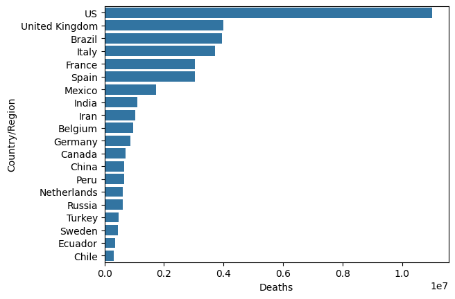
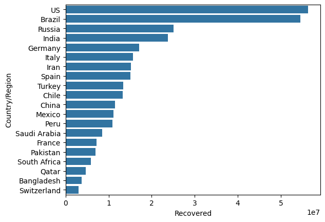
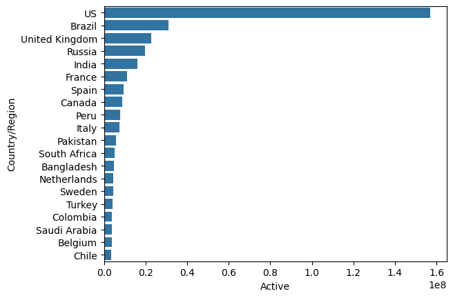
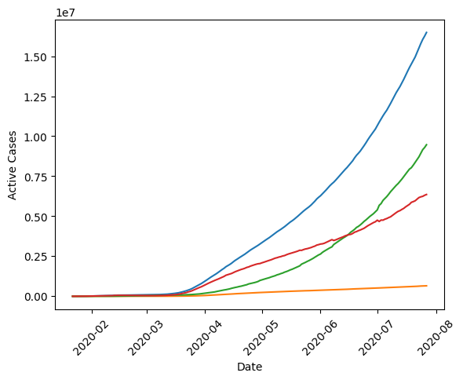
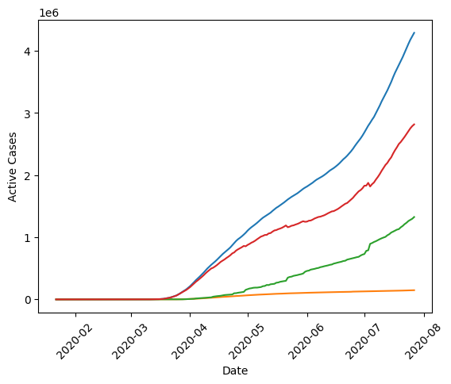
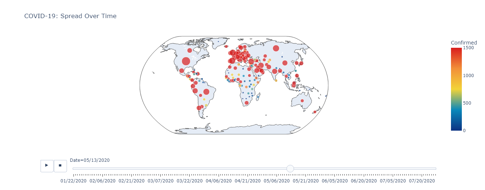
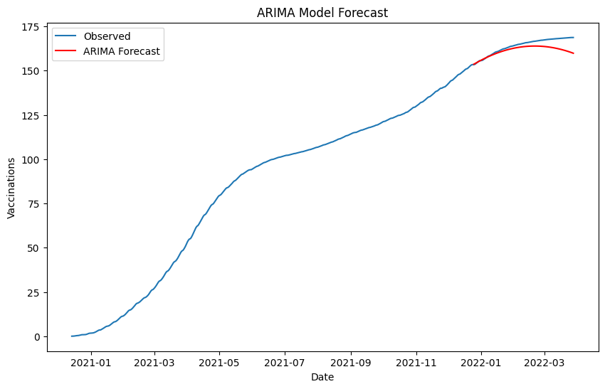
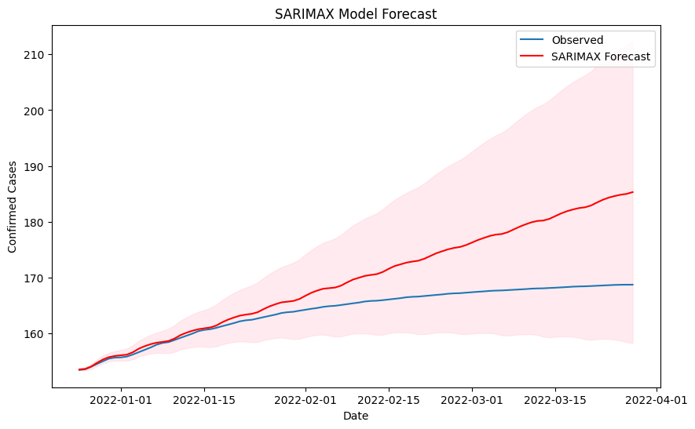
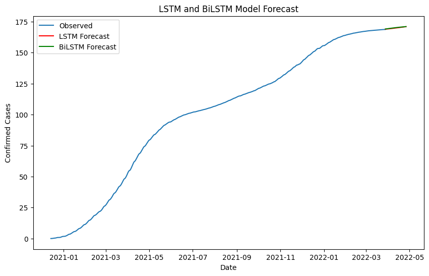

## **Covid Case Predictor**

### 🎯 **Goal**
To predict the number of covid cases for every month.

### 🧵 **Dataset**
https://www.kaggle.com/datasets/imdevskp/corona-virus-report/data

### 🧾 **Description**
The project focuses on exploring the data on the COVID-19 pandemic and forecast the number of confirmed cases in steps of 30 days(1 month).

### 🧮 **What I had done!**

- Load the dataset
- Initial inspection of data
- Preprocessing
- Exploratory Data Analysis
- Model training and evaluation

### 🚀 **Models Implemented**

Since this is a time series dataset, I have chosen to proceed with time series models like ARIMA, SARIMAX, LSTM, BiLSTM.

### 📚 **Libraries Needed**
- numpy
- pandas
- matplotlib
- seaborn
- plotly
- sklearn
- statsmodels
- tensorflow
- keras

### 📊 **Exploratory Data Analysis Results**

### 📈 **Performance of the Models based on the Accuracy Scores**

|                    |   MAPE    |
|--------------------|---------------|
|      ARIMA        |     14%       |  
|     SARIMAX       |     11%       |
|    LSTM    |     57%       |
|    BiLSTM    |     58%       |   

### 📢 **Conclusion**
BiLSTM model performs better comparative to other models used on the above dataset.

### ✒️ Abirami Gurushanker

