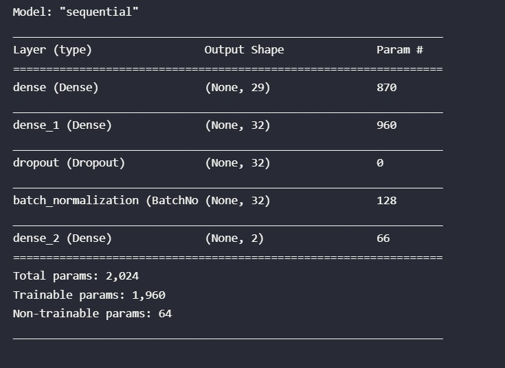
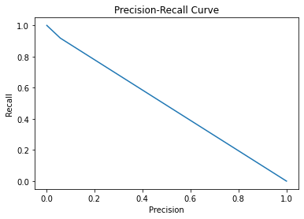
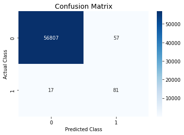
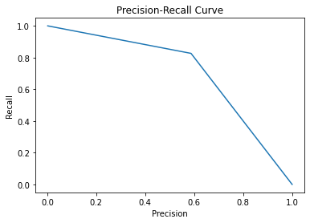

# **CREDIT CARD FRAUD DETECTION**

# Aim

To build a Deep Learning model that is able to recognize fradulent credit card transactions so that customers are not charged for items they did not purchase

# **Dataset**

The dataset used in this project is from https://www.kaggle.com/datasets/mlg-ulb/creditcardfraud.

# Approach

We will start with Exploratory Data Analysis and pre-processing(if required). Then we will try to build and train an ANN model and compare it with a baseline classifier model using appropriate metrics.

# Exploratory Data Analysis

The dataset contains 31 Features  and 284807 data points. The Class coloumn signifies whether a transaction is fake or real.

The dataset is highly imbalanced in favour of non-fradulent transactions.

So we have to use either undersampling or oversampling techniques. I have used SMOTE Oversampling in this case.

Due to the nature of Dataset accuracy is not a good metric for judging the perfomance of our model. Thus we should use precision,F1-score and Area under Precision-Recall Curve as the evaluation criteria.

# The Model

The ANN model consists of 3 Dense layers , 1 Dropout Layer and Batch Normalization.

The optimizer used is Adam. The loss function is Sparse Categorical Cross Entropy. The activation function used for the first 2 layers is relu while softmax is used for the last layer.

# Observation

Our baseline Logistic Regression model gave very poor results in both F1 and precision scores.

By using an ANN model we got much better results.

# Conclusion

Neural Networks are far more flexible than traditional algorithms and thus can provide much accurate results.
