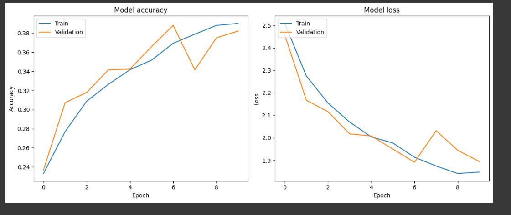
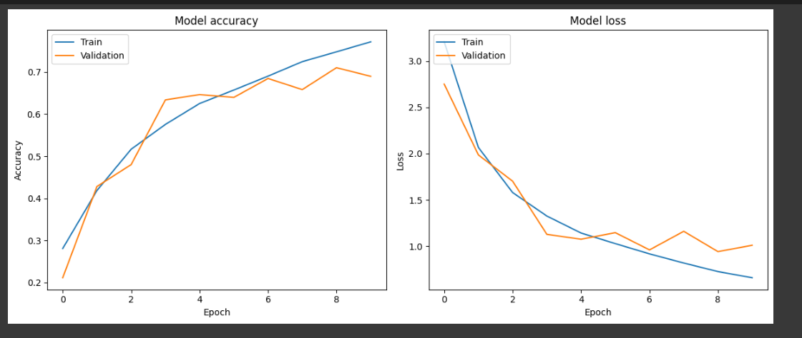
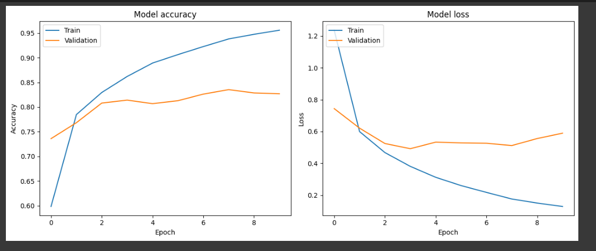

# Crop Pest and Disease Detection

**GOAL**

To classify the images from the crop pest and disease dataset using a Deep Learning approach.

**DATASET**

[Crop Pest and Disease Detection Dataset](https://www.kaggle.com/datasets/nirmalsankalana/crop-pest-and-disease-detection)

**DESCRIPTION**

The dataset contains images of various crops affected by pests and diseases, categorized into 22 different classes. The task is to classify these images using deep learning architectures.

**WHAT I DID**

First, I imported all the required libraries and the dataset for this project. I split the dataset into training, validation, and testing sets in the ratio of 70:20:10. Then I proceeded to build and evaluate the models.

I developed several deep learning models to classify the images. Initially, I used an Artificial Neural Network (ANN), followed by a Convolutional Neural Network (CNN). Both models did not yield satisfactory accuracy. I then used VGG16 and ResNet architectures, with the latter providing better performance. Finally, I employed data augmentation and regularization techniques to enhance the ResNet model, resulting in a model named ResNet(Perfect), which provided a balanced performance without overfitting.

**MODELS USED**

The models are:

1. Artificial Neural Network (ANN)
2. Basic Convolutional Neural Network (CNN)
3. VGG16 Model
4. ResNet Model
5. Enhanced ResNet Model with Data Augmentation and Regularizations (ResNet(Perfect))

**LIBRARIES NEEDED**

- tensorflow
- matplotlib
- opencv-python
- numpy
- random
- shutil

**VISUALIZATION**

### Model 1 (ANN Model) Performance Graphs

### Model 2 (Basic CNN Model) Performance Graphs

### Model 3 (VGG16 Model) Performance Graphs

### Model 4 (ResNet Model) Performance Graphs
_Training.png)

**ACCURACIES**

| Model              | Architecture                | Accuracy in % (on testing data) |
|--------------------|:---------------------------:|:------------------------------:|
| Model 1            | ANN Model                   | 38.98                          |
| Model 2            | Basic CNN Model             | 69.92                          |
| Model 3            | VGG16 Model                 | 83.03                          |
| Model 4            | ResNet Model                | 85.62                          |
| Model 5            | ResNet(Perfect) Model       | 84.58                          |

**CONCLUSION**

I successfully developed a deep learning model that can classify images from the given crop pest and disease dataset. The ResNet(Perfect) model is chosen as the optimal model due to its balance of high accuracy and reduced overfitting, making it the best candidate for deployment.

**Connect with Me**

- [LinkedIn](https://www.linkedin.com/in/barrenkala-veera-venkata-karthik-b58b9a285/)
- [GitHub](https://github.com/Karthik110505)
