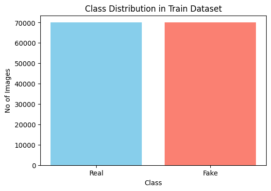
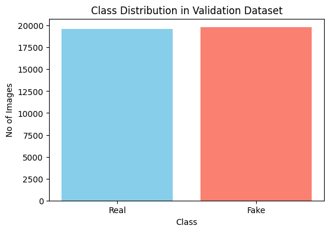
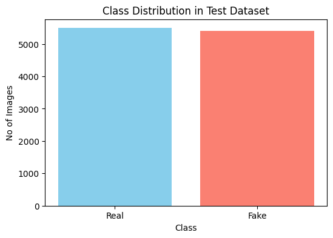
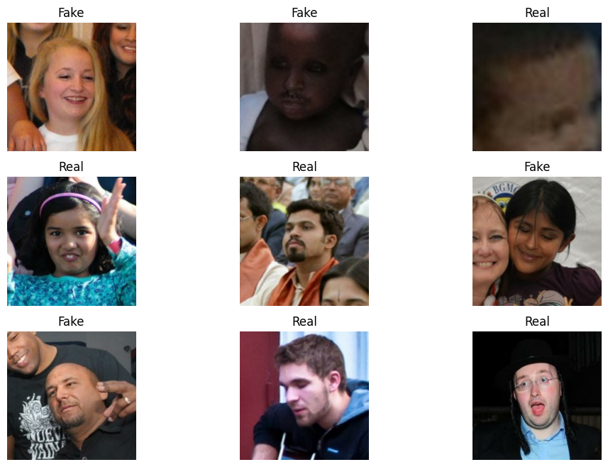
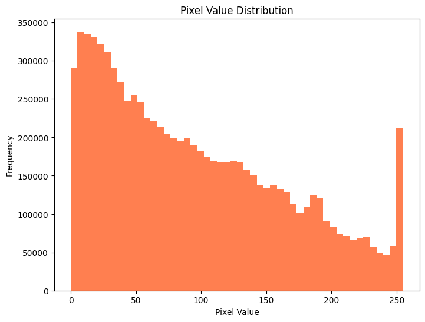

## **Deepfake Images Detector Using DL**

### 🎯 **Goal**

The primary goal of this project is to develop multiple deep learning models for detecting deepfake images and compare their performance based on accuracy. This project aims to combat misinformation and promote image authenticity by leveraging deep learning techniques.

### 🧵 **Dataset**

The dataset used in the project is taken from kaggle.
Dataset Link: https://www.kaggle.com/datasets/manjilkarki/deepfake-and-real-images 

### 🧾 **Description**

This project involves the development of a Deepfake Images Detector by implementing three deep learning models - Convolutional Neural Network (CNN), Capsule Network (CapsNet), and Xception. Exploratory Data Analysis (EDA) was conducted on the loaded datasets with real and fake images, followed by model training and performance evaluation. The objective was to compare these models based on accuracy and identify the most effective approach for detecting deepfakes.

### 🧮 **What I had done!**

1. **Exploratory Data Analysis** 
    * Checked whether the data was balanced i.e. had equal or close number of 'Real' and 'Fake' images by plotting the class distributions for Train, Validation and Test datasets.
    * Displayed some sample images from the dataset and printed the image shapes of one batch.
    * Plotted the pixel value distribution of images in the Train dataset.

2. **Model Training**
    * Implemented and trained a Convolutional Neural Network (CNN) using Keras to classify images as real or fake.
    * Implemented and trained a Capsule Network (CapsNet) to capture spatial hierarchies for deepfake image detection.
    * Implemented and trained an Xception model using transfer learning to enhance classification accuracy.

3. **Model Evaluation and Results**
    * Evaluated each of the three models on a subset of the test dataset.
    * Since the dataset is very large, small subsets of the train, validation, and test datasets were used.
    * Calculated the loss and accuracy for each model, and selected the best model based on these metrics.

### 🚀 **Models Implemented**

1. **Convolutional Neural Network (CNN):**
   * Chosen for its simplicity and excellence at capturing intricate patterns and features within images, making it ideal for identifying subtle inconsistencies introduced by deepfake manipulation techniques.

2. **Capsule Networks (CapsNets):**
   * Chosen for its ability to capture spatial relationships between features, which is crucial in detecting deepfakes that often exhibit inconsistencies in facial features and their spatial arrangements.

3. **Xception:**
   * Chosen for its powerful architecture and ability to efficiently extract fine-grained details and anomalies in facial regions, making it well-suited for deepfake detection.

### 📚 **Libraries Needed**

* numpy
* matplotlib
* os
* tensorflow
* keras

### 📊 **Exploratory Data Analysis Results**

#### 1. Class Distribution Plots

  
  
  

#### 2. Sample Dataset Images

#### 3. Pixel Distribution

### 📈 **Performance of the Models based on the Accuracy Scores**

1. **CNN model**
    * Loss: 1.2989
    * Accuracy: 59.58%

2. **CapsNet model**
    * Loss: 0.6988
    * Accuracy: 46.67%

3. **Xception model**
    * Loss: 0.5873
    * Accuracy: 68.96%

### 📢 **Conclusion**

Out of the three models developed, the Xception model performed best with an accuracy score of 0.6896 or 68.96% along with a minimal loss of 0.5873. 

### ✒️ **Your Signature**

Contributed by: Fathima Zulaikha 
* Github: <a href="https://github.com/zul132">zul132</a>