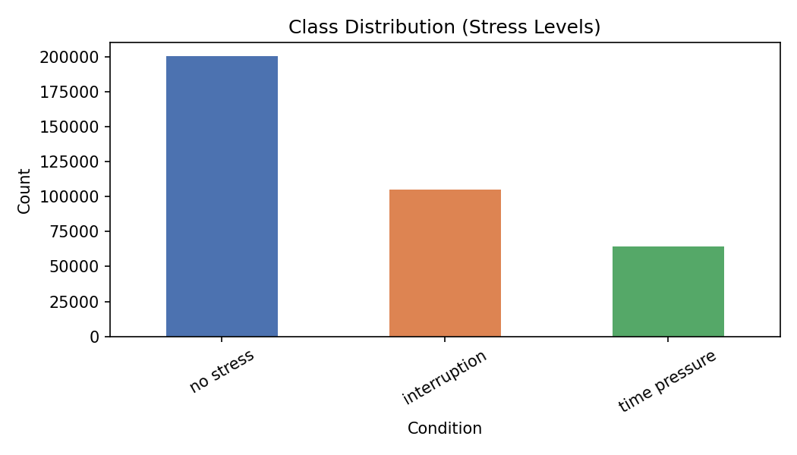
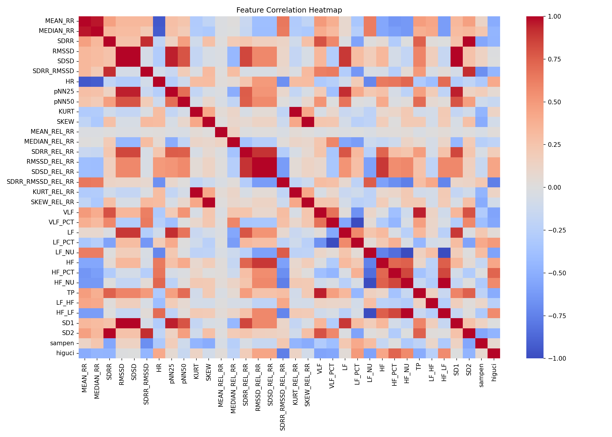
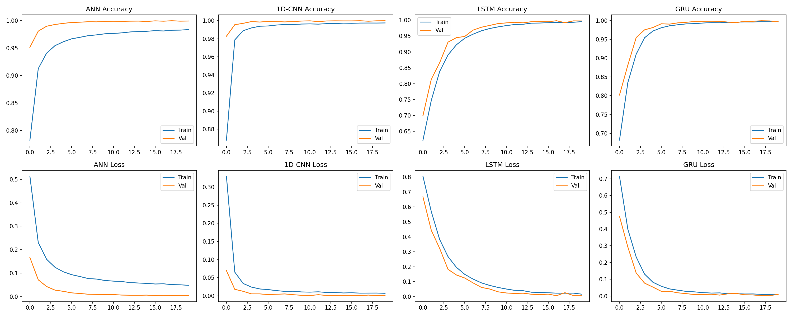
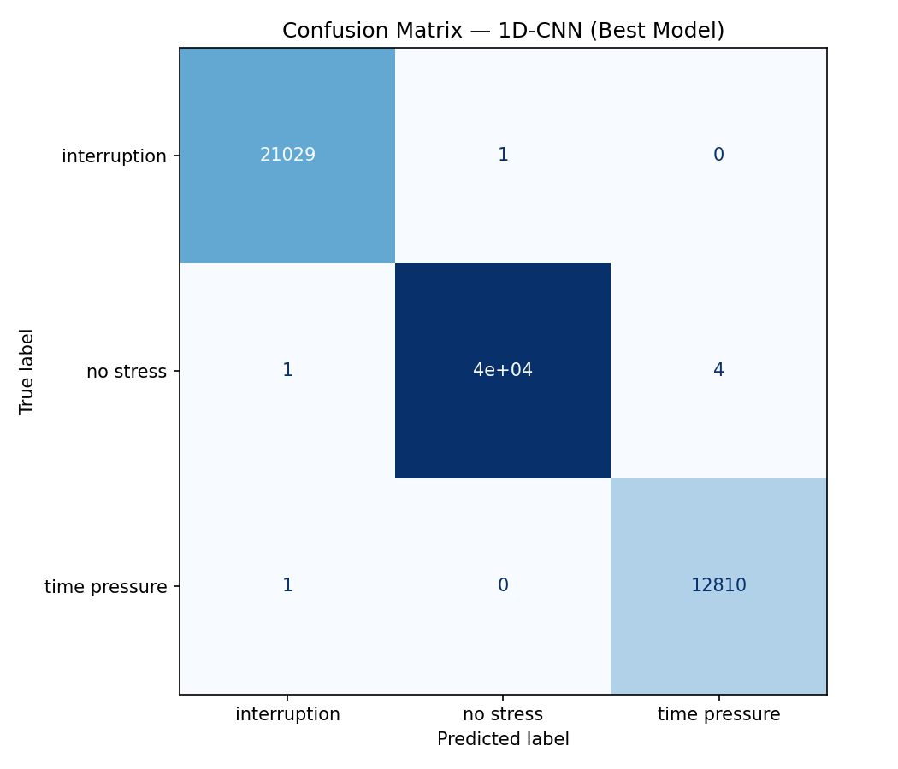

# Detecting Stress Levels from PPG Sensor Data using ANN

## 🎯 Aim

The goal of this project is to predict stress levels using features derived from **Photoplethysmography (PPG) sensor data** by employing multiple deep learning architectures — ANN, 1D-CNN, LSTM, and GRU — and comparing their performance.

---

## 📂 Dataset

- **Source:** [Heart Rate Prediction to Monitor Stress Level — Kaggle](https://www.kaggle.com/datasets/vinayakshanawad/heart-rate-prediction-to-monitor-stress-level)
- **Training samples:** 369,289 | **Test samples:** 73,858
- **Features:** 34 HRV features across three domains:
  - **Time-domain** (19 features): MEAN_RR, SDRR, RMSSD, HR, pNN50, etc.
  - **Frequency-domain** (11 features): VLF, LF, HF, LF_HF ratio, etc.
  - **Non-linear** (4 features): SD1, SD2, sampen, higuci
- **Target classes:** `no stress`, `interruption`, `time pressure`

---

## 📁 Project Structure

```
Detecting Stress Levels from PPG Sensor Data using ANN/
│
├── Dataset/
│   └── README.md            ← Dataset source & description
│
├── Images/
│   ├── class_distribution.png
│   ├── correlation_heatmap.png
│   ├── accuracy_loss_curves.png
│   └── confusion_matrix.png
│
├── Model/
│   ├── stress-ppg-detection.ipynb   ← Full pipeline notebook
│   └── README.md                    ← Model details & results
│
├── Web App/
│   ├── web_app.py           ← Streamlit web application
│   ├── stress_ppg_cnn_model.h5
│   ├── scaler.pkl
│   └── README.md
│
├── README.md                ← (this file)
└── requirements.txt
```

---

## 🧠 Models Implemented

| Model   | Architecture | Test Accuracy |
|---------|-------------|--------------|
| ANN     | 3× Dense layers with Dropout | 99.93% |
| 1D-CNN  | 2× Conv1D → MaxPool → Dense | **99.99%** Best |
| LSTM    | 1× LSTM(64) → Dense | 99.90% |
| GRU     | 1× GRU(64) → Dense | 99.94% |

### Why these models?

| Model | Rationale |
|-------|-----------|
| **ANN** | Strong baseline for tabular HRV feature learning |
| **1D-CNN** | Captures local temporal patterns and short-term signal variations |
| **LSTM** | Handles long-range dependencies in sequential physiological data |
| **GRU** | Lighter LSTM alternative — faster training, competitive accuracy |

---

## 📊 Exploratory Data Analysis

### Class Distribution


### Feature Correlation Heatmap


### Training Accuracy & Loss Curves (1D-CNN)


### Confusion Matrix (1D-CNN)


---

## ⚙️ Preprocessing Pipeline

1. Merged three feature CSV files on `uuid` key
2. Dropped `uuid` and `datasetId` identifier columns
3. Label-encoded target (`condition`: 0 = Interruption, 1 = No Stress, 2 = Time Pressure)
4. Applied `StandardScaler` normalization
5. 80/20 stratified train-test split
6. Reshaped to `(samples, 34, 1)` for sequence-based models (CNN, LSTM, GRU)

---

## 🏆 Results & Conclusion

**1D-CNN** is the best-performing model with **99.99% test accuracy** (only 10 misclassifications out of 73,858 samples). It achieves near-perfect precision, recall, and F1-score across all three stress classes.

Key findings:
- HRV features are highly discriminative for stress classification — even a simple ANN achieves 99.93%
- CNN's local pattern detection outperforms recurrent models for tabular HRV data
- LSTM/GRU are 4× slower per epoch with marginal accuracy difference
- 1D-CNN is the recommended architecture for deployment

---

## 🌐 Web Application

A **Streamlit** web app allows real-time stress level prediction by entering HRV feature values manually.

**To run:**
```bash
cd "Web App"
streamlit run web_app.py
```

---

## 📦 Libraries & Dependencies

```
numpy
pandas
matplotlib
seaborn
scikit-learn
tensorflow
streamlit
joblib
kaggle
```

Install with:
```bash
pip install -r requirements.txt
```

---

## 👤 Author

**Juned Pinjari**
- GitHub: [@juned-pinjari](https://github.com/juned-pinjari)
- Contribution: GSSoC 2026

---

*Part of the [DL-Simplified](https://github.com/abhisheks008/DL-Simplified) open-source repository.*
