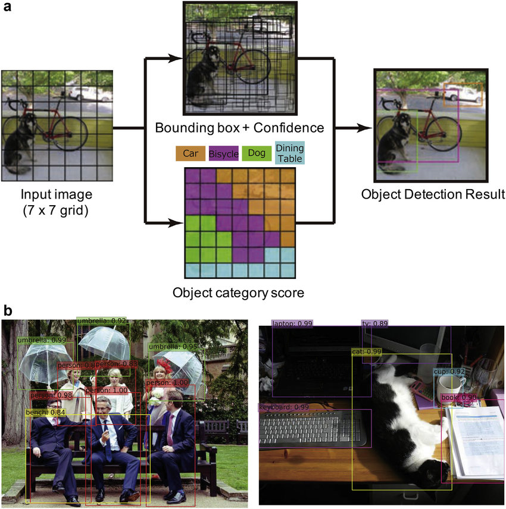
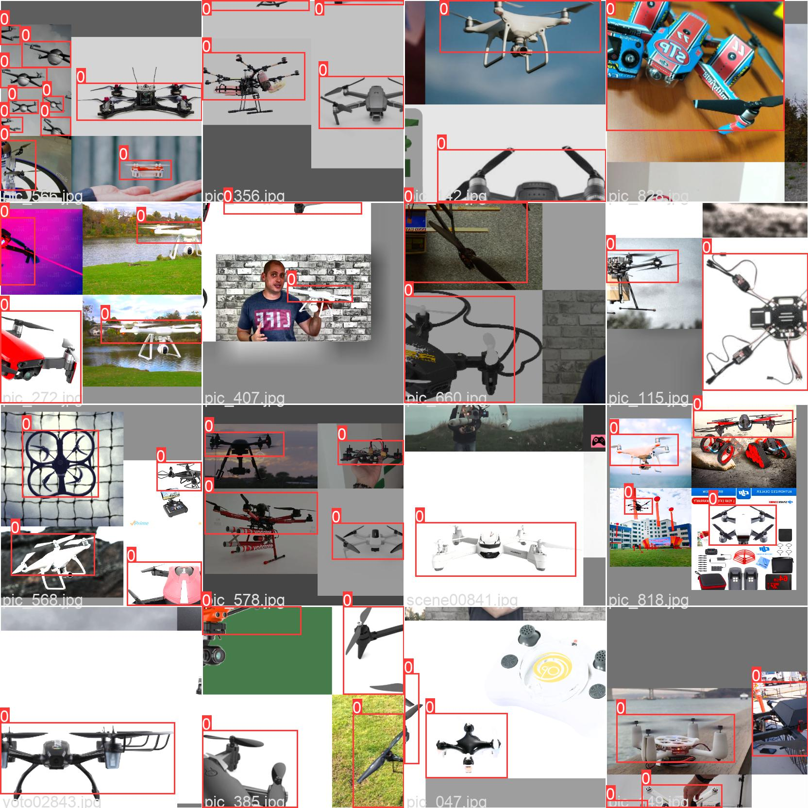
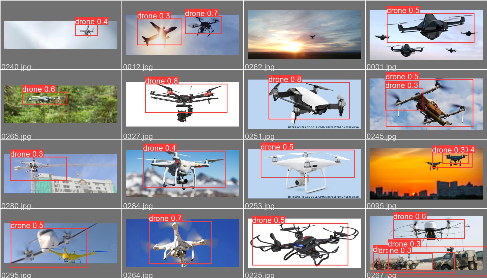

# Drone Detection Using YOLO
This project os an attempt to train models in order to do object-detection particularly Drone Detection. I am using some of the State of the Art(SOTA) architectures built on YOLO(You only look once) technique for this detection. This project is a part of Social Summer of Code(SSOC) and is presented to the project DL-Simplified.

## How to install requirements
```
pip install -r requirements.txt (Python 2), or
pip3 install -r requirements.txt (Python 3)
```
## About Dataset
The dataset used here is provided at https://www.kaggle.com/datasets/muki2003/yolo-drone-detection-dataset.

Read-On Dataset for training yolo drone detection model contain 1012 training image and 347 validation images with annotations. The images are labelled using yolo-labelling and can be directly fed into the YOLO architectures.

## The Model
So the model I have used here is here is YOLO V5S, YOLO V5M, and YOLO V5X, commom industry standard models used for object detection.

### How YOLO works
Compared to the approach taken by object detection algorithms before YOLO, which repurpose classifiers to perform detection, YOLO proposes the use of an end-to-end neural network that makes predictions of bounding boxes and class probabilities all at once.

Following a fundamentally different approach to object detection, YOLO achieves state-of-the-art results beating other real-time object detection algorithms by a large margin.
<center>


Source:Google
</center>

## Training and Testing of the Models
All the three models were trained on Google Colab using the free tier GPU. The results along with their training and validation time and epoches are given below:

| Models | AP@.5 | mAP@.5:.95:| Precision | Recall | Computation-Time| Number of Epochs|
|--------|-------|------------|-----------|--------|-----------------|-----------------|
| custom_YOLOv5s |0.24 | 0.0826 | 0.354 | 0.366 | 5min 7s | 20 |
| YOLOv5m | 0.581 | 0.282| 0.768 | 0.512  |  6min 20s | 20 |
| YOLOv5x | 0.391 | 0.164 | 0.541 | 0.39| 14min 24s | 20 |

### Explanation of the parameters of Yolo:
<ul>
<li><u>Average Precision (AP)</u></li>

Average Precision is calculated as the area under a precision vs recall curve for a set of predictions.

<li><u>Recall</u></li>

Recall is calculated as the ratio of the total predictions made by the model under a class with a total of existing labels for the class. 

<li><u>Precision</u></li>
On the other hand, Precision refers to the ratio of true positives with respect to the total predictions made by the model.

<li><u>mean Average Precision (mAP)</u></li>
The area under the precision vs recall curve gives us the Average Precision per class for the model. The average of this value, taken over all classes, is termed as mean Average Precision (mAP).
</ul>

### Results of Training of the models
Below are the results of the training of Yolo V5m (the best fit for the data):

<center>


</center>

## Conclusion

So since the precision of YOLOv5m is best(0.768), so it comes out to be the best model for the drone-detection. Some same predictions made by this model can be shown below:

### Training Batch:


### Validation Batch:



## Methods and sources Used:
- Michigan's Deep Learning fSta6VK4)or Computer Vision
(https://www.youtube.com/playlist?list=PL5-TkQAfAZFbzxjBHtzdVCWE0Zbhomg7r)
- Pytorch Tutorials
(https://www.youtube.com/playlist?list=PLqnslRFeH2UrcDBWF5mfPGpqQD
- https://github.com/ultralytics/yolov5 (The github repo of creator of Yolo and this repo is imported in the model for detection of drones)

## Tensorboard Implementation
https://tensorboard.dev/experiment/DbgMtA7DRNar6Q1ilDZbTQ/#scalars

## Developer Details
Developed By Aryan Gupta 
(Electrical Engineering Student, IIT Roorkee)
