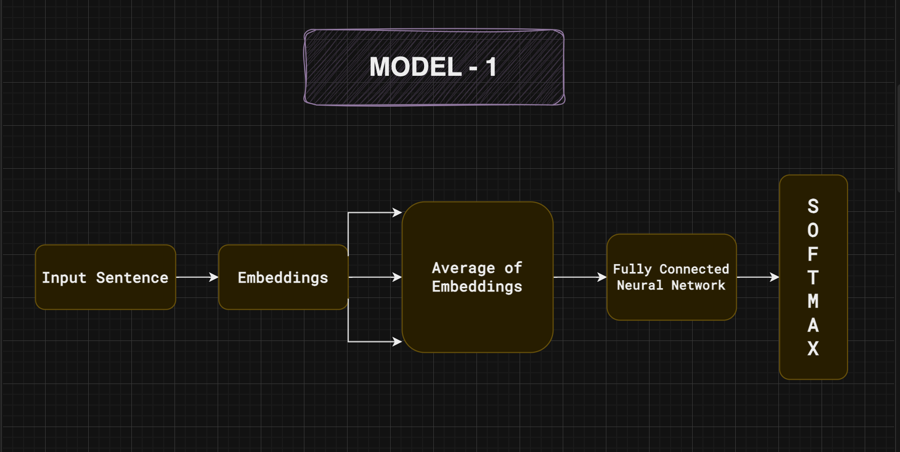
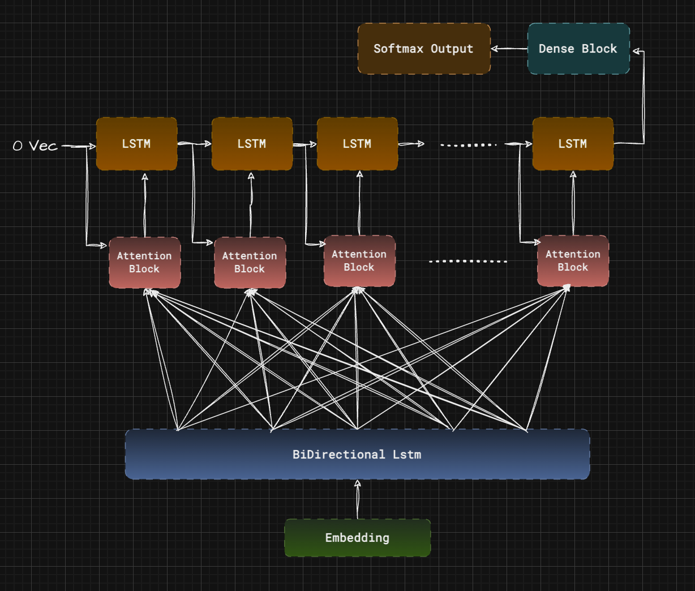

## **Emojify Your Tweets 😉 : Unleash the Power of Neural Networks**

### 🎯 **`Goal`**
---
The Goal is of this project is to analyse a given Tweet sentence and predict a an appropriate Emoji for it.

### 🧵 **`Dataset`**
---
I have used [Twitter Emoji Prediction Dataset](https://www.kaggle.com/datasets/hariharasudhanas/twitter-emoji-prediction) and [Glove Vector Representation](https://www.kaggle.com/datasets/watts2/glove6b50dtxt)

### 🧾 **`Description`** 
---
Emojis are the lifeblood of online expression! This project explored predicting the perfect emoji for your tweets using neural networks. We built two models: a basic one (34% accuracy) and a powerful LSTM (93% accuracy) that considers word order. We fine-tuned the models for optimal performance and analyzed their strengths beyond just accuracy. This paves the way for even more accurate emoji prediction, making your tweets truly shine! 

### 🧮 **`What have I done`**
---
The first thing I did was to get a dataset with a good number of examples and usability.
Then I spent quite a good time researching different architectures and techniques that could be used to solve the problem, and I found solutions that involved the use of word embeddings.

<h3>The first architecture is as follows:</h3>
</img>

In this architecture, given a sentence, we would split it into words and get its GloVe vector representation, i.e., the embeddings.
> - The GloVe vector is a 50-dimensional vector that was trained over a large corpus of texts and documents.
> - and the vocabulary has 400k words.

Now once we obtain the embedding for each word in the sentence, we average out the embeddings, and this mean vector is passed as an input to a Fully Connected NN that has a softmax output layer (There are 20 emojis in the dataset).
The model is then trained and results in a satisfactory performance.

<h3>The Second architecture is as follows:</h3>
</img>

The main problem with the previous model was that the average operation doesn't capture much useful information. So, the best option would be using an LSTM. Now to train the LSTM for a given sentence, we need to pass each word to the LSTM cell i.e., `Tx time steps`. So, all the sentences need to be of the same length, and this can be done using padding and truncation operations.

We are gonna have 2 dictionaries `WORD_TO_VEC` and `WORD_TO_INDICES`.
> - `WORD_TO_VEC`: maps every word in the vocabulary to their vector representations.
> - `WORD_TO_INDICES`: maps every word in the vocabulary to their positions in the vocabulary.

Now the first operation is `sentence_to_indices`: From the name, it's clear that we are going to replace each word in a sentence with their respective indices in the vocabulary, and if the word is not found, it's gonna be 0.

The second thing is building an `Embedding Layer`: We will be converting the vocabulary into a matrix where each row is a vector representation `shape = (400k + 1, 50)` of words. We set it as weights to the Embedding Layer and put `training = False` as we don't want to update them.

The final step is to create a multi-layer LSTM architecture connected to a softmax layer with 20 units (20 emojis...). The model is then trained over 50 epochs and made to overfit the training data. Once it overfits, we use regularization techniques like Dropout to generalize well.

Now the model is saved in keras format and performance analysis is performed like calculating precision , recall , f1-score , accuracy and confusion matrix.

<h3>The Third architecture is as follows:</h3>
</img>

To further improve performance, we introduce an attention mechanism in the model. Attention allows the model to focus on specific parts of the input sequence when predicting the output.

The third model utilizes a pre-trained embedding layer, a bidirectional LSTM, and an attention mechanism before passing the context vector through another LSTM and dense layers for final classification.

First, we use the `pretrained_embedding_layer` function to create an embedding layer from the `WORD_TO_VEC` and `WORD_TO_INDICES` dictionaries. This layer converts input indices into their corresponding word embeddings, with the embedding matrix shape being `(400k + 1, 50)`. Then, a Bidirectional LSTM processes the input embeddings in both forward and backward directions to capture context from both sides. The output is a sequence of LSTM states for each time step.

Next, we integrate the attention mechanism to enhance the model's ability to focus on important parts of the input sequence. The `AttentionLayer` consists of several components: the `Repeator` repeats the previous state `s` to match the shape of the pre-LSTM states; the `Concatenate` layer combines the repeated state with the pre-LSTM states; three dense layers with 128, 64, and 10 units respectively process the concatenated states. The `Energy Dense Layer` computes the "energy" scores for attention using a dense layer with a single unit, and the `Softmax` layer converts these energy scores to attention weights. The `Context Vector` is then calculated as the weighted sum of the concatenated states.

After the attention mechanism, an LSTM layer processes the context vector and updates the state and cell values for each time step. The output of the post-attention LSTM is passed through dense layers with ReLU activation and dropout for regularization. Specifically, the first dense layer has 128 units with ReLU activation, followed by a 0.5 dropout rate. The second dense layer has 64 units with ReLU activation, followed by another 0.5 dropout rate. The final dense layer has 20 units with softmax activation to predict the probability distribution over the 20 emoji classes.

The model is trained with the input sequences, initial states, and target labels, with the initial states for the LSTM set to zeros. The training process involves optimizing the model weights to minimize the categorical cross-entropy loss. This third architecture, by incorporating attention, aims to enhance the model's ability to focus on important parts of the sentence, thereby improving classification performance.

### 🚀 **`Models Implemented`**
 ---
I have used two different models 
- Fully Connected Neural Network.
- Multi-Layer LSTM Architecture.
- Attenion Model.

### 📈 **`Performance of the Models based on the Accuracy Scores`**
---
<table style = "border: 1px solid black;">
    <tr>
        <th>S.No</th>
        <th>Model Name</th>
        <th>Accuracy</th>
    </tr>
    <tr>
        <td>1.</td>
        <td>FCNN</td>
        <td>34.25%</td>
    </tr>
    <tr>
        <td>2.</td>
        <td>LSTM MODEL</td>
        <td>93.42%</td>
    </tr>
    <tr>
        <td>3.</td>
        <td>Attention MODEL</td>
        <td>92.43%</td>
    </tr>
<table>

### 📢 **Conclusion**
---
This project delved into the realm of predicting emojis from text data using neural networks, focusing on tweets as the primary input. We explored three distinct architectures to enhance prediction accuracy:

1. **Fully Connected Neural Network (FCNN)**: Utilizing averaged GloVe embeddings, this baseline model achieved an accuracy of 34.25%. While straightforward, it underscored the need for capturing richer semantic context.

2. **Multi-Layer LSTM**: Addressing the limitations of averaging, we implemented an LSTM architecture that processed sequential data, achieving remarkable accuracy. This model demonstrated 93.42% accuracy on training data and maintained 92% on test data, highlighting the efficacy of LSTM networks in capturing temporal dependencies.

3. **Attention Model**: To further refine performance, we introduced an attention mechanism. This model, incorporating pre-trained embeddings and bidirectional LSTM layers with attention, achieved 92.43% accuracy. The attention mechanism allowed the model to focus on salient parts of the input sequence, enhancing classification performance.

### 🚀 **Next Steps**
---

Continued exploration into advanced neural network architectures and attention mechanisms could unlock even greater accuracy and robustness in emoji prediction tasks. This project lays a solid foundation for further advancements in natural language processing and sentiment analysis.

### ✒️  **`Author`**
---
`Bingumalla Likith |
GSSoC 24 Contributor|
Issue Number #673`

  
