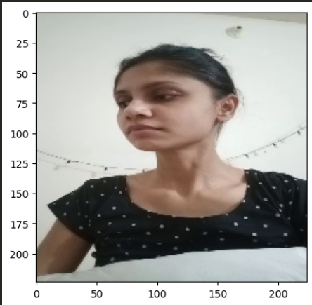
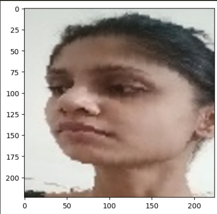
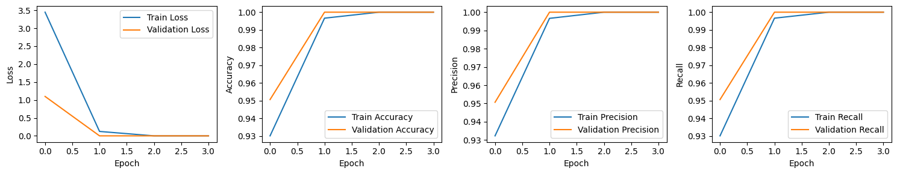
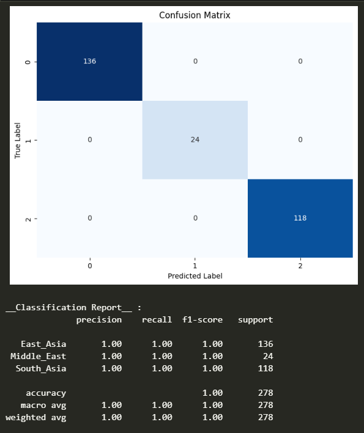
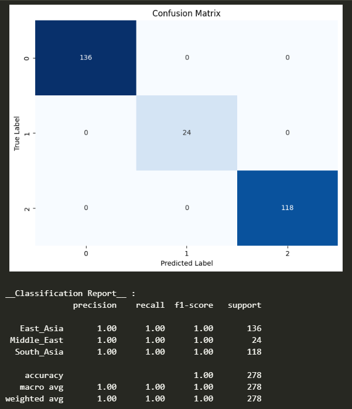

  

# Ethnicity Classification of Asian People

  

## 🎯Goal

  

This project implements different ways of classifying the ethnicities of different Asian people. Used various pre-trained models and Sci-kit learn classifiers. The details of the performances of the above models can be found in the `Models` directory. Also experimented with various kinds of preprocessing methods.

  

## 🧵 **Dataset**

  

Details available in the `Dataset` directory

  

## 🧮 **What I had done!**

  

-  **Image Extraction:** Extracted the image frames from the 10 given videos in the dataset and stored them in the folders of the respective ethnicities: `South_Asia`, `East_Asia`, `Middle_East`

-  **Image Alignment and Face Extraction:** Used `MTCNN` library for processing the images

-  **Train and Test Folders:** Splitted the processed images between the Train and Test folders

-  **Data Augmentation:** Used `ImageDataGenerator` class for augmenting images with the following params :

- brightness_range : Varies brightness

- shear_range : Applies random shear to the image

- zoom_range : Zooms the image to a random degree

- preprocessing_function : Passed the preprocessing function of the respective pretrained model being used.

-  **Transfer Learning Techniques:** VGG-16, ResNet-50, MobileNet V2 and Xception

-  **Sklearn Classifiers:** KNN, SGD, RF classifiers

-  **Model Evaluation:** Used classification metrics and graphs for visualization

## 🚀  **Models Implemented**
  

### Pretrained CNN models used for classification

- VGG-16: best_vgg16_model.h5 (129 MB)

- ResNet50: best_resnet50_model.h5 (384 MB)

- MobileNet V2: best_mobilenetv2_model.h5 (192 MB)

- Xception: best_xception_model.h5 (373 MB)

  `.h5 files` are the model files generated during training in ipynb.

### Sklearn classifier models

- Random Forest classifier: best_rf_classifier.joblib

- Stochastic Gradient Descent: best_sgd_classifier.joblib

- K Nearest Neighbours classifier: best_knn_classifier.joblib
`.joblib files` are the sklearn model files generated during training in ipynb.
  

## 📚 **Libraries Needed**

- tensorflow

- pandas

- opencv-python

- numpy

- tqdm

- mtcnn

- matplotlib

- scikit-learn

- seaborn

 
 *Available in the `requirements.txt` file*

## 📊  **Exploratory Data Analysis Results**

|  |
|:------------------------------------------------------------: |
| *Statistics for the dataset* |
  
| |                                                |
|----------------|---------------------
|*Original image*|*Aligned and cropped image. Done using `MTCNN` lib*| 

## 📈  **Performance of the Models based on the Accuracy Scores**

`MobileNet V2` was performing pretty good and with good speed compared to the other models as it has a light weight architecture.
  

**MobileNet V2 classification metrics with graphs :**

  

|  |
|:--: |
| *Loss and Accuracy curves* |
|  |
| *Confusion matrix* |

  
  Here `RF` and `SGD` were performing better than `KNN` classifier.

  

**Confusion matrices :**

  

|  |
|:--: |
| **Random Forest** |
|  |
| **Stochastic Gradient Descent** |

  

***Note: The accuracy of almost all models were very close to 1 or 100%. This is due to the small variation of the dataset images.***

  

*Metrics and training graphs of all other models can be found within the `Images` directory*

## 💻 **Steps for running this project locally**

- I have originally used Python version `3.11` for this project.

- Install the required packages from the `requirements.txt` file by using one of the following commands in the terminal:

  

-  `pip install -r requirements.txt` (for `pip` environment)

-  `conda install --yes --file requirements.txt` (for `conda` environment)

  

## 📢 **Future Scope**

  

The same training procedure may be followed with ***a larger dataset with wider variety of face images of different ethnicities***. Then the models can generalize well on classifying ethnicities of any real-life image with a fairly good and acceptable accuracy.

  

## ✒️ **Signature**

  

`Subhranil Nandy`  `GSSoC 2024 contributor`

  

Connect with me :)

-  `LinkedIn` : [subhranil-nandy](https://www.linkedin.com/in/subhranil-nandy/)

-  `GitHub` : [Subhranil2004](https://github.com/Subhranil2004)
