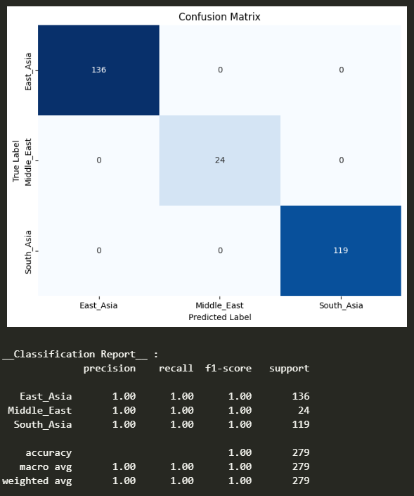

## Models

### Pretrained CNN models
-  VGG-16: best_vgg16_model.h5 (129 MB)
-  ResNet50: best_resnet50_model.h5 (384 MB)
-  MobileNet V2: best_mobilenetv2_model.h5 (192 MB)
-  Xception: best_xception_model.h5 (373 MB)

`MobileNet V2` was performing pretty good and with good speed compared to the other models as it has a light weight architecture.

**MobileNet V2 classification metrics with graphs :**

|  | 
|:--: | 
| *Loss and Accuracy curves* |
|  | 
| *Confusion matrix* |

### Sklearn classifier models
- Random Forest classifier: best_rf_classifier.joblib 
- Stochastic Gradient Descent: best_sgd_classifier.joblib 
- K Nearest Neighbours classifier: best_knn_classifier.joblib 

Here `RF` and `SGD` were performing better than `KNN` classifier.

**Confusion matrices :**

|  | 
|:--: | 
| **Random Forest** |
|  | 
| **Stochastic Gradient Descent** |

***Note: The accuracy of almost all models were very close to 1 or 100%. This is due to the small variation of the dataset images.***

*Metrics and training graphs of all other models can be found within the `model_images` directory*
