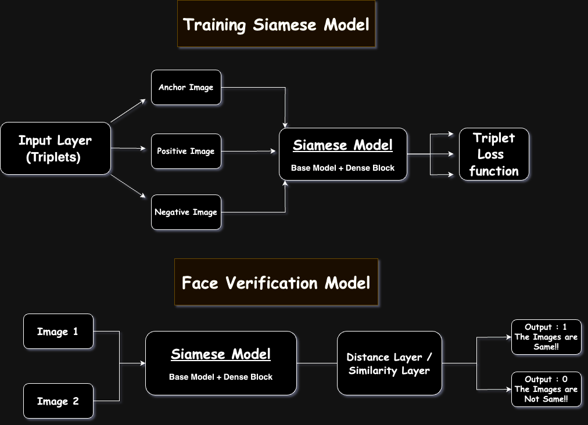

## **Face Recognition Using Siamese Neural Network**

### 🎯 **`Goal`**
---
The Goal of the project is to do Face recognition task using Siamese Neural Network that is trained over a triplet loss function , This is useful in situations where you have limited dataset for training the model.

### 🧵 **`Dataset`**
---
I have used the LFW dataset for training and testing the model.

### 🧾 **`Description`** 
---
This codebase implements a face recognition system using a Siamese Neural Network architecture. It helps you understand how this approach works and tackles the challenge of large datasets by employing one-shot learning techniques.

**Model Functionality:**

* **Feature Extraction:** Generates a 128-dimensional vector embedding for any input image, capturing its key features.
* **Similarity Measurement:** Compares the 128-dimensional vectors of two images to determine their similarity and classify them as belonging to the same person or not.

**Triplet Loss for Training:**

The model leverages a triplet loss function during training. This function uses triplets of images: anchor (reference), positive (same person), and negative (different person). It aims to:

* Minimize the distance between the anchor and positive embeddings.
* Maximize the distance between the anchor and negative embeddings.

This approach helps the model learn robust representations for effective face discrimination.

### 🧮 **`What I had done!`**
---
**Preprocessing and triplet generation:**

I have used a `MTCNN` model that is capable of detecting faces in an image and return the dimensions of bounding boxes that contain the faces , then I crop out these faces and apply some basic filtering and resize the image to a shape of `(100 , 100)` which are then used to form triplets.

I have generated 1000 triplets and saved the numpy array so that we need not repeat the process again and again.

**Model Architecture**

I have used 3 different Models as base models for extracting low level features in an image, over which a block of dense layer has been posed for generating 128 dimensional vector embeddings this network is then trained over Triplet loss function and then it is saved.

Here is a view of How the model looks like !!

After training , I scrape out the `SIAMESE MODEL` and make clone of it as we dont need the triplets input format and the triplet loss function.
Using this Model I structure the final model that takes doublet of images then pass them through `SIAMESE MODEL` that generates 2 vector embeddings.
I add a custom distance layer that takes these embeddings as input then measures the [`COSINE SIMILARITY`](https://builtin.com/machine-learning/cosine-similarity) between them and if this is greater than a particular `THRESHOLD` then both the images are same ,or else different.

**Testing the Model**

I took 100 Positive and 100 negative image pairs from given by the mismatchpairsDevTrain.csv , matchpairsDevTrain.csv file and preprocessed them.
For ease I have saved these pairs and their corresponding labels too in numpy array format.😉

### 🚀 **`Models Implemented`**
 ---
I have used three different models as the base Model as they have been trained on Imagenet dataset , which makes them capable of detecting low level features effectively
- InceptionResnetV2
- VGG19
- MobileNetV2

### 📈 **`Performance of the Models based on the Accuracy Scores`**
---
Here are some trained models and their performances
| Model | Accuracy |
|-------|----------|
| [InceptionResnetV2](https://drive.google.com/file/d/14-ZEqCV30yXUWdL3xoMNIPmkvjHm3AYt/view?usp=sharing) | 0.6582914590835571 |
| [VGG19](https://drive.google.com/file/d/1-aoaTwgfPpvJSgYAlABPghCUyIIWJxMP/view?usp=sharing)| 0.5376884341239929 |
|[MobileNetV2](https://drive.google.com/file/d/1-8Fa_x6TbThDvgJBs5--SwWca40XmwyM/view?usp=sharing) | 0.5778894424438477 |

### 📢 **`Conclusion`**
---
This project successfully implemented a face recognition system using a Siamese Neural Network with triplet loss training. The system demonstrates the capability of achieving reasonable accuracy even with limited training data. Further exploration could involve experimenting with different hyperparameter tuning strategies and more advanced network architectures to potentially improve performance and Use real time dataset for increasing the robustness.

### ✒️  **`Author`**
---
`Bingumalla Likith |
GSSoC 24 Contributor|
Issue Number #512`

  