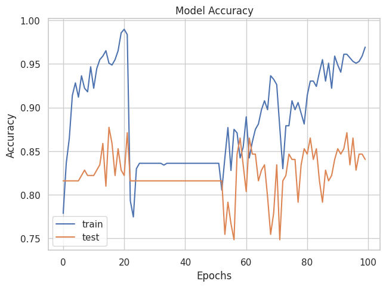

---

# Fire Detection Project Report

## 🎯 Goal

The primary objective of this project is to perform image classification using a custom Convolutional Neural Network (CNN) architecture, as well as leveraging pre-trained models such as VGG19, ResNet50, InceptionV3, and Xception. These models are trained to categorize images into two classes, offering a versatile solution for various image processing tasks.

## 🖼️ Dataset

The dataset used for this project comprises images distributed across two classes: Fire and Non-Fire. As the original dataset allocated for this project was no longer available as open-source, an alternative dataset was utilized.

**Dataset Link**: [Fire Detection Dataset](https://www.kaggle.com/datasets/atulyakumar98/test-dataset/data)

## 🧾 Description

This project utilizes a custom CNN architecture, VGG19, ResNet50, InceptionV3, and Xception for image classification. The custom CNN model is tailored to capture specific features of the dataset, while the pre-trained VGG19 and ResNet50 models leverage transfer learning, enhancing the model's ability to generalize across diverse images.

## 🧮 What I Had Done

1. **Data Preprocessing**:
   - Resizing images to match the input size of the models (e.g., 128x128 pixels for pretrained models).
   - Normalization of pixel values to the range [0, 1].

2. **Model Architectures**:
   - Custom CNN: Designed for specific features of the dataset.
   - VGG19: Leveraging the pre-trained VGG19 architecture.
   - ResNet50: Utilizing the pre-trained ResNet50 architecture.
   - InceptionV3: Utilizing the pretrained model with version V3.
   - Xception: Leveraging the powerful Xception model.

3. **Model Training**:
   - Training the models over the image dataset.
   - Evaluating the models on the validation set to monitor performance.

4. **Save Models**:
   Saving the trained models for future use and predictions.

## 📚 Libraries Needed

1. TensorFlow
2. Matplotlib
3. Numpy
4. Scikit-learn (for additional evaluation metrics if required)
5. Seaborn

## 📊 Visualization Results

### Image Distribution

### Training Result

### Prediction Example

## 📈 Model Performance based on Accuracy Scores

| Model           | Accuracy |
|-----------------|----------|
| Custom CNN      | 100      |
| Xception        | 87.5     |
| ResNet50        | 96.8     |
| InceptionV3     | 89       |
| VGG19           | 90.6     |

## 📢 Conclusion And Result

The image classification project using different models demonstrates effective learning and categorization across two classes. The models achieve promising accuracy on both training and validation sets, showcasing their potential for various image processing applications. Our custom CNN scored the highest with 100% accuracy, while Xception scored the lowest with 87%.

✒️ Your Signature  
Keshav Arora

--- 
