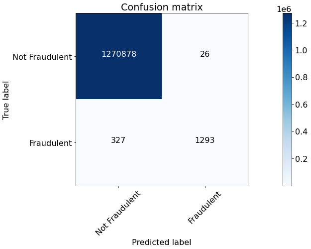
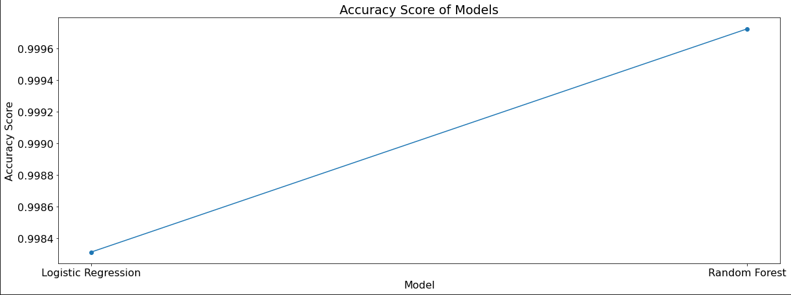

# Fraudulent Transactions Detection

**AIM**

Develop a model for predicting fraudulent transactions for a financial company and use insights from the model to develop an actionable plan.

**DATASET**

https://www.kaggle.com/datasets/miznaaroob/fraudulent-transactions-data

**CONTENT**

Data for the case is available in CSV format having 6362620 rows and 10 columns.

**WHAT I HAD DONE**

First I imported all the required libraries and dataset for this project. Then I did some EDA to find which mode of transaction results into most fraudulent transactions. Then I worked throught to treat any inconsistency in the data. Then I proceeded to build the model. I worked two different models and compared results from both to select mode appropriate one for this project. First I used a logistic regression model classify Fraudulent and Non fraudulent transactions. Next I worked with Random Forest classifier model to amp up the accuracy which resulted in some improvement from the previous LR moel. At the end I observed an accuracy of 99.97.

**MODELS USED**

The models are:

1. Logistic Regression
2. Random Forest Classifier

**HOW TO RUN**

Upload kaggle api key file and fraud_transaction_detection.ipynb file on colab and just run the code.

**LIBRARIES NEEDED**

* Opendatasets (for downloading the dataset)
* Pandas - for data analysis
* Numpy - for data analysis
* matplotlib - for data visualization
* seaborn - for data visualization
* itertools - for data analysis

**VISUALIZATION**

### Dataset Head snipshot

### Confusion matrix for Logistic Regression model

### Confusion matrix for Random Forest Classifier model

By viewing Confusion Matrix it is easily deduced that RFC model is the best model for this project.

### Accuracy score for Random Forest Classifier in comparison to Logistic Regression

**ACCURACIES**

| Model         | Architecture                      | Accuracy in % (on testing data) |
| ------------- |:---------------------------------:|:-------------:|
| Model 1       | Logistic Regression model         |99.83          |
| Model 2       | Random Forest classifier Model    |99.97          |

**CONCLUSION**

I was successfully able to find the most accurate model to detect fraudlent transactions.

# Tanish Khandelwal

Connect with me on Linkedin: https://www.linkedin.com/in/tanish-khandelwal-da/

Check out my Github profile: https://github.com/tknishh
