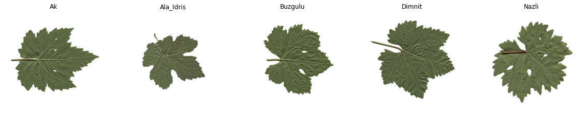

  <h1>Grapevine Leaves Image Identification</h1>

### Goal
The goal of this project is to create a deep learning model to classify GrapeVine Leaves.

### Dataset
The dataset for this project is taken from the Kaggle. Here is the link for the dataset: https://www.kaggle.com/datasets/muratkokludataset/grapevine-leaves-image-dataset

### What Have I Done?
- Imported all the required libraries and dataset for this project.
- Visualized Images
- Split the Dataset into Training & Testing
- Used the Following Models:
  - Basic CNN Model using keras
  - More Advanced CNN Model using MaxPool & Conv2d layers
  - Transfer Learning (using Imagenet)
- Visualize the Accuracy Curve
- Visualize the Error Curve

### Libraries used:
- tensorflow
- matplotlib
- random
- os
- shutil

### Visualizing the Dataset:

### Model 1 - Basic CNN:

### Model 2 - Conv + MaxPool CNN:

### Model 3 - Transfer Learning:

### Author
Code Contributed by: Kunal Agrawal
