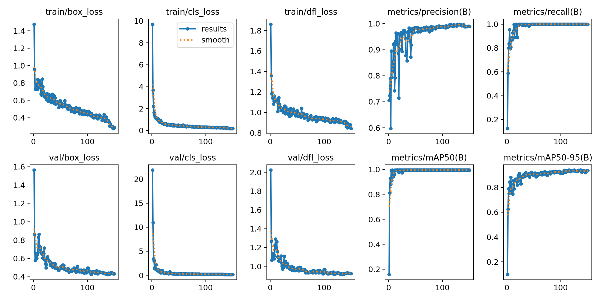
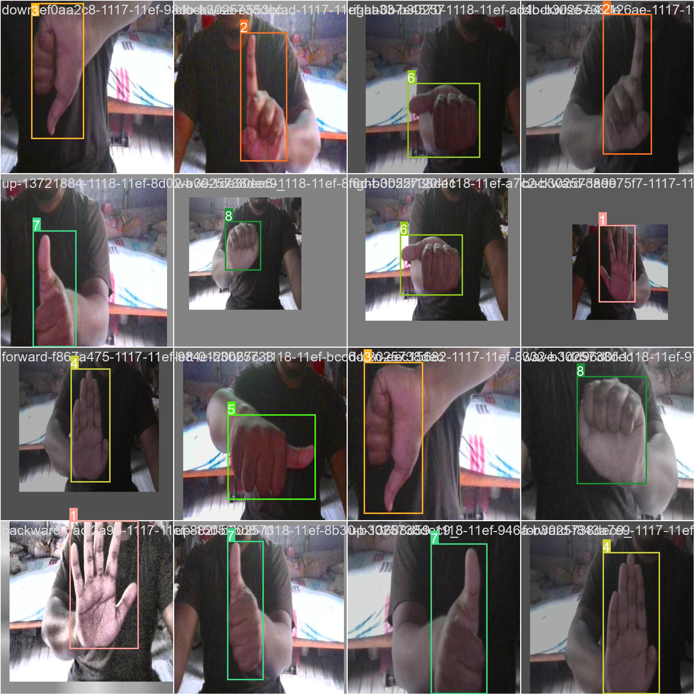
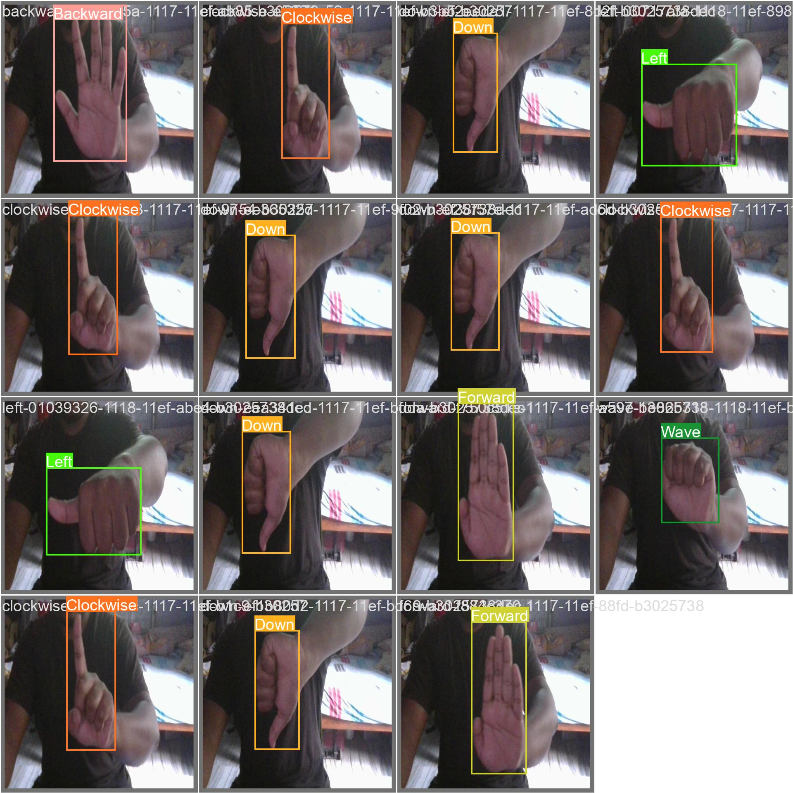

## **Hand Navigation Landmarks Detection**

### 🎯 **Goal**

To do Hand Landmark Detection with 9 classes [AntiClockwise, Backward, Clockwise. Down, Forward, Left, Right, Up, Wave]

### 🧵 **Dataset**

Dataset was made by me and uploaded in Roboflow to annotate
[Dataset](https://app.roboflow.com/nit-raipur-szo7o/handlandmark/browse?queryText=&pageSize=50&startingIndex=0&browseQuery=true)

### 🧾 **Description**

I used YOLOv8 to do Hand Landmark Detection with 9 classes.

### 🧮 **What I had done!**

1. First we need to import ultralytics. 
2. Import the dataset from Roboflow(Dataset can be imported from any source but it just needs to be anotated in YOLOv8 format).
3. Download the yolov8s.pt file from official Github of YOLO and use it to train the model.
4. You can extract the best.pt file generated from training and use the code given below for realtime testing with WebCamera.
5. Use the data.yaml file to get the proper class names.

```python
from ultralytics import YOLO
import cv2
import math
import yaml

cap = cv2.VideoCapture(0)  # For Webcam
model = YOLO("best.pt")

# Load class names from data.yaml
with open("data.yaml", "r") as file:
    data = yaml.safe_load(file)
classNames = data['names']

# Print class names
print("Class Names:", classNames)

# Define colors for different classes
class_colors = {
    'Anticlockwise-dLyJ': (255, 0, 0),  # Blue
    'Backward': (0, 255, 0),        # Green
    'Clockwise': (0, 0, 255),       # Red
    'Down': (255, 255, 0),          # Cyan
    'Forward': (0, 255, 255),       # Yellow
    'Left': (255, 0, 255),          # Magenta
    'Right': (128, 128, 0),         # Olive
    'Up': (128, 0, 128),            # Purple
    'Wave': (0, 128, 128)           # Teal
}

while True:
    success, img = cap.read()
    if not success:
        break

    results = model(img, stream=True)
    for r in results:
        for box in r.boxes:
            # Bounding Box
            x1, y1, x2, y2 = box.xyxy[0]
            x1, y1, x2, y2 = int(x1), int(y1), int(x2), int(y2)
            w, h = x2 - x1, y2 - y1

            # Confidence
            conf = box.conf[0].item()
            # Class Name
            cls = int(box.cls[0])

            # Check if class index is within the range of classNames
            if 0 <= cls < len(classNames):
                current_class = classNames[cls]

                # Only draw if confidence is above threshold
                if conf > 0.50:
                    color = class_colors.get(current_class, (255, 255, 255))  # Default color is white
                    label = f'{current_class} {conf:.2f}'
                    cv2.putText(img, label, (x1, max(35, y1)), cv2.FONT_HERSHEY_SIMPLEX, 1, color, 2)
                    cv2.rectangle(img, (x1, y1), (x2, y2), color, 3)
            else:
                print(f"Warning: Detected class ID {cls} not found in classNames list.")

    cv2.imshow("Image", img)
    if cv2.waitKey(1) & 0xFF == ord('q'):
        break

cap.release()
cv2.destroyAllWindows()

```

### 🚀 **Models Implemented**

YOLOv8 model has been used here because it is very fast to do Real-time Object Detection when compared to ANN or CNN. It's result might not be good locally but when considered globally it provides quite impressive results.

### 📚 **Libraries Needed**

1. Ultralytics 
2. YOLOv8.2.18 🚀 
3. Python-3.10.12 
4. torch-2.2.1+cu121

### 📊 **Exploratory Data Analysis Results**






### 📈 **Performance of the Models based on the Accuracy Scores**

# Model Summary

- **Layers**: 168
- **Parameters**: 11,129,067
- **Gradients**: 0
- **GFLOPs**: 28.5

## Performance Metrics

| Class           | Images | Instances | Box(P) | R    | mAP50 | mAP50-95 |
|:----------------|:-------|:----------|:------|:-----|:------|:---------|
| **all**         | 47     | 47        | 0.994 | 1    | 0.995 | 0.941    |
| **Anticlockwise**| 47    | 7         | 1     | 1    | 0.995 | 0.938    |
| **Backward**    | 47     | 2         | 0.97  | 1    | 0.995 | 0.995    |
| **Clockwise**   | 47     | 4         | 1     | 1    | 0.995 | 0.967    |
| **Down**        | 47     | 5         | 1     | 1    | 0.995 | 0.923    |
| **Forward**     | 47     | 2         | 1     | 1    | 0.995 | 0.995    |
| **Left**        | 47     | 10        | 0.993 | 1    | 0.995 | 0.911    |
| **Right**       | 47     | 6         | 0.989 | 1    | 0.995 | 0.941    |
| **Up**          | 47     | 3         | 1     | 1    | 0.995 | 0.874    |
| **Wave**        | 47     | 8         | 0.994 | 1    | 0.995 | 0.922    |


### 📢 **Conclusion**

YOLOv8 perform remarkably for Hand navigation Landmark Detection giving and accuracy of almost 95% with such varied form of data and classes.
### ✒️ **Your Signature**

**Name- Utsab Samadder**
**Email-utsab.samadder@gmail.com**
**LinkedIn-https://www.linkedin.com/in/utsab-samadder/**
**Github-https://github.com/utsabsamadder**


