# Grad-CAM Visualization for CNN Models

This repository implements Grad-CAM (Gradient-weighted Class Activation Mapping) to visualize and interpret the decision-making process of Convolutional Neural Networks (CNNs) in image classification tasks. It includes a variety of pretrained models such as Xception, ResNet50, and VGG19. The project helps us understand which regions of an image are important for a CNN's prediction, thus providing insights into the inner workings of the model.

## Why Grad-CAM?

Grad-CAM is a technique that uses the gradients of the target class flowing into the final convolutional layer to generate a heatmap highlighting the important regions in an image. This helps us understand the decision-making process of a CNN, making it more transparent and interpretable. Understanding the model's reasoning is crucial for debugging, improving, and trusting the model, especially in sensitive fields like medical image analysis and autonomous vehicles.

Grad-CAM does not require any changes to the model architecture and can be applied to any CNN that has a convolutional layer.

## Models Used

This repository implements Grad-CAM for the following pretrained models:

1. **Xception**:  
   - A deep convolutional neural network that improves upon the Inception architecture. It is designed for efficiency and accuracy in image classification tasks.
   - Xception's depth and the use of depthwise separable convolutions make it a powerful choice for large-scale image classification tasks.

2. **ResNet50**:  
   - ResNet (Residual Networks) introduces skip connections that allow gradients to propagate more effectively through deeper layers, addressing the vanishing gradient problem.
   - ResNet50 is a 50-layer deep network that has been highly successful in image classification tasks due to its deep architecture and skip connections.

3. **VGG19**:  
   - VGG19 is a variant of the VGG architecture, which is known for its simplicity and effectiveness. It uses 19 layers to extract rich feature representations for images.
   - Despite being computationally expensive, VGG19 is still widely used for transfer learning and feature extraction due to its robust performance.

These models were chosen because they are popular and widely used for image classification tasks. Each has different architectural strengths, and by applying Grad-CAM to each, we can compare how different networks focus on various parts of the image.

## How Does Grad-CAM Help Us Understand CNN Decisions?

Convolutional Neural Networks are often considered "black-box" models because it is difficult to understand why they make specific predictions. Grad-CAM helps address this issue by providing a visualization that highlights the areas in an image that contribute most to a given decision.

### Key Steps in Grad-CAM:
1. **Forward Pass**: The input image is passed through the CNN, and the output prediction is obtained.
2. **Backward Pass**: Gradients of the class of interest are computed with respect to the final convolutional layer. These gradients are used to weigh the importance of the activations in that layer.
3. **Generate Heatmap**: The weighted activations are summed up to produce a heatmap that highlights the most important regions in the image.

The heatmap helps to understand what part of the image influenced the model’s prediction the most. This visualization is critical in areas like model debugging, improving model fairness, and ensuring that models are focusing on the correct features.

## Example Visualizations:
The following outputs are generated as part of the Grad-CAM process. Each input image is processed through the **Xception**, **ResNet50**, and **VGG19** models, and the respective Grad-CAM heatmaps are shown as outputs.

### Input Image 1: **Snow Leopard**
   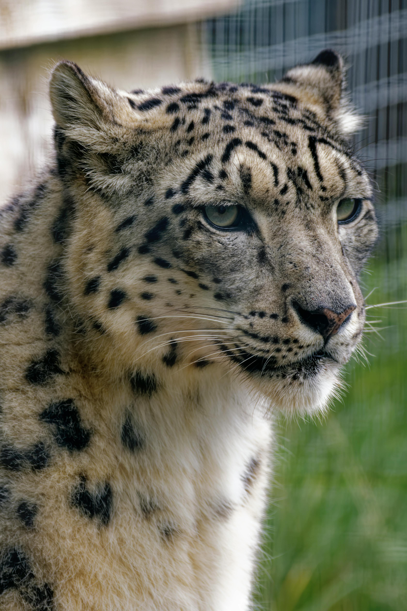  
   This is the original input image that was processed by all three models for classification.

1. **xception_output_1.png**:  
   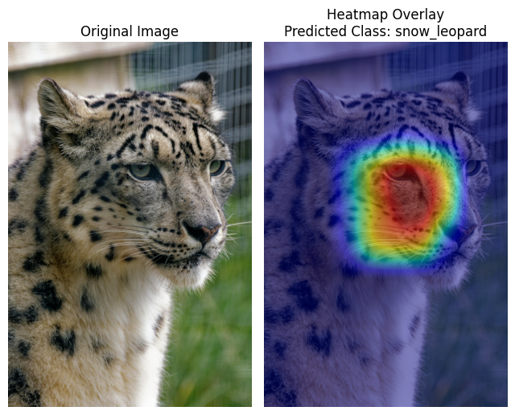  
   This output shows the Grad-CAM heatmap overlaid on the original image, processed by the Xception model.

2. **resnet50_output_1.png**:  
   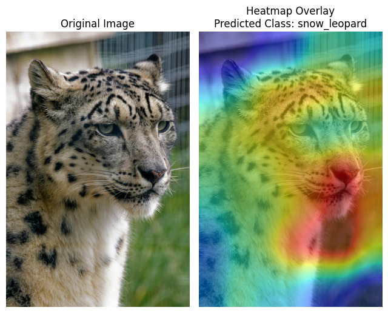  
   This output shows the Grad-CAM heatmap overlaid on the original image, processed by the ResNet50 model.

3. **vgg19_output_1.png**:  
     
   This output shows the Grad-CAM heatmap overlaid on the original image, processed by the VGG19 model.

---

### Input Image 2: **Monument Pillar**
     
   This is the original input image that was processed by all three models for classification.

1. **xception_output_2.png**:  
   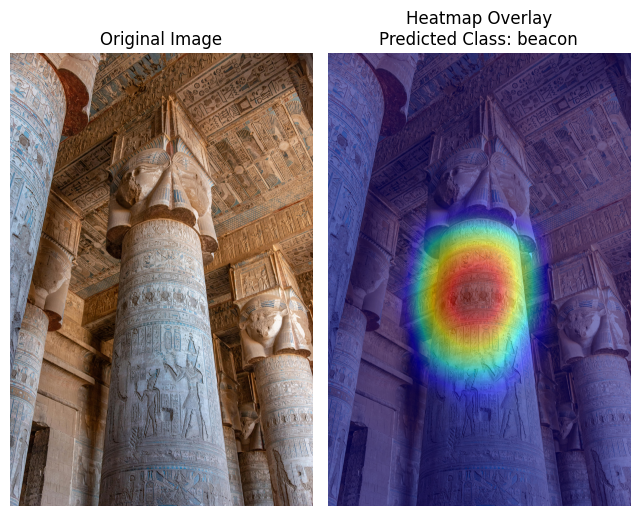  
   This output shows the Grad-CAM heatmap overlaid on the original image, processed by the Xception model.

2. **resnet50_output_2.png**:  
   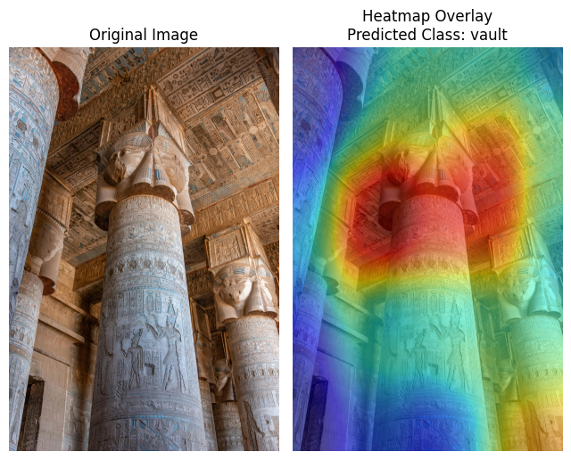  
   This output shows the Grad-CAM heatmap overlaid on the original image, processed by the ResNet50 model.

3. **vgg19_output_2.png**:  
   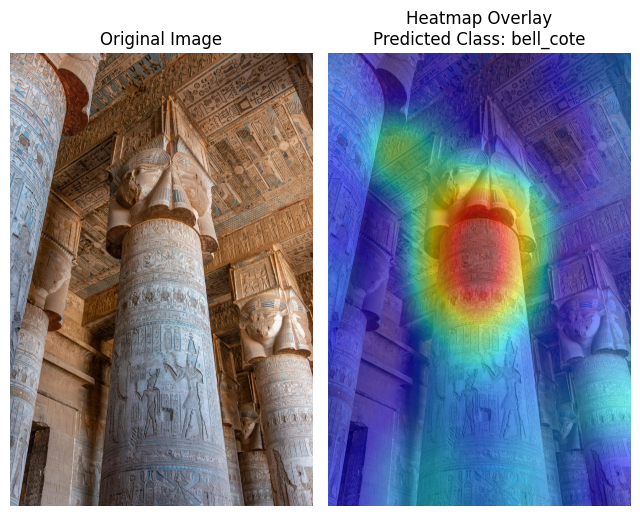  
   This output shows the Grad-CAM heatmap overlaid on the original image, processed by the VGG19 model.

---

### Input Image 3: **War Plane (SR 71)**
   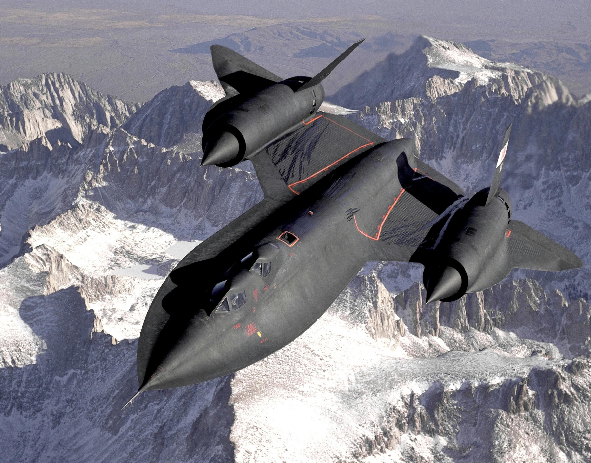  
   This is the original input image that was processed by all three models for classification.

1. **xception_output_3.png**:  
   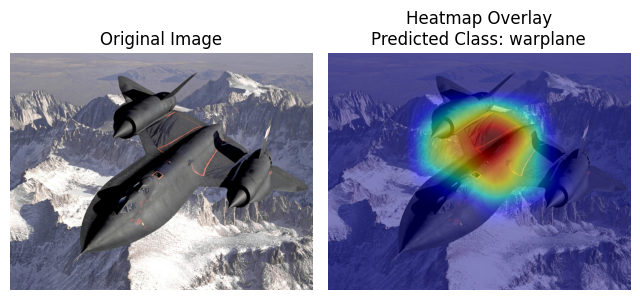  
   This output shows the Grad-CAM heatmap overlaid on the original image, processed by the Xception model.

2. **resnet50_output_3.png**:  
   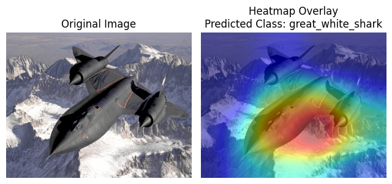  
   This output shows the Grad-CAM heatmap overlaid on the original image, processed by the ResNet50 model.

3. **vgg19_output_3.png**:  
   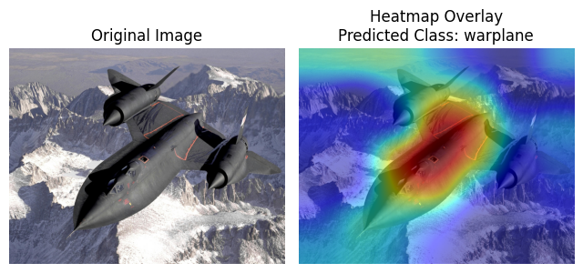  
   This output shows the Grad-CAM heatmap overlaid on the original image, processed by the VGG19 model.

---

### Input Image 4: **Skyscrapers**
     
   This is the original input image that was processed by all three models for classification.

1. **xception_output_4.png**:  
   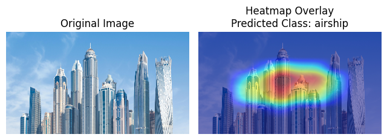  
   This output shows the Grad-CAM heatmap overlaid on the original image, processed by the Xception model.

2. **resnet50_output_4.png**:  
   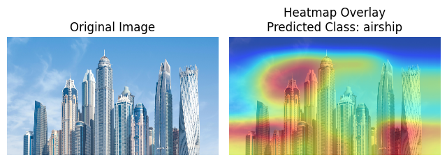  
   This output shows the Grad-CAM heatmap overlaid on the original image, processed by the ResNet50 model.

3. **vgg19_output_4.png**:  
   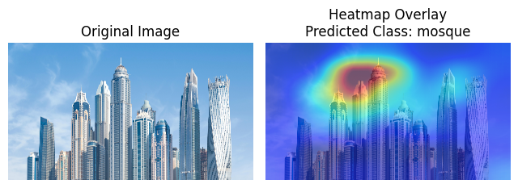  
   This output shows the Grad-CAM heatmap overlaid on the original image, processed by the VGG19 model.

## Requirements

To run this project, you'll need Python 3.6 or later and the following libraries:

- `torch` - PyTorch, the deep learning framework used to implement the models and Grad-CAM.
- `torchvision` - Provides pre-trained models and utilities for image preprocessing.
- `timm` - Library for accessing additional models like Xception.
- `numpy` - For numerical operations.
- `matplotlib` - For plotting and visualizing the heatmaps.
- `Pillow` - Python Imaging Library (PIL) for image handling.
- `requests` - To fetch ImageNet labels.
