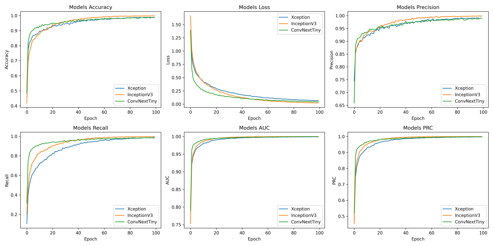
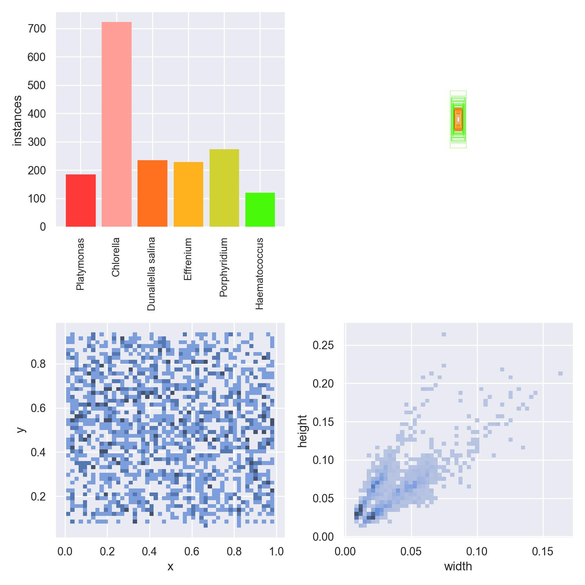
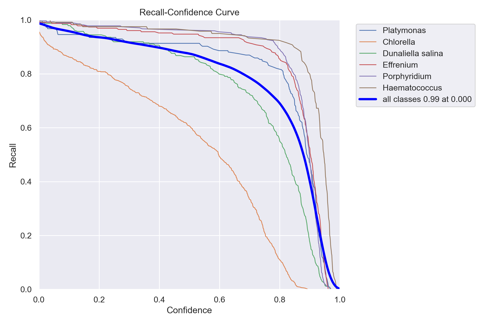
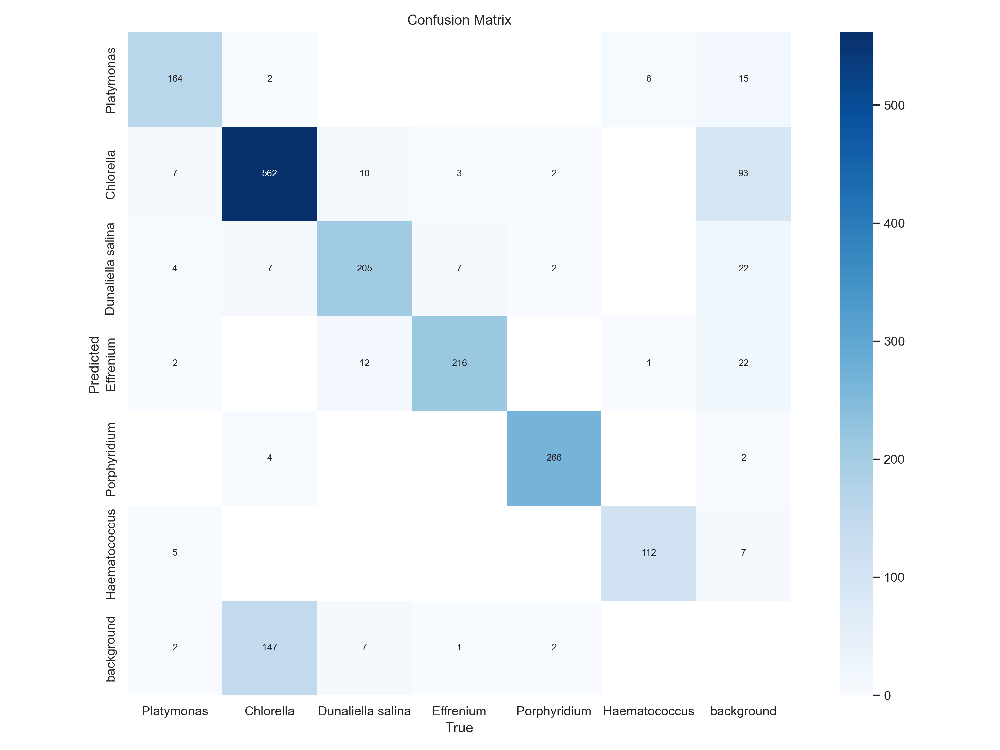

# 🌿 High Throughput Algae Cell Detection 🔍

## 🚀 Project Overview

**📌 Project Title**: High Throughput Algae Cell Detection

**🎯 Aim**: The aim of this project is to detect high throughput algae cells using Deep Learning and OpenCV methods.

**📊 Dataset**: [High Throughput Algae Cell Detection Dataset](https://www.kaggle.com/datasets/marquis03/high-throughput-algae-cell-detection)

## 🛠 Approach

I'm planning to explore the following models for the project:

1. [Xception](https://keras.io/api/applications/xception) 🧠
2. [ConvNeXtTiny](https://keras.io/api/applications/convnext/#convnexttiny-function) 🕹️
3. [InceptionV3](https://keras.io/api/applications/inceptionv3) 🌀
4. [YOLOv8n](https://github.com/ultralytics/ultralytics) 🚀

**Reason for Choosing These Models:**
All mentioned models have approximately close parameters, making them suitable for a comprehensive comparison. I have previous experience working with both pre-trained CNN architectures and YOLOv8 base architectures (tiny and base) for projects like [face-mask-detection](https://github.com/ARPIT2128/SAP-internal-face-mask-detection) and more.

## 📚 Dataset and Models Used

[Dataset](https://github.com/ARPIT2128/DL-Simplified/blob/main/High%20Throughput%20Algae%20Cell%20Detection/Dataset/DATASET.md) description is provided in the project. One of the approaches I recently went through was using [YOLOV5](https://www.kaggle.com/code/marquis03/yolov5-high-throughput-algae-cell-detection) for this dataset (YOLOV5 links to the notebook mentioning the approach).

## 🚀 Getting Started

To get started with the project, follow these steps:

1. Clone the repository:
   ```bash
   git clone https://github.com/abhisheks008/DL-Simplified.git
   cd High Throughput Algae Cell Detection

2. Install dependencies:
    ```bash
    pip install -r requirements.txt

3. Download the dataset from Kaggle and place it in the Dataset/ directory (create if not exist).

4. Run the notebooks for each model to train and evaluate the performance.

## 📂 Directory Structure
```plain
- Dataset/
  - DATASET.md
  - labels.csv
  
- Images/
  - NON_YOLO_RESULTS.png
  - confusion_matrix.png
  - labels.png
  - P_curve.png
  - PR_curve.png
  - R_curve.png
  - results.png
  - val_batch2_pred.jpg

- Models/
  - results/..
  - runs/detect/
    - train
    - train2
  - Xception.ipynb
  - ConvNeXtTiny.ipynb
  - InceptionV3.ipynb
  - YOLOv8n.ipynb
  - yolo8n.pt

- README.md
- requirements.txt
```

## 📊 Visualization

### Non YOLO Results


### YOLOn Results







### Sample Images


## 📈 Accuracies
**Xception Model:**
  - Accuracy: 98.86%

**Conv Model:**
  - Accuracy: 98.92%

**InceptionV3 Model:**
  - Accuracy: 99.83%


## 🚀 What I Had Done

### Step-by-Step Procedure:

1. **Data Preprocessing:**
   - Loaded the dataset and performed necessary data cleaning steps.

2. **Model Training:**
   - Implemented and trained the selected models (Xception, ConvNeXtTiny, InceptionV3, YOLOv8n) on the preprocessed dataset.
   - Tuned hyperparameters for optimal performance.

3. **Evaluation:**
   - Evaluated the models using appropriate metrics.
   - Generated accuracy scores and confusion matrices.

4. **Visualization:**
   - Created visualizations of the non-YOLO results and other relevant insights.

## 📚 Libraries Needed
  - tensorflow
  - matplotlib.pyplot
  - numpy
  - pandas
  - pytorch
  - sebornsplit-folders
  - scikit-learn
  - ultralytics
  - Pillow
  - opencv-python-headless

## 📝 Conclusion

The project utilized a diverse set of deep learning models to detect high throughput algae cells, each with impressive accuracy:

- **Xception Model:** 98.86%
- **Conv Model:** 98.92%
- **InceptionV3 Model:** 99.83%

In addition to the mentioned models, YOLOv8n was also explored, adding to the comprehensive comparison of methodologies.

The chosen models were justified by their close parameters, making them suitable for a thorough evaluation. Previous experience with pre-trained CNN architectures and YOLOv8 base architectures influenced the selection process.

The project's approach, encompassing Xception, ConvNeXtTiny, InceptionV3, and YOLOv8n, provides a robust foundation for algae cell detection using deep learning techniques.

The remarkable accuracies achieved by the models indicate the success of the project in meeting its objectives. The exploration of various models allows for flexibility in choosing the most suitable approach based on specific project requirements and constraints.

## 🧑‍💻 Your Name

- Name: Arpit Sharma
- GitHub: [ARPIT2128](https://github.com/ARPIT2128)  
- LinkedIn: [Arpit Sharma](https://www.linkedin.com/in/arpit-sharma-b3a565222/)