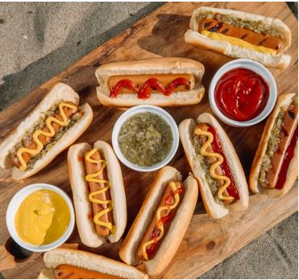
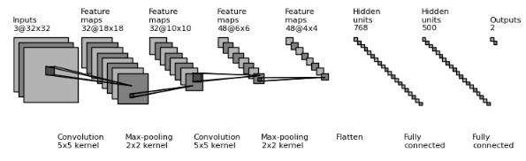
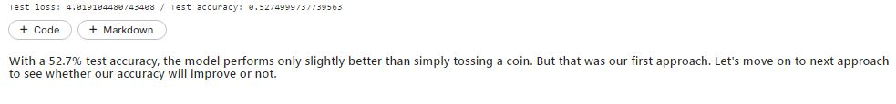
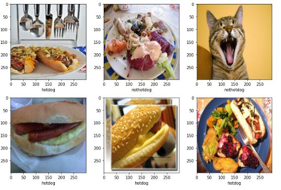
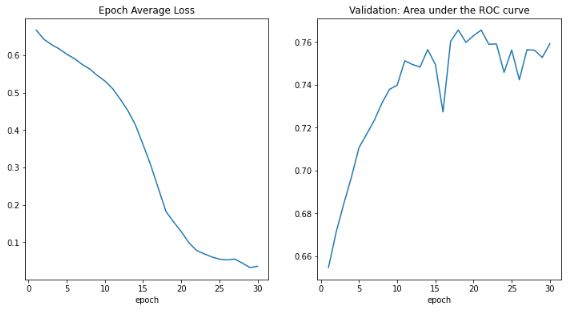
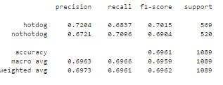
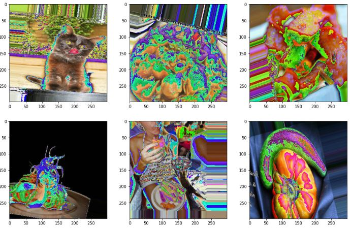
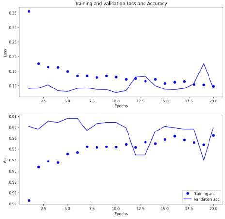
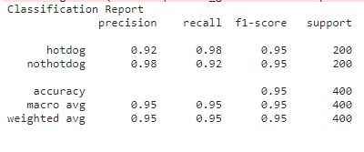
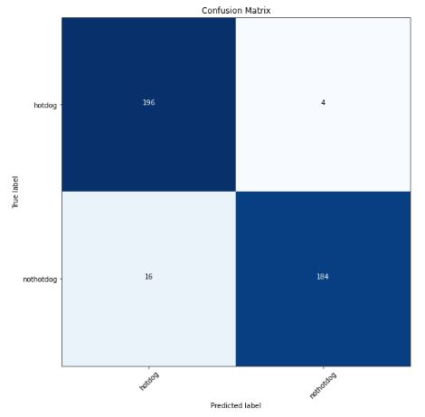

 # Hotdog Prediction Model
 
 

 # Introduction

Hotdog Prediction Model is a Machine Learning based frame work which will predict whether a given image is of hotdog or not. Let's have a talk about the dataset.

# Dataset

The dataset for this project is taken from the Kaggle website. Here is the link for the dataset,https://www.kaggle.com/datasets/thedatasith/hotdog-nothotdog.
Here in the dataset you will find the test and training images for the Hotdog | Not Hotdog dataset. The goal is to use this images for binary classification and predict with the help of our model whether the image is of hotdog or not.
This dataset contains:Training images to be used for developing a binary classification model
2121 images of hot dogs, and 2121 images of other items.Test images to be used after training a binary classification model 200 images of hot dogs, and 200 images of other items.
The total number of images is, of course, 2x2121 for training and 2x200 for testing, with a total of 4,642 files.

# Goal

The goal of this project is to build a machine learning model with highest accuracy, which will predict the image is of hotdog or not.

# Approach

In this notebook we will implement various approaches and compare their accuracy with the help of dataset each approach will be divided into different section. For each approach EDA and all techniques of training and testing will be done seperately. 

# Approach Using CNN
A Convolutional Neural Network is a type of neural network that is used in Computer Vision and Natural Language Processing tasks quite often due to the fact that it can learn to extract relevant features from the input data.
A typical CNN layer can be understood with the help of following diagram:

#### With a 52.7% test accuracy, the model performs only slightly better than simply tossing a coin. But that was our first approach. Let's move on to next approach to see whether our accuracy will improve or not.

# Approach Using MONAI Framework

The MONAI framework is the open-source foundation being created by Project MONAI. MONAI is a freely available, community-supported, PyTorch-based framework for deep learning in imaging field. It provides domain-optimized foundational capabilities for developing  imaging training workflows in a native PyTorch paradigm.

Project MONAI also includes MONAI Label, an intelligent open source image labeling and learning tool that helps researchers and clinicians collaborate, create annotated datasets, and build AI models in a standardized MONAI.

### Visualizing some examples

## Plot the loss and metric

## Classification Report

### With a 69.6% test accuracy, the model performs much better than the previous simple CNN approach. But that is our second approach. Let's move on to next approach to see whether our accuracy will improve or not.

# Approach Using Tensorflow and Transfer Learning

Transfer learning is a method of reusing an already trained model for another task. The original training step is called pre-training. The general idea is that, pre-training “teaches” the model more general features, while the latter final training stage “teaches” it features specific to our own (limited) data. In this approach we have used InceptionResNetV2 as pre-training model and based on this we will transfer the learnings from this model into our model and predict the result.

## Generated Images Using Train Generator

### Loss and Accuracy Plot

## Classification Report and Confusion Matrix

### So here we have obtained the best accuracy from all the approaches that is **95 percent** and in this further scope can be improved by testing different type of pre-trained models like in our approach we have used InceptionResNetV2 . Other Resnet can also be used for transfer learning purpose.

# Conclusion
### We have implemented three different approaches CNN, Monai Pytorch, And Tensorflow with transfer learning and in each case we obtained the accuracy 52.7%,69.7%, and 95% respectively which clearly indicates that transfer learning for this dataset is best when used with InceptionResNetV2 among all approaches which  has been discussed in this file.

Connect with me on Linkedin:https://www.linkedin.com/in/vikalp-tripathi-187190202/ Check out my Github profile: https://github.com/Vikalp981