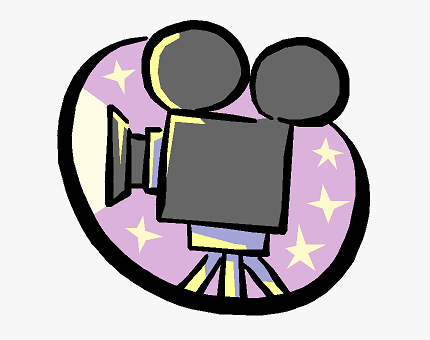
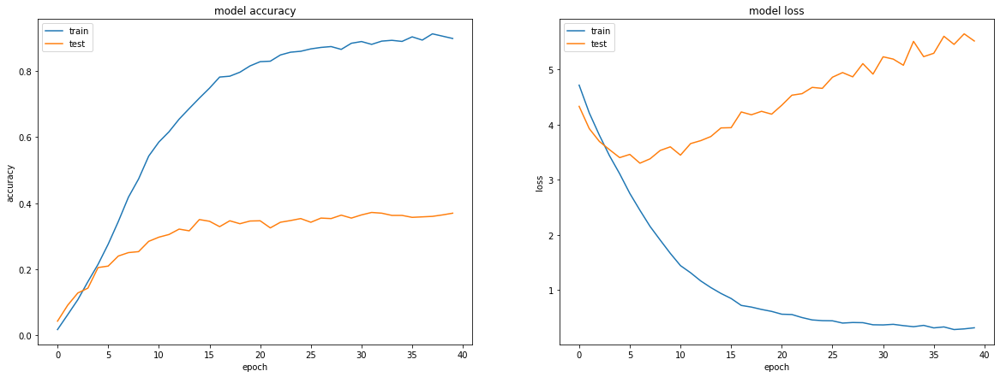
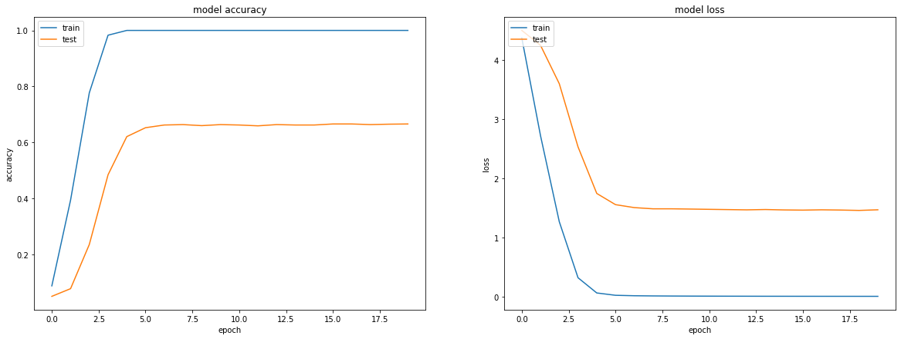

  <h1>Indian Actors Recognition</h1>
  

### Goal

The goal of this project is to create a deep learning model to successfully classify 135 different Indian Actors.

Actors are: Abhay Deol, Adil Hussain, Ajay Devgn, Akshay Kumar, Akshaye Khanna, Amitabh Bachchan, Amjad Khan, Amol Palekar, Amole Gupte, Amrish Puri, Anil Kapoor, Annu Kapoor, Anupam Kher, Anushka Shetty, Arshad Warsi, Aruna Irani, Ashish Vidyarthi, Asrani, Atul Kulkarni, Ayushmann Khurrana, Boman Irani, Chiranjeevi, Chunky Panday, Danny Denzongpa, Darsheel Safary, Deepika Padukone, Deepti Naval, Dev Anand, Dharmendra, Dilip Kumar, Dimple Kapadia, Farhan Akhtar, Farida Jalal, Farooq Shaikh, Girish Karnad, Govinda, Gulshan Grover, Hrithik Roshan, Huma Qureshi, Irrfan Khan, Jaspal Bhatti, Jeetendra, Jimmy Sheirgill, Johnny Lever, Kader Khan, Kajol, Kalki Koechlin, Kamal Haasan, Kangana Ranaut, Kay Kay Menon, Konkona Sen Sharma, Kulbhushan Kharbanda, Lara Dutta, Madhavan, Madhuri Dixit, Mammootty, Manoj Bajpayee, Manoj Pahwa, Mehmood, Mita Vashisht, Mithun Chakraborty, Mohanlal, Mohnish Bahl, Mukesh Khanna, Mukul Dev, Nagarjuna Akkineni, Nana Patekar, Nandita Das, Nargis, Naseeruddin Shah, Navin Nischol, Nawazuddin Siddiqui, Neeraj Kabi, Nirupa Roy, Om Puri, Pankaj Kapur, Pankaj Tripathi, Paresh Rawal, Pawan Malhotra, Pooja Bhatt, Prabhas, Prabhu Deva, Prakash Raj, Pran, Prem Chopra, Priyanka Chopra, Raaj Kumar, Radhika Apte, Rahul Bose, Raj Babbar, Raj Kapoor, Rajat Kapoor, Rajesh Khanna, Rajinikanth, Rajit Kapoor, Rajkummar Rao, Rajpal Yadav, Rakhee Gulzar, Ramya Krishnan, Ranbir Kapoor, Randeep Hooda, Rani Mukerji, Ranveer Singh, Ranvir Shorey, Ratna Pathak Shah, Rekha, Richa Chadha, Rishi Kapoor, Riteish Deshmukh, Sachin Khedekar, Saeed Jaffrey, Saif Ali Khan, Salman Khan, Sanjay Dutt, Sanjay Mishra, Shabana Azmi, Shah Rukh Khan, Sharman Joshi, Sharmila Tagore, Shashi Kapoor, Shreyas Talpade, Smita Patil, Soumitra Chatterjee, Sridevi, Sunil Shetty, Sunny Deol, Tabu, Tinnu Anand, Utpal Dutt, Varun Dhawan, Vidya Balan, Vinod Khanna, Waheeda Rehman, Zarina Wahab, Zeenat Aman

### Dataset

The dataset for this project is taken from the Kaggle. Here is the link for the dataset: https://www.kaggle.com/datasets/iamsouravbanerjee/indian-actor-images-dataset

### What Have I Done?

- Imported all the required libraries and dataset for this project.
- Visualized Images
- Split the Dataset into Training & Testing
- Used the Following Models:
  - Basic CNN Model using keras
  - More Advanced CNN Model using MaxPool & Conv2d layers
  - InceptionV3
  - FaceNet
- Visualize the Accuracy Curve
- Visualize the Error Curve
- Calculated Error & Accuracies for Each Model

### Libraries Used:

- tensorflow
- matplotlib
- random
- os
- shutil

### Visualizing the Dataset:

### Model 1 - Basic CNN:

### Model 2 - Conv + MaxPool CNN:

### Model 3 - InceptionV3:

### Model 4 - FaceNet:

### Accuracies

Model 1

- Loss: 4.905
- Accuracy: 0.741%

Model 2

- Loss: 43.925
- Accuracy: 32.7%

Model 3

- Loss: 5.520
- Accuracy: 37.0%

Model 4

- Loss: 1.464
- Accuracy: 66.6%

### Conclusion
Model 4, (FaceNet) performed the best with the accuracy of 66.6% without any pre-processing of images for this project.

### Author

Code Contributed by: Kunal Agrawal

Github: kunalagra
