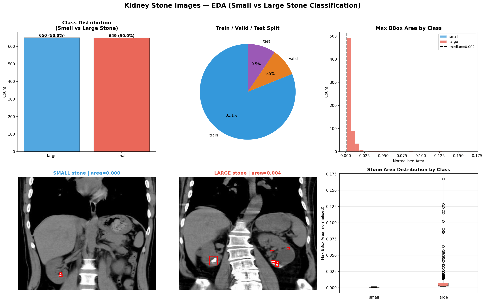
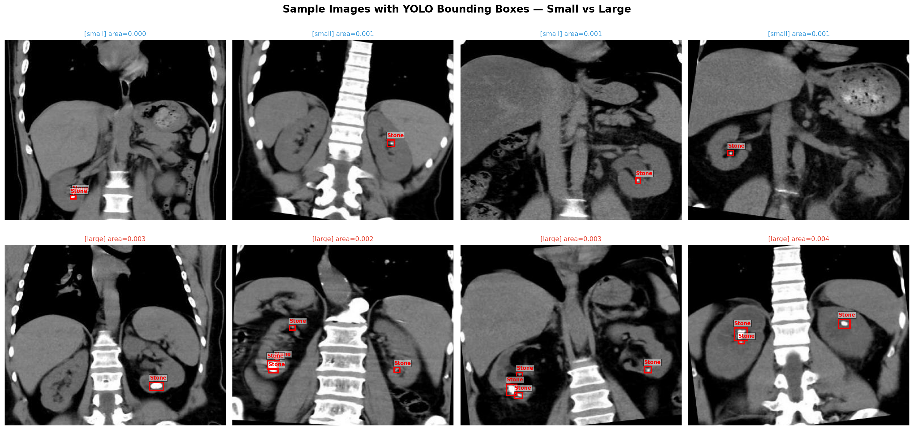
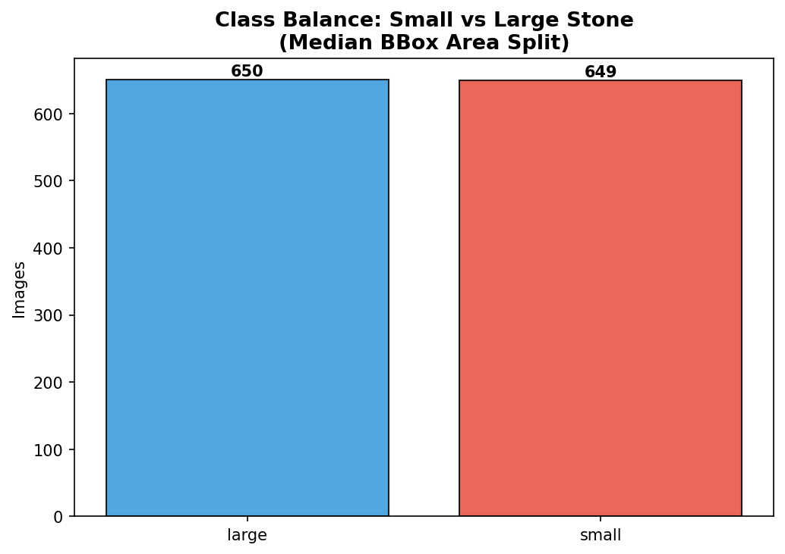
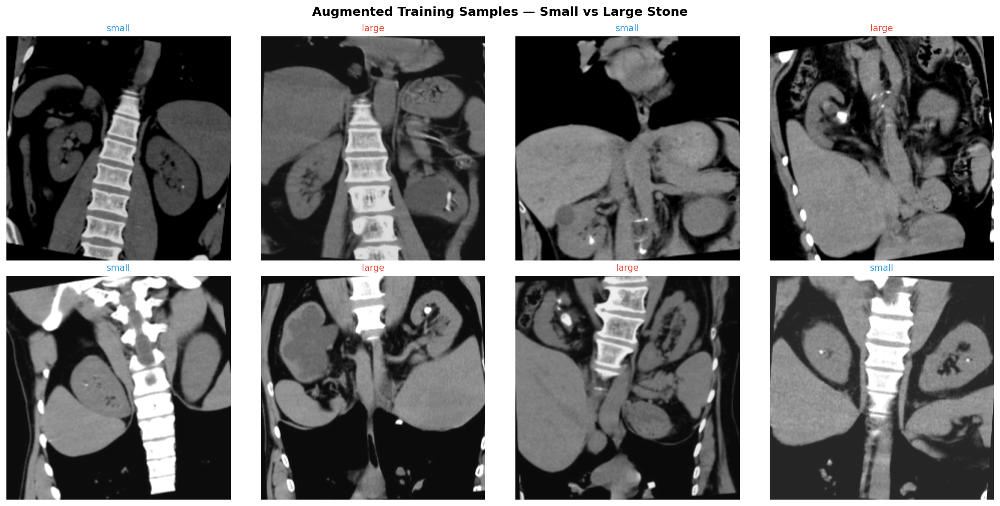
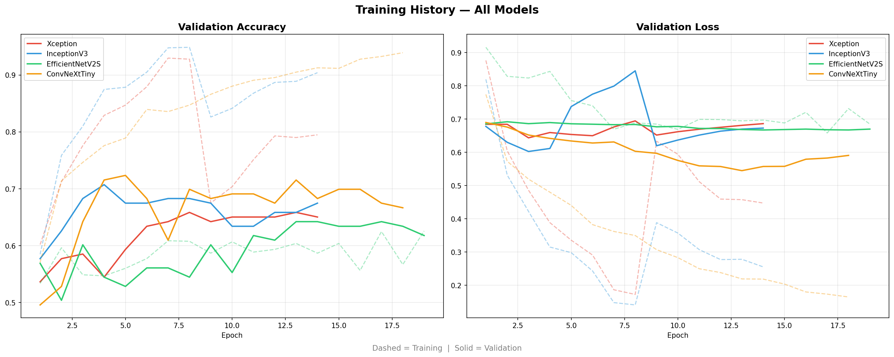
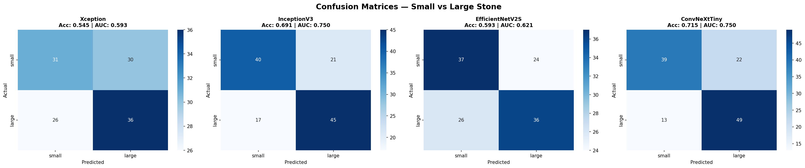
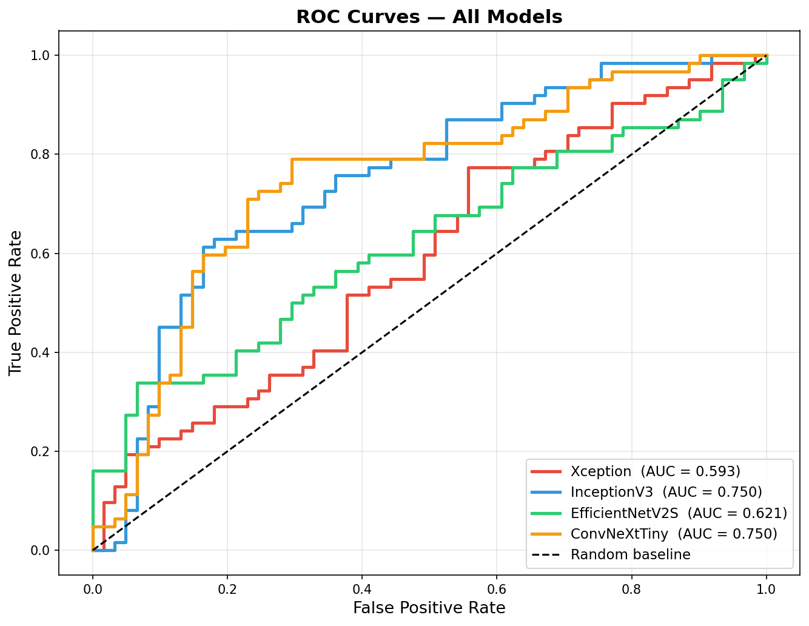
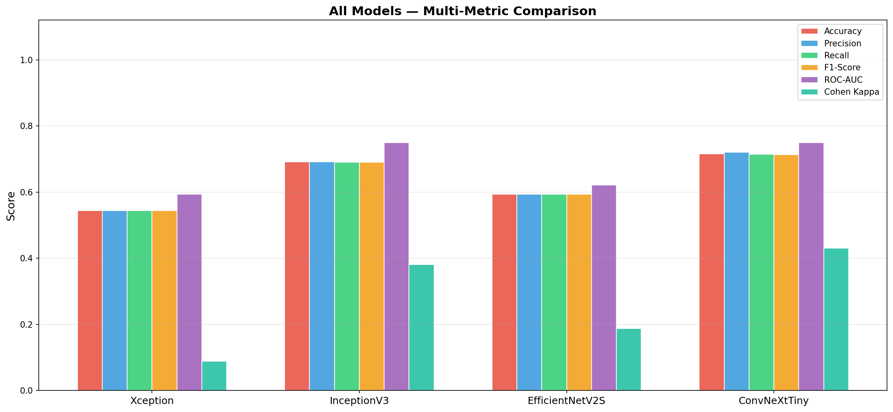

# Kidney Stone Images Classification using Deep Learning

## 🎯 Aim of the Project
To classify CT scan images from the kidney stone dataset using deep learning and compare four transfer learning models by performance metrics to identify the best approach for stone size classification.

## 📂 Dataset
- **Source:** [Kaggle — Kidney Stone Images with Bounding Box Annotations](https://www.kaggle.com/datasets/safurahajiheidari/kidney-stone-images)
- **Total Images:** ~1,299 CT scan images
- **Splits:** Pre-divided into `train / valid / test` (1054 / 123 / 123)
- **Label format:** YOLO `.txt` annotations (bounding boxes), `nc: 1`, class `Tas_Var`
- **Classification task:** Binary — **Small Stone vs Large Stone** (median bounding box area split, threshold = 0.0015)

> All images contain kidney stones (`nc: 1`). Classification is based on the largest bounding box area per image — images above the dataset median are labelled `large`, below are labelled `small`. Large stones visually dominate more of the CT image, providing more learnable signal than stone count.

## 🧠 Models Used

| Model | Key Strength |
|---|---|
| **Xception** | Depthwise separable convolutions — captures subtle stone texture patterns |
| **InceptionV3** | Multi-scale inception modules — handles variation in stone size across the image |
| **EfficientNetV2S** | Fused-MBConv + progressive learning — outperforms V1 on small medical datasets |
| **ConvNeXt-Tiny** | Modern (2022) pure-CNN — matches transformer accuracy with standard convolutions |

All models use **two-phase transfer learning**: frozen base (phase 1) → fine-tuning top 30 layers at `lr=1e-5` (phase 2).

## 🔬 Approach

1. **Dataset Structure Check** — Auto-detect path, walk directory, read `data.yaml`
2. **YOLO Label Parsing** — Extract bounding boxes, compute max area per image
3. **EDA** — Class distribution, bounding box visualisation, stone size distribution, augmentation preview
4. **Median Split Labelling** — `large` if `max_area ≥ 0.0015`, else `small` — guarantees balanced classes
5. **tf.data Pipeline** — AUTOTUNE, caching, shuffling, augmentation (flip, brightness, contrast)
6. **Class Weights** — Applied during training as best practice
7. **Training** — Each model trained independently; histories saved with `pickle` after every model
8. **Evaluation** — Test set evaluation using Accuracy, Precision, Recall, F1-Score, ROC-AUC, Cohen's Kappa
9. **Visualisation** — Training curves, confusion matrices, ROC curves, multi-metric bar chart

## 📊 Exploratory Data Analysis

## 📈 Training Curves

## 🔲 Confusion Matrices

## 📉 ROC Curves

## 🏆 Performance Comparison

| Model | Accuracy | Precision | Recall | F1-Score | ROC-AUC | Cohen κ |
|---|---|---|---|---|---|---|
| **ConvNeXtTiny** | **0.7154** | **0.7201** | **0.7148** | **0.7136** | **0.7501** | **0.4302** |
| InceptionV3 | 0.6911 | 0.6918 | 0.6908 | 0.6905 | 0.7496 | 0.3817 |
| EfficientNetV2S | 0.5935 | 0.5937 | 0.5936 | 0.5935 | 0.6214 | 0.1872 |
| Xception | 0.5447 | 0.5447 | 0.5444 | 0.5440 | 0.5933 | 0.0889 |

## ✅ Conclusion

**Best Model: ConvNeXtTiny** — Accuracy: 71.54% | F1-Score: 0.7136 | ROC-AUC: 0.7501 | Cohen κ: 0.4302

ConvNeXtTiny and InceptionV3 are closely matched on ROC-AUC (0.7501 vs 0.7496), but ConvNeXtTiny edges ahead on all other metrics. Its modern large-kernel convolution design likely captures the spatial spread of larger stones more effectively.

EfficientNetV2S and Xception underperformed, suggesting that depthwise and compound-scaled architectures need more data to generalise well on this subtle medical imaging task.

All models were evaluated beyond plain accuracy using ROC-AUC and Cohen's Kappa — metrics designed for balanced binary tasks in medical imaging.

## 📦 Libraries Used
- TensorFlow / Keras
- NumPy, Pandas
- Matplotlib, Seaborn
- scikit-learn (classification_report, roc_auc_score, cohen_kappa_score)
- pickle (history persistence)

## 🖥️ Platform
Kaggle Notebook — T4 GPU (2×)