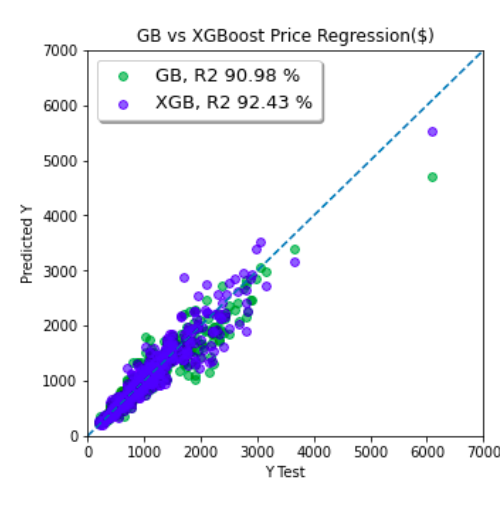

#  Laptop Price Predictor  
## SWOC S4 /World-of-ML/DL-Simplified#334

Full name : Onkar Viralekar

GitHub Profile Link : https://github.com/onkar-1432

Email ID : onkarviralekar.143@gmail.com

What is your participant role? SWOC S4 

**Approach to the problem statement** :
- Data Cleaning and Exploration: Exploring the dataset, handling missing values, and creating new features based on the existing ones.The use of Seaborn and Matplotlib for data visualization is great, and it helps in understanding the distribution of data.

- Encoding:Applied label encoding and handled categorical variables well.

- Machine Learning Models: Implemented several regression models, such as Linear Regression, Decision Tree Regressor, Gradient Boosting Regressor, and XGB Regressor.The evaluation metrics, including Mean Squared Error (MSE), Mean Absolute Error (MAE), and R-squared (R2) Score, provide a comprehensive view of model performance.

### Dataset
The dataset for this project is taken from the Kaggle dataset website. Here is the link for the dataset:  https://www.kaggle.com/datasets/muhammetvarl/laptop-price/data

### MODELS USED
- Linear Regression:
        Description: Linear Regression is a simple regression algorithm that models the relationship between the dependent variable and one or more independent variables using a linear equation.
        Performance: Achieved a decent R-squared score of 0.7629, indicating a moderate fit to the data.

- Decision Tree Regressor:
        Description: Decision Tree Regressor is a non-linear algorithm that makes decisions based on a set of rules, creating a tree-like structure.
        Performance: Demonstrated good predictive accuracy with an R-squared score of 0.8178, capturing more complex relationships.

- Gradient Boosting Regressor:
        Description: Gradient Boosting builds an ensemble of weak learners (typically decision trees) in a sequential manner, where each new tree corrects the errors of the previous ones.
        Performance: Outperformed the other models with a high R-squared score of 0.9098, indicating strong predictive capability.

- XGB Regressor:
        Description: XGBoost (Extreme Gradient Boosting) is an optimized implementation of gradient boosting with additional features for improved speed and performance.
        Performance: Produced excellent results with an R-squared score of 0.9243, demonstrating a high level of accuracy and reliability.

### ACCURACIES
The accuracies of the models used in this project are as follows:
| Model                     | Mean Squared Error (MSE) | Mean Absolute Error (MAE) | R-squared (R2) Score |
|---------------------------|--------------------------|---------------------------|----------------------|
| Linear Regression         | 0.0872                   | 0.2354                    | 0.7629               |
| Decision Tree Regressor    | 0.0671                   | 0.1897                    | 0.8178               |
| Gradient Boosting Regressor| 0.0332                   | 0.1390                    | 0.9098               |
| XGB Regressor              | 0.0279                   | 0.1282                    | 0.9243               |

### Libraries used:
1. numpy.
2. pandas.
3. matplotlib.
4. seaborn.
5. xgboost

### Author

Full Name : Onkar Viralekar
Code contributed by: **Onkar Viralekar**
- Check out my GitHub Profile: https://github.com/onkar-1432