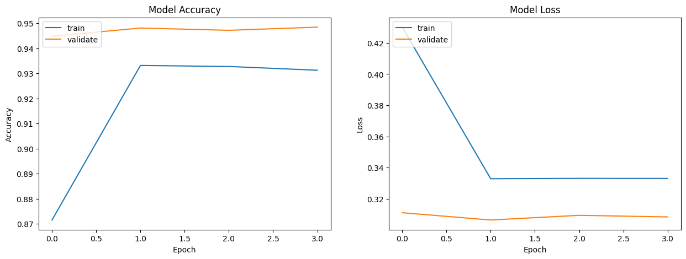
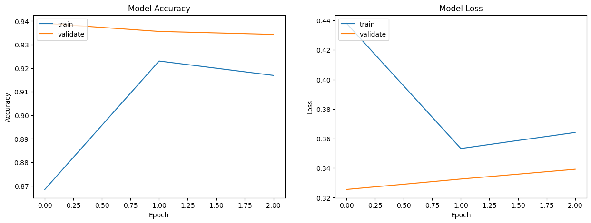
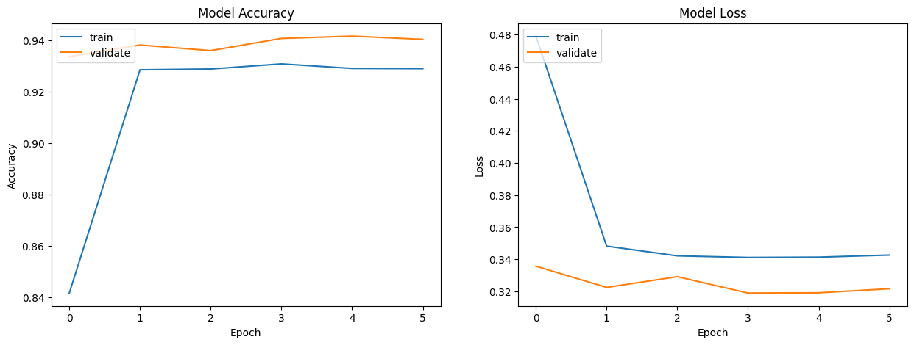
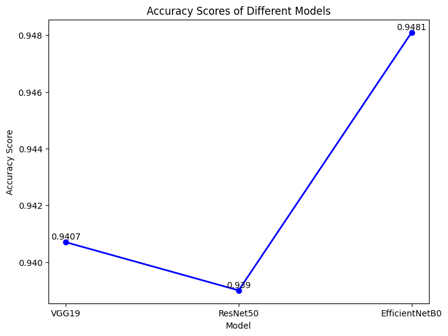
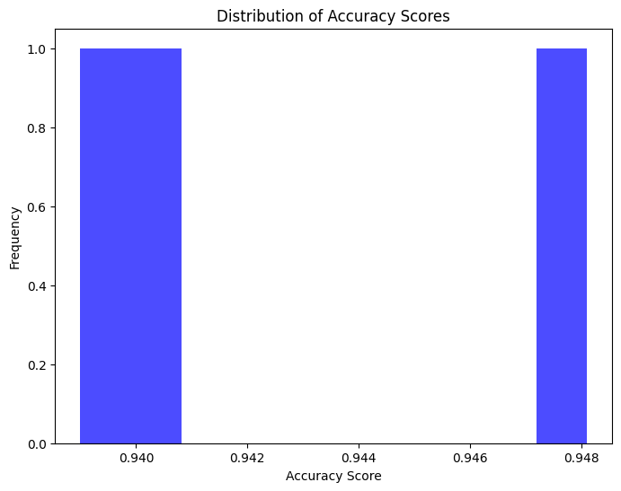
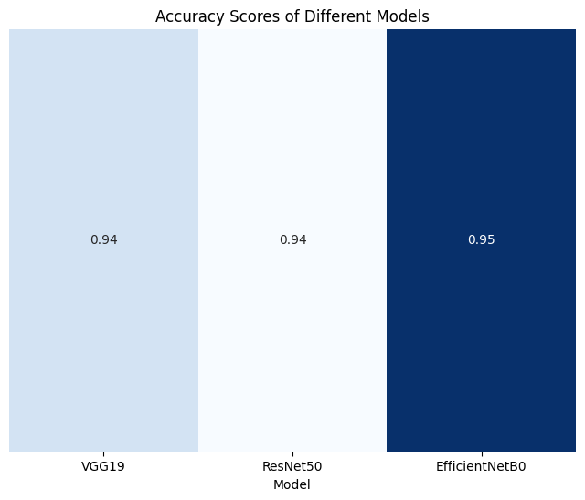

# Malaria Cell Image Classification

## Goal

The main goal of this project is to develop a deep learning model that can accurately predict whether a cell image is parasitized or uninfected with malaria. The model will be trained on a dataset of cell images taken from thin blood smear slides of segmented cells. Various deep learning architectures will be explored to perform this classification task. The model will be evaluated based on the accuracy of its predictions.

## Dataset

The dataset for this project can be found at [Kaggle](https://www.kaggle.com/datasets/iarunava/cell-images-for-detecting-malaria/data) and [TensorFlow Datasets](https://www.tensorflow.org/datasets/catalog/malaria).

For more information about the dataset, please refer to this readme file in the Dataset folder [Dataset Description](../Dataset/README.md)

## Approach

1. Data loading and exploration: Loaded the dataset, examined it via data visualization and ragged tensors, and split it into training and test sets.

2. Data Augmentation: Conducted data augmentation to improve model performance and reduce overfitting. This included random flipping, rotation, translation, and changing the contrast of the images.

3. Hyparameter selection: Resize image size, batch size, epochs are selected. Learning rate scheduling is also done. The model is trained using the SGD optimizer. The loss function used is the binary cross-entropy loss function.

4. Model development:

```bash
  a.EfficientNetB0 (CNN): Transfer learning is applied by using the pre-trained weights of the EfficientNetB0 model on the ImageNet dataset. The first step to transfer learning here is to freeze all layers and train only the top layers. Note that validation accuracy and loss will usually be better than training accuracy and loss. This is because the regularization is strong, which only suppresses training-time metrics. The model achieved an accuracy of 94.81% on the evaluation set.
```

```bash
  b.ResNet50 (CNN): Similar to the EfficientNetB0 model, the ResNet50 model is also trained using transfer learning. For top layers, the model uses a GlobalAveragePooling2D layer and a Dense layer with a sigmoid activation function. Batch normalization is also applied to the model. The model achieved an accuracy of 93.90% on the evaluation set.
```

```bash
  c.VGG19 (CNN): Like the previous two models, the VGG19 model is also trained using transfer learning. For top layers, same layers as the ResNet50 model and EfficientNetB0 model are used. The model achieved an accuracy of 94.07% on the evaluation set.
```

5. Model evaluation: Evaluated the performance of each model using appropriate metrics such as training and validation accuracy and loss. The model with the highest accuracy on evaluation is selected as the best performing model for this task considering used hyperparameters.

## Libraries Needed

- Numpy
- Matplotlib
- Seaborn
- Tensorflow
- Keras
- Keras-cv

## Accuracies

| Model          | Accuracy |
| -------------- | -------- |
| EfficientNetB0 | 94.81%   |
| ResNet50       | 93.90%   |
| VGG19          | 94.07%   |

## Accuracy Graphs

- Training and Validation Accuracy & Loss Graphs for EfficientNetB0 Model
  

- Training and Validation Accuracy & Loss Graphs for ResNet50 Model
  

- Training and Validation Accuracy & Loss Graphs for VGG19 Model
  

## Model Comparison

- Line plot of the accuracy of the three models on the evaluation set
  

- Distribution of the accuracy of the three models on the evaluation set
  

- Heatmap of the accuracy of the three models on the evaluation set
  

## Conclusion

In conclusion, this project aimed to classifies malaria infected and uninfected cells using deep learning models. The models developed were EfficientNetB0, ResNet50, and VGG19. The models were evaluated based on their accuracy on the evaluation set. The model with the highest accuracy was selected as the best performing model for this task. Among the models developed, the EfficientNetB0 model achieved the highest accuracy of 94.81% on the evaluation set. One of the reason of this is State-of-the-Art accuracy of EfficientNet on both imagenet and common image classification transfer learning tasks. EfficientNetB0 along with other EfficientNet family models (B1 to B7) represents a good combination of efficiency and accuracy on a variety of scales.

## Author [Sitam Meur](https://github.com/sitamgithub-MSIT)

## References

- Keras Documentation: https://keras.io/api/
- TensorFlow Documentation: https://www.tensorflow.org/api_docs
- TensorFlow Datasets: https://www.tensorflow.org/datasets
