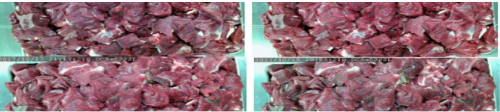
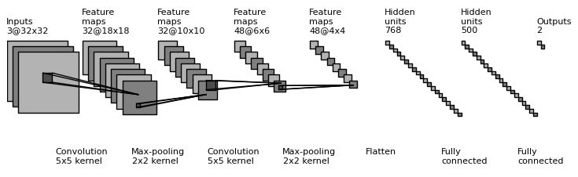
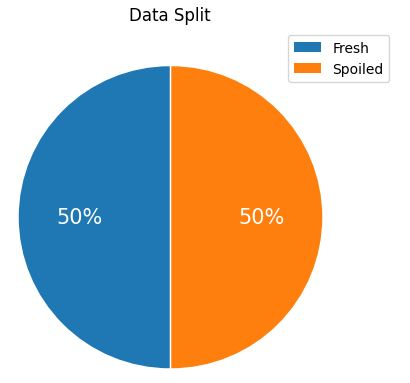
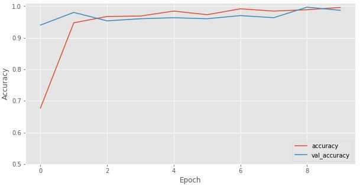
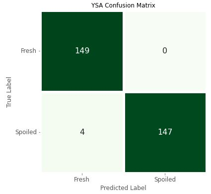
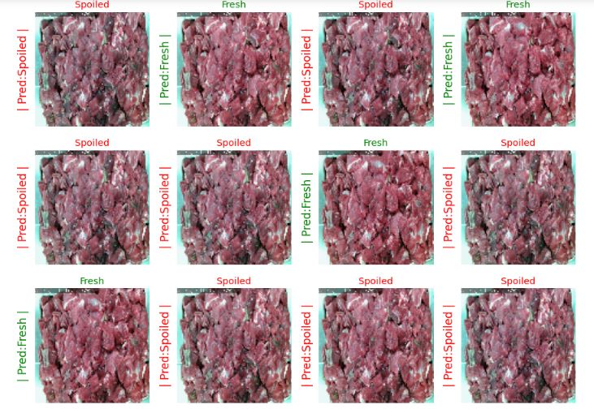
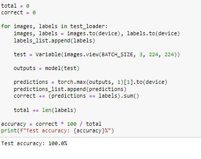
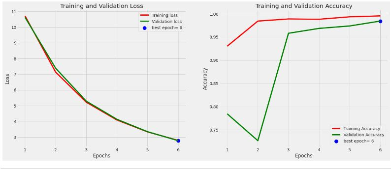
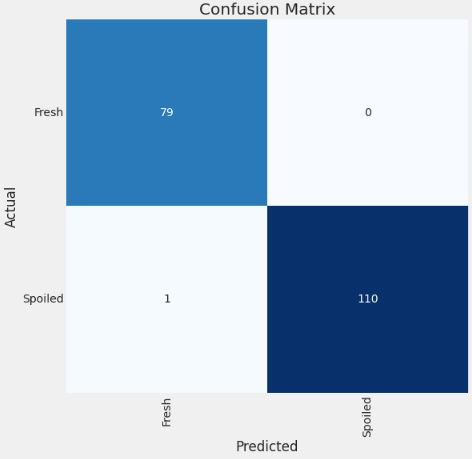
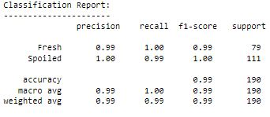

# Meat Quality Assessment Model

# Introduction
​
Meat Quality Assessment Model is a Machine Learning based frame work model which will predict whether a given image of meat is spoiled or fresh. Let's have a talk about the dataset.
​
# Dataset
​
The dataset for this project is taken from the Kaggle website. Here is the link for the dataset,https://www.kaggle.com/datasets/crowww/meat-quality-assessment-based-on-deep-learning
This dataset contains 2 classes, fresh and spoiled red meat samples collected from a supermarket in Izmir, Turkey for a university-industry collaboration project at Izmir University of Economics, and this work was published in ASYU 2019.Images were collected via an IP camera and the resolution of the images are 1280 x 720. There are 1896 images in total, 948 per class.
​
If you use this dataset in your work, please consider to cite:
​
O.Ulucan , D.Karakaya and M.Turkan.(2019) Meat quality assessment based on deep learning. In Conf. Innovations Intell. Syst. Appli. (ASYU)
​
# Goal
​
The goal of this project is to build a machine learning model with highest accuracy, which will predict whether the meat is spoiled or fresh with the help of image.
​
# Approach
​
In this notebook we will implement various approaches and compare their accuracy with the help of dataset each approach will be divided into different section. For each approach EDA and all techniques of training and testing will be done seperately. 

# Approach Using CNN
A Convolutional Neural Network is a type of neural network that is used in Computer Vision and Natural Language Processing tasks quite often due to the fact that it can learn to extract relevant features from the input data.
A typical CNN layer can be understood with the help of following diagram:

## Here we can see that dataset is equally splitted so it is not unbalanced.

## Accuracy has been shown with varying number of epochs

## Some of the predictions and actual result.

### We obtained an accuracy of **98.6** percent by using CNN. Let us now see another approaches and test whether the accuracy will improve or not by classifying it with another approach

# Approach Using Pytorch

### So, as we can see with this approch we have received a 100% accuracy. Now just for comparison let us see another approach using transfer learning to see whether it has same accuracy or less than this

# Approach Using Tensorflow and Transfer Learning

Transfer learning is a method of reusing an already trained model for another task. The original training step is called pre-training. The general idea is that, pre-training “teaches” the model more general features, while the latter final training stage “teaches” it features specific to our own (limited) data. In this approach we have used **MobileNetV2** as pre-training model and based on this we will transfer the learnings from this model into our model and predict the result.

## Loss and accuracy of training and validation dataset

## Confusion matrix obtained is:

### So here we have obtained the  accuracy  **99 percent** and in this further scope can be improved by testing different type of pre-trained models like in our approach we have used MobileNetV2 . Other Resnet can also be used for transfer learning purpose.

# Conclusion
### We have implemented three different approaches CNN,  Pytorch, And Tensorflow with transfer learning and in each case we obtained the accuracy 98.6%,100%, and 99.47% respectively which clearly indicates that Pytorch for this dataset is best among all approaches which  has been discussed in this file.
Connect with me on Linkedin:https://www.linkedin.com/in/vikalp-tripathi-187190202/ Check out my Github profile: https://github.com/Vikalp981
