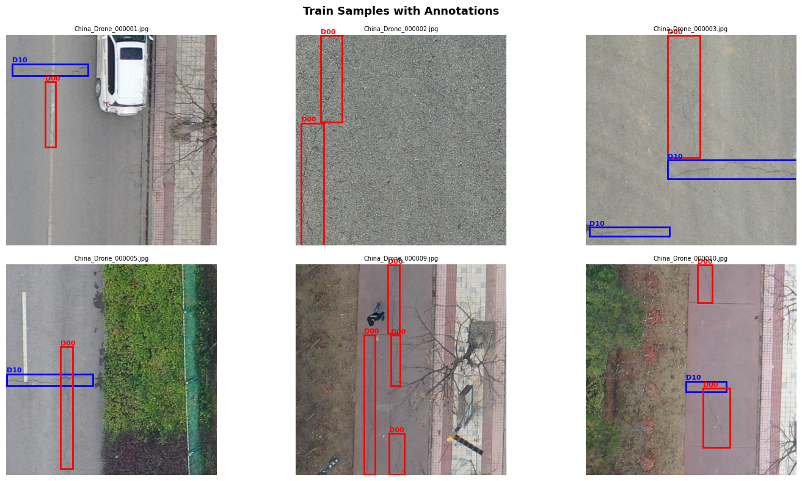
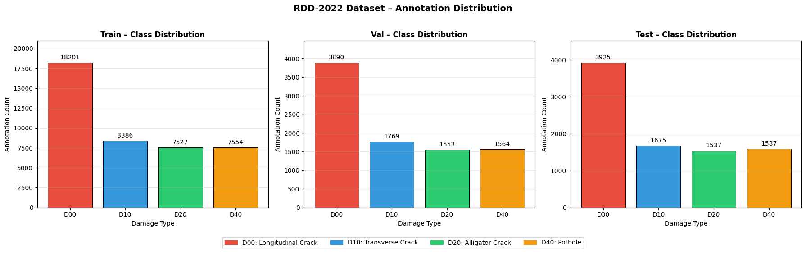
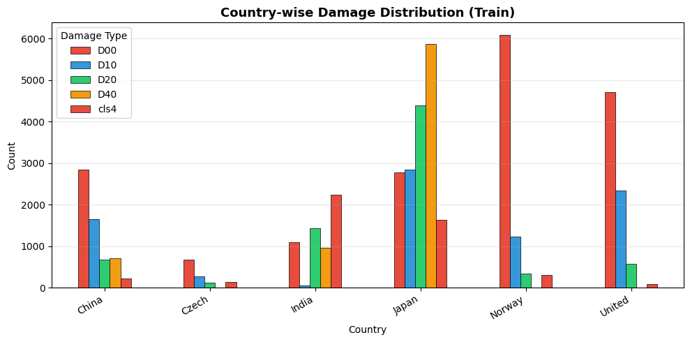
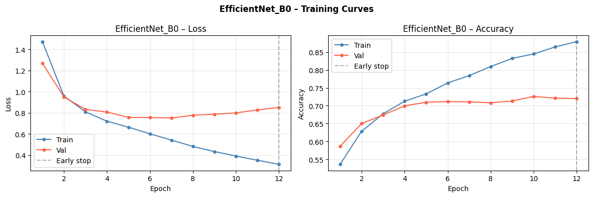
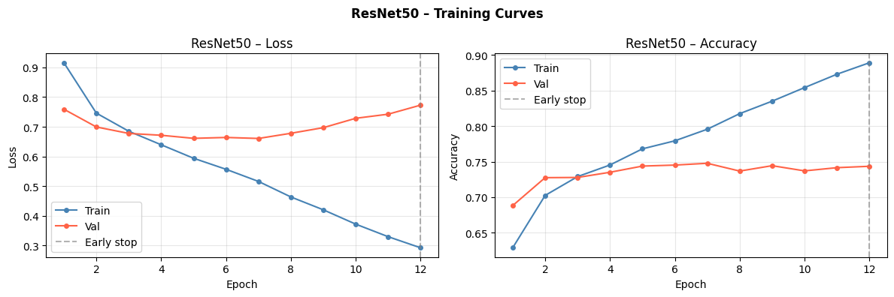
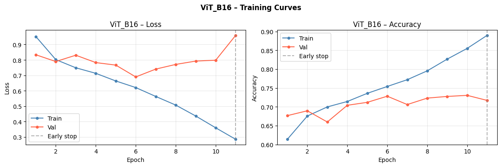
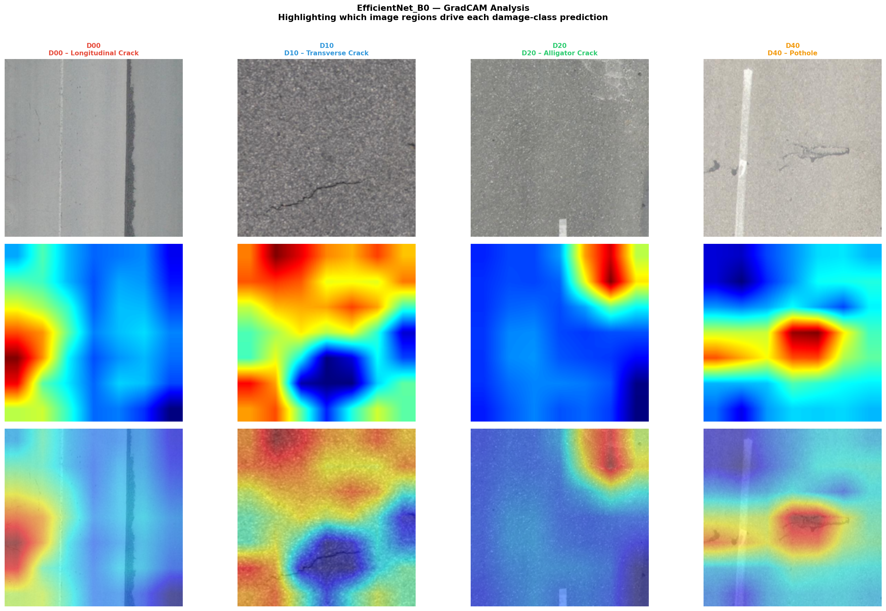
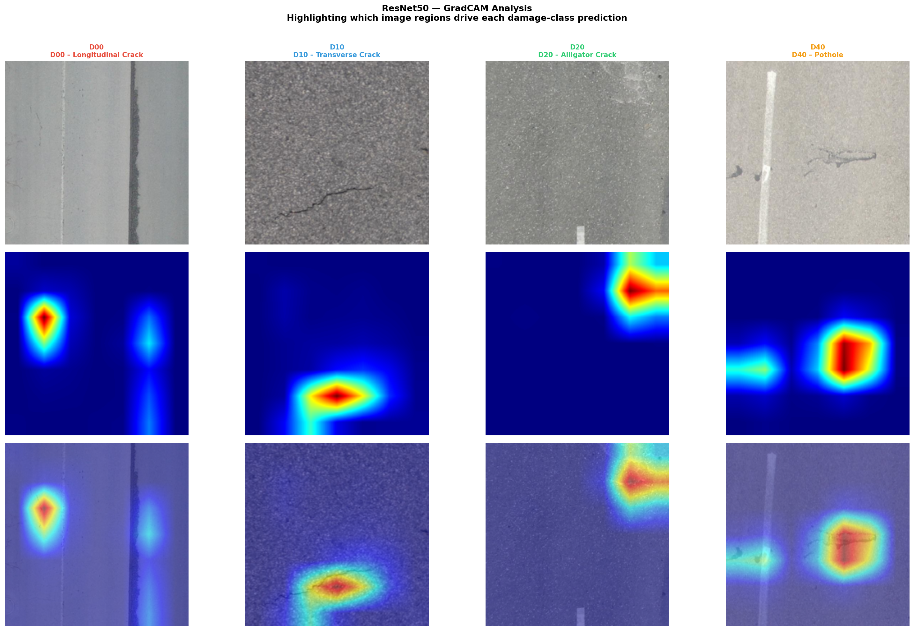
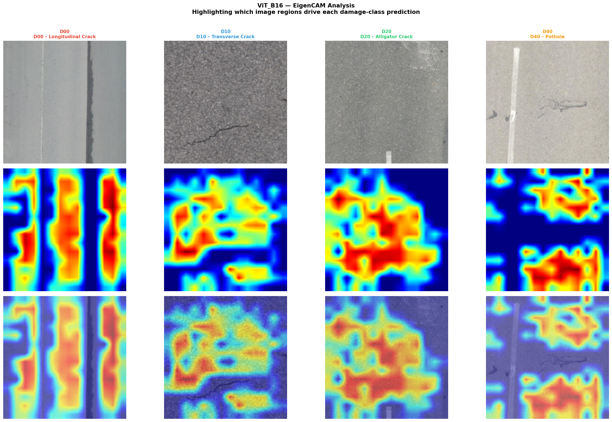
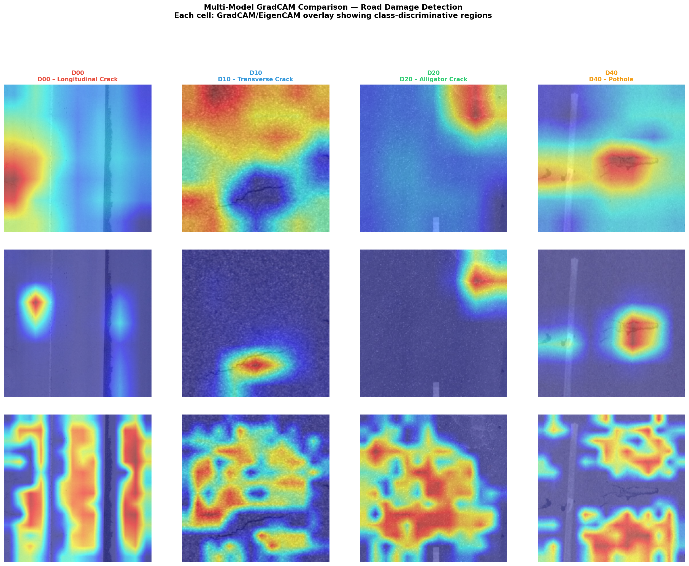

# 🛣️ Multi-Modal Deep Learning Framework for Road Damage Detection

**GSSoC 2026 | DL-Simplified**

---

## 📌 Project Overview

This project implements a **Multi-Modal Deep Learning Framework** for automated road damage detection and classification. Four distinct deep learning architectures — **EfficientNet-B0**, **ResNet50**, **YOLOv8n**, and **Vision Transformer (ViT-B/16)** — are trained, evaluated, and compared on the **RDD-2022 (Road Damage Dataset)** to detect and classify four types of road damage across multiple countries.

The framework supports both **image classification** (CNN-based and transformer-based) and **object detection** (YOLO-based), offering a comprehensive comparison of modern deep learning approaches for road surface monitoring.

---

## 🎯 Aim of the Project

To build, train, and evaluate multiple deep learning models for classifying road surface damage types from images, enabling automated, scalable, and accurate inspection of road infrastructure.

---

## 📁 Dataset

### Source: RDD-2022 (Road Damage Dataset 2022)

The dataset contains road images collected from **multiple countries** using smartphones mounted on vehicles. Images are labeled with bounding boxes in YOLO format.

### Damage Categories

| Class ID | Class Name | Description |
|----------|------------|-------------|
| D00 | Longitudinal Crack | Cracks running parallel to road direction |
| D10 | Transverse Crack | Cracks running perpendicular to road direction |
| D20 | Alligator Crack | Web-like, interconnected cracking patterns |
| D40 | Pothole | Holes or depressions in road surface |

### Dataset Split

| Split | Image Count |
|-------|------------|
| Train | 26,869 |
| Validation | 5,758 |
| Test | 5,758 |

### Label Distribution (Training Set)

| Class | Count |
|-------|-------|
| D00 (Longitudinal Crack) | 18,201 |
| D10 (Transverse Crack) | 8,386 |
| D40 (Pothole) | 7,554 |
| D20 (Alligator Crack) | 7,527 |

---

## 🗂️ Project Structure

```
Multi-Modal Road Damage Detection/
├── Dataset/
│   └── RDD_SPLIT/
│       ├── train/
│       │   ├── images/
│       │   └── labels/
│       ├── val/
│       │   ├── images/
│       │   └── labels/
│       └── test/
│           ├── images/
│           └── labels/
├── Images/
│   ├── class_distribution.png
│   ├── country_wise_damage_distribution.png
│   ├── efficientnet_training_curves.png
│   ├── resnet50_training_curves.png
│   ├── vit_training_curve.png
│   ├── gradcam_efficientnet_b0.png
│   ├── gradcam_resnet50.png
│   ├── gradcam_vit_b16.png
│   ├── gradcam_comparison_grid.png
│   └── train_samples.png
├── Model/
│   └── Road_Damage_Detection.ipynb
├── requirements.txt
└── README.md
```

---

## 🧠 Models Implemented

### 1. EfficientNet-B0
- **Architecture:** Compound scaling CNN with depthwise separable convolutions
- **Parameters:** ~4.01M
- **Input Size:** 224×224
- **Pretrained on:** ImageNet (via `torchvision`)
- **Modification:** Final classifier replaced with 4-class output head
- **Training:** 12 epochs (early stopping at epoch 12), ~46.7 min on RTX 5060

### 2. ResNet50
- **Architecture:** Deep residual network with skip connections (50 layers)
- **Parameters:** ~25M
- **Input Size:** 224×224
- **Pretrained on:** ImageNet (via `torchvision`)
- **Modification:** Final FC layer replaced with 4-class output head
- **Training:** Full 15 epochs

### 3. YOLOv8n (Object Detection)
- **Architecture:** You Only Look Once v8 Nano — single-stage object detector
- **Task:** Object detection with bounding box localization
- **Pretrained on:** COCO (via `ultralytics`)
- **Input Size:** 640×640
- **Output:** Bounding boxes with class labels for road damage instances

### 4. Vision Transformer (ViT-B/16)
- **Architecture:** Pure transformer encoder applied to image patches (patch size: 16×16)
- **Parameters:** ~86M
- **Input Size:** 224×224
- **Pretrained on:** ImageNet-21k (via `timm`)
- **Modification:** Classification head replaced with 4-class output
- **Training:** 11 epochs (early stopping at epoch 11), ~152.95 min on RTX 5060

---

## ⚙️ Methodology & Pipeline

### 1. Data Preprocessing

- **Image Normalization:** Mean `[0.485, 0.456, 0.406]`, Std `[0.229, 0.224, 0.225]` (ImageNet statistics)
- **Resize:** All images resized to `224×224` for CNN/ViT models; `640×640` for YOLOv8
- **Data Augmentation (Training):** Random horizontal flip, random crop, color jitter
- **Batch Size:** 16
- **DataLoader Workers:** Multi-threaded loading

### 2. Training Configuration

| Hyperparameter | Value |
|---------------|-------|
| Learning Rate | 1e-4 |
| Optimizer | Adam |
| LR Scheduler | Cosine Annealing |
| Batch Size | 16 |
| Max Epochs | 15 |
| Early Stopping Patience | 5 |
| Min Delta (Early Stopping) | 1e-4 |
| Loss Function | Cross-Entropy Loss |

### 3. Hardware Used

- **GPU:** NVIDIA GeForce RTX 5060 Laptop GPU
- **VRAM:** 8.5 GB
- **Framework:** PyTorch (CUDA-accelerated)

---

## 📊 Exploratory Data Analysis

### Training Sample Visualization



### Class Distribution



### Country-wise Damage Distribution



---

## 📈 Training Curves

### EfficientNet-B0



### ResNet50



### Vision Transformer (ViT-B/16)



---

## 🔍 Grad-CAM Visualizations

**Gradient-weighted Class Activation Mapping (Grad-CAM)** is used to visualize what regions of the road image each model focuses on when making predictions — providing interpretability and insight into model decision-making.

### EfficientNet-B0 Grad-CAM



### ResNet50 Grad-CAM



### ViT-B/16 Grad-CAM



### Model Comparison Grid



---

## 🛠️ Libraries & Dependencies

### Core Deep Learning

| Library | Version | Purpose |
|---------|---------|---------|
| `torch` | 2.11.0+cu128 | Deep learning framework |
| `torchvision` | 0.26.0+cu128 | Computer vision models & transforms |
| `timm` | Latest | Pretrained Vision Transformer (ViT) |
| `ultralytics` | Latest | YOLOv8 training & inference |

### Data Processing & Visualization

| Library | Purpose |
|---------|---------|
| `opencv-python` | Image I/O and preprocessing |
| `matplotlib` | Training curve and visualization plots |
| `seaborn` | Confusion matrix heatmaps |
| `scikit-learn` | Evaluation metrics (F1, precision, recall) |
| `pandas` | Label distribution analysis |
| `numpy` | Numerical operations |
| `tqdm` | Progress bars during training |
| `grad-cam` | Gradient-based attention visualization |
| `Pillow` | Image loading and handling |

---

## 🚀 How to Run

### Prerequisites

- Python 3.9+
- NVIDIA GPU with CUDA support (recommended)
- CUDA 12.8+ drivers

### Step 1: Clone the Repository

```bash
git clone https://github.com/Adhavan1801/DL-Simplified.git
cd "DL-Simplified/Multi-Modal Road Damage Detection"
```

### Step 2: Set Up Environment

```bash
python -m venv venv
# Windows
venv\Scripts\activate
# Linux/macOS
source venv/bin/activate
```

### Step 3: Install Dependencies

```bash
pip install torch torchvision --index-url https://download.pytorch.org/whl/cu128
pip install timm ultralytics opencv-python matplotlib seaborn scikit-learn pandas numpy tqdm grad-cam Pillow
```

Or install from `requirements.txt`:
```bash
pip install -r requirements.txt
```

### Step 4: Prepare the Dataset

1. Download the **RDD-2022 dataset** and place it under `Dataset/RDD_SPLIT/`
2. Ensure the following structure exists:
   ```
   Dataset/RDD_SPLIT/
   ├── train/images/  & train/labels/
   ├── val/images/    & val/labels/
   └── test/images/   & test/labels/
   ```

### Step 5: Configure Paths

Open `Model/Road_Damage_Detection.ipynb` and update `BASE_DIR` to point to your local dataset path:

```python
BASE_DIR = Path(r'YOUR_PATH_HERE/Dataset/RDD_SPLIT')
```

### Step 6: (Optional) HuggingFace Token

Add your HuggingFace token in the notebook to speed up ViT weight downloads:

```python
HF_TOKEN = "hf_xxxxxxxxxxxxxxxxxxxx"  # Your HF read token
```

### Step 7: Run the Notebook

Open and run `Model/Road_Damage_Detection.ipynb` cell by cell, or execute all:

```bash
jupyter notebook "Model/Road_Damage_Detection.ipynb"
```

---

## 📋 Notebook Sections

| Section | Description |
|---------|-------------|
| 0. Install & Import Dependencies | Installs packages and imports all libraries |
| 1. HuggingFace Token | Optional token setup for faster ViT downloads |
| 3. Configuration & Paths | Dataset paths, class names, and hyperparameters |
| 4. Exploratory Data Analysis (EDA) | Label distribution, country-wise analysis, sample visualization |
| 5. Dataset & DataLoader | PyTorch Dataset class, transforms, and DataLoaders |
| 6. Training Utilities | Training loop, early stopping, evaluation, and Grad-CAM setup |
| 7. Model 1 — EfficientNet-B0 | Build, train, and evaluate EfficientNet-B0 |
| 8. Model 2 — ResNet50 | Build, train, and evaluate ResNet50 |
| 9. Model 3 — YOLOv8n | Train and evaluate YOLOv8n for object detection |
| 10. Model 4 — ViT-B/16 | Build, train, and evaluate Vision Transformer |
| 11. Grad-CAM Visualizations | Generate attention maps for all classification models |
| 12. Model Comparison | Summary table and performance comparison |

---

## 🔧 Technical Details

### Custom Dataset Class

A custom PyTorch `Dataset` parses YOLO-format labels (`.txt` files) and maps bounding box class IDs to the 4 damage categories. Multi-label images are handled by assigning the dominant (most frequent) class per image for classification tasks.

### Early Stopping

Training uses early stopping with:
- **Patience:** 5 epochs (stop if validation loss doesn't improve for 5 consecutive epochs)
- **Min Delta:** 1e-4 (minimum improvement threshold)
- Best model weights are saved automatically when validation loss improves

### Learning Rate Scheduling

**Cosine Annealing LR Scheduler** gradually reduces the learning rate following a cosine curve, allowing fine-grained weight updates in later epochs.

### Evaluation Metrics

All classification models are evaluated with:
- **Accuracy** — overall correctness
- **Precision** (weighted) — positive predictive value
- **Recall** (weighted) — sensitivity / true positive rate
- **F1-Score** (weighted) — harmonic mean of precision and recall
- **Inference Latency** — milliseconds per image
- **Confusion Matrix** — per-class performance breakdown

---

## 📦 Saved Model Artifacts

After training, model checkpoints and evaluation plots are saved in the `Model/` directory:

| File | Description |
|------|-------------|
| `EfficientNet_B0_best.pth` | Best EfficientNet-B0 weights |
| `ResNet50_best.pth` | Best ResNet50 weights |
| `ViT_B16_best.pth` | Best ViT-B/16 weights |
| `yolov8n_rdd/weights/best.pt` | Best YOLOv8n weights |
| `*_training_curves.png` | Loss and accuracy plots per model |
| `*_confusion_matrix.png` | Confusion matrices per model |

---

## 🌍 Multi-Country Generalization

The RDD-2022 dataset contains road images from **multiple countries** (Japan, India, Czech Republic, China, Norway, USA), making the models trained here capable of generalizing to diverse road surface conditions, lighting environments, and damage patterns across different geographical regions.

---

## 📊 Model Performance Results

The following results were obtained on the **test set** (5,758 images) after training on the RDD-2022 dataset.

### Classification Models (EfficientNet-B0, ResNet50, ViT-B/16)

| Model | Accuracy | Precision | Recall | F1-Score | Latency (ms/img) |
|-------|----------|-----------|--------|----------|------------------|
| **EfficientNet-B0** | 0.7131 | 0.7137 | 0.7131 | 0.7131 | 8.48 |
| **ResNet50** | 0.7586 | 0.7572 | 0.7586 | 0.7573 | 8.64 |
| **YOLOv8n** | 0.5659 | 0.6196 | 0.5290 | 0.5707 | 7.52 |
| **ViT-B/16** | 0.7342 | 0.7362 | 0.7342 | 0.7275 | 12.95 |

> **Note:** YOLOv8n is evaluated as an object detector (bounding-box level), while EfficientNet-B0, ResNet50, and ViT-B/16 are evaluated as image-level classifiers. Direct metric comparison should account for task differences.

### 🏆 Key Observations

- **Best Overall Accuracy & F1:** `ResNet50` achieved the highest test accuracy (**75.86%**) and F1-score (**0.7573**), making it the top-performing classification model on this dataset.
- **Most Lightweight & Fast:** `YOLOv8n` offers the **lowest inference latency** (7.52 ms/img) and uniquely provides **bounding box localization** — detecting damage locations within images rather than just classifying them.
- **Efficient Accuracy-Speed Trade-off:** `EfficientNet-B0` delivers competitive accuracy (**71.31%**) with only **4.01M parameters**, making it ideal for edge deployment.
- **Transformer-based:** `ViT-B/16` achieves **73.42% accuracy** but at a higher computational cost (~86M parameters and 12.95 ms/img latency).

### 📈 Summary Chart

| Metric | EfficientNet-B0 | ResNet50 | YOLOv8n | ViT-B/16 |
|--------|:-:|:-:|:-:|:-:|
| Accuracy | 71.31% | **75.86%** | 56.59% | 73.42% |
| Precision | 71.37% | **75.72%** | 61.96% | 73.62% |
| Recall | 71.31% | **75.86%** | 52.90% | 73.42% |
| F1-Score | 71.31% | **75.73%** | 57.07% | 72.75% |
| Latency | 8.48 ms | 8.64 ms | **7.52 ms** | 12.95 ms |
| Params | ~4.01M | ~25M | ~3.2M | ~86M |

> ✅ **Recommended Model:** **ResNet50** for highest classification accuracy. **YOLOv8n** for real-world deployment requiring spatial damage localization.

---

## 🤝 Contributing

This project is part of **GSSoC 2026** under the **DL-Simplified** repository.

1. Fork the repository
2. Create a feature branch: `git checkout -b feature/your-feature`
3. Commit your changes: `git commit -m 'Add your feature'`
4. Push to the branch: `git push origin feature/your-feature`
5. Submit a Pull Request

---

## 👤 Author

**Adhavan**
- GitHub: [@Adhavan1801](https://github.com/Adhavan1801)
- Project: GSSoC 2026 — DL-Simplified

---

## 📄 License

This project is licensed under the **MIT License** — see the [LICENSE](../../LICENSE) file for details.

---

## 🙏 Acknowledgements

- **RDD-2022 Dataset** — Provided by the international road damage detection challenge organizers
- **GSSoC 2026** — For the open-source contribution opportunity
- **DL-Simplified** — For the project framework and guidance
- **PyTorch**, **Ultralytics (YOLOv8)**, **timm**, and the broader open-source ML community
