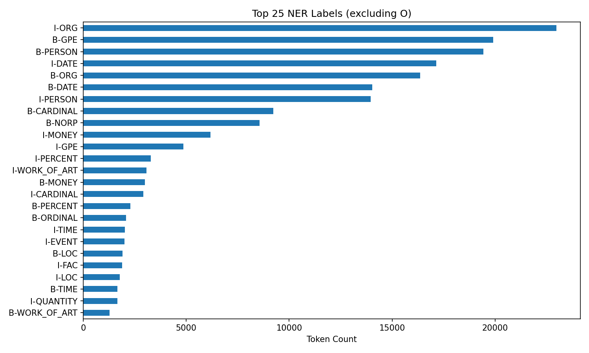
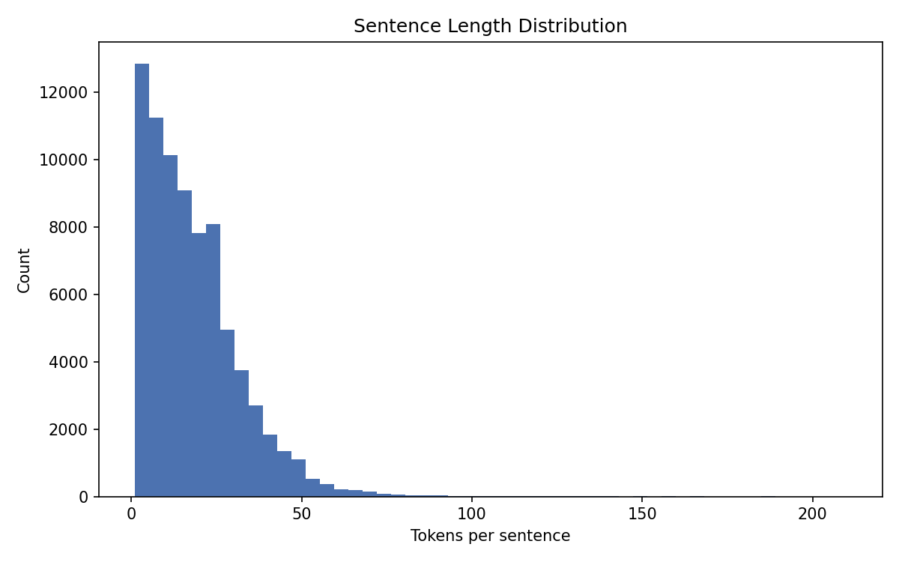
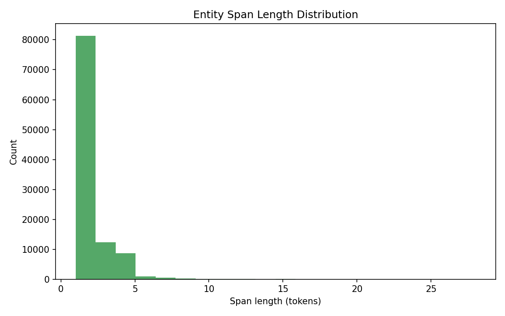
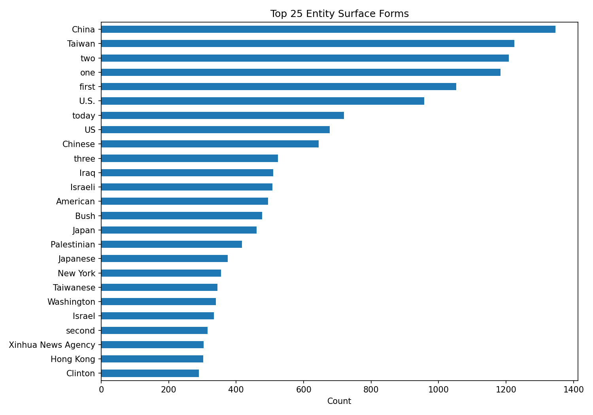
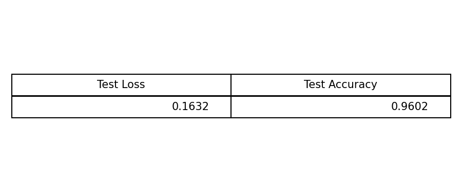

## **PROJECT TITLE**

Named Entity Recognition Using NLP (OntoNotes 5)

### 🎯 **Goal**

Build a named entity recognition system from scratch, explore the dataset, and provide an interactive Streamlit demo.

### 🧵 **Dataset**

OntoNotes 5.0 (LDC2013T19). Obtain via the Linguistic Data Consortium (LDC).

### 🧾 **Description**

This project trains a BiLSTM tagger for NER using the OntoNotes 5 JSONL dataset. It includes EDA plots, model training with per-epoch checkpoints, and a Streamlit app for inference.

### 🧮 **What I had done!**

- Loaded OntoNotes 5 JSONL splits and label mapping.
- Ran EDA to understand label distribution, sentence length, entity span length, and top entity forms.
- Built a token vocabulary from the training split.
- Trained a BiLSTM tagger with padded batches.
- Saved per-epoch model weights to the Streamlit folder.
- Generated training metrics and final metrics images.
- Built a Streamlit app for quick inference.

### 🚀 **Models Implemented**

- BiLSTM tagger (from scratch) for sequence labeling: simple, fast, and effective baseline for NER without relying on pretrained transformers.

### 📚 **Libraries Needed**

- torch
- numpy
- pandas
- matplotlib
- streamlit

### 📊 **Exploratory Data Analysis Results**

`INCLUSION OF IMAGES OF THE VISUALIZATION IS MUST (RESULT OF EDA).`

### 📈 **Performance of the Models based on the Accuracy Scores**

- BiLSTM tagger: 

### 📢 **Conclusion**

The BiLSTM baseline provides a solid starting point for OntoNotes 5 NER. Use the final metrics image to report test accuracy after training.

Gaurav Upreti
[GitHub](https://github.com/Reaper-ai) | [LinkedIn](https://www.linkedin.com/in/gaurav-upreti-488348312/)
Contribution under GSSoC 2026