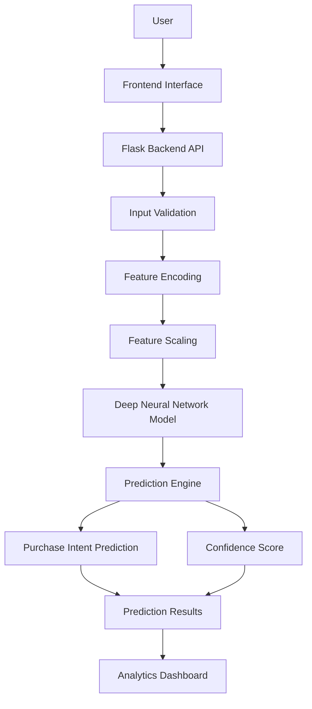
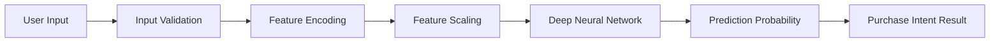
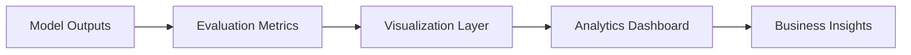

# Web Application - Online Shoppers Intention Prediction

## Overview

This web application extends the Online Shoppers Intention Prediction project into an end-to-end machine learning system capable of predicting whether a visitor is likely to complete a purchase session based on browsing behaviour and interaction patterns.

The application combines a trained deep learning model, a Flask-based prediction API, and an analytics dashboard to provide both real-time inference and model performance analysis.

---

## Application Architecture



---

## Core Features

| Feature                    | Description                                                                   |
| -------------------------- | ----------------------------------------------------------------------------- |
| Purchase Intent Prediction | Predicts whether a visitor is likely to complete a purchase session.          |
| Real-Time Inference        | Generates predictions using the trained deep learning model.                  |
| Input Validation           | Validates user inputs before model execution.                                 |
| Confidence Scoring         | Displays prediction confidence alongside results.                             |
| Analytics Dashboard        | Provides insights into model performance and business metrics.                |
| Model Comparison           | Compares MLP, LSTM, GRU, and Deep Neural Network models.                      |
| Business Insights          | Translates technical metrics into business-relevant findings.                 |
| End-to-End Pipeline        | Demonstrates the complete machine learning workflow from input to prediction. |

---

## Machine Learning Assets

| Asset                    | Purpose                             |
| ------------------------ | ----------------------------------- |
| 01_mlp_model.h5          | Multi-Layer Perceptron model        |
| 02_lstm_model.h5         | Long Short-Term Memory model        |
| 03_gru_model.h5          | Gated Recurrent Unit model          |
| 04_deep_network_model.h5 | Best-performing deep learning model |
| feature_scaler.pkl       | Feature normalization and scaling   |
| label_encoders.pkl       | Categorical feature encoding        |
| target_encoder.pkl       | Target label transformation         |

---

## Prediction Workflow



---

## Analytics Workflow



---

## Dashboard Capabilities

The dashboard provides a consolidated view of model behaviour and evaluation metrics.

### Included Analytics

| Analytics Module            | Purpose                                             |
| --------------------------- | --------------------------------------------------- |
| Dataset Statistics          | Understand dataset composition and characteristics  |
| Model Comparison            | Compare all implemented deep learning architectures |
| Accuracy Analysis           | Compare classification accuracy across models       |
| Precision & Recall Analysis | Evaluate classification quality                     |
| F1 Score Analysis           | Assess model balance between precision and recall   |
| ROC-AUC Analysis            | Evaluate discrimination capability                  |
| Confusion Matrix Analysis   | Visualize classification performance                |
| Training History            | Review learning behaviour across epochs             |
| Feature Importance          | Understand influential behavioural features         |
| Business Insights           | Translate model outputs into actionable findings    |

---

## Technology Stack

| Layer            | Technology                |
| ---------------- | ------------------------- |
| Frontend         | HTML5, CSS3, JavaScript   |
| Backend          | Flask                     |
| Machine Learning | TensorFlow, Keras         |
| Data Processing  | Pandas, NumPy             |
| Evaluation       | Scikit-Learn              |
| Visualization    | HTML/CSS dashboards        |
| Model Storage    | HDF5 (.h5), Pickle (.pkl) |

---

## Screenshots

The running Flask application provides a polished enterprise UI for the landing page, prediction workflow, and analytics dashboard. Screenshots can be captured directly from the deployed app once the server is running.

---

## Application Execution

### Clone Repository

```bash
git clone <repository-url>
```

### Navigate to Project

```bash
cd "Online Shoppers Intention Prediction/Web App"
```

### Install Dependencies

```bash
pip install -r ../requirements.txt
```

### Start Flask Server

```bash
python app.py
```

### Open Application

```text
http://127.0.0.1:5000
```

---

> [!NOTE]
>
> This application uses the trained deep learning model generated during the notebook training pipeline. The prediction workflow applies the same preprocessing, encoding, and scaling strategy used during model training to ensure consistency between training and inference environments.
>
> Before running the application, ensure the following artifacts are available inside the `Models` directory:
>
> * `04_deep_network_model.h5`
> * `feature_scaler.pkl`
> * `label_encoders.pkl`
> * `target_encoder.pkl`

---

## Project Objective

The goal of this application is to demonstrate how deep learning can be used to predict online shopper purchase intent and transform machine learning experimentation into an interactive analytics platform suitable for business intelligence and decision support.