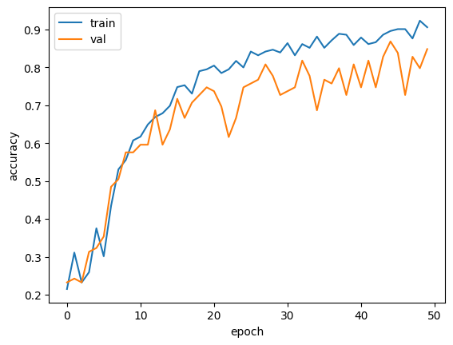
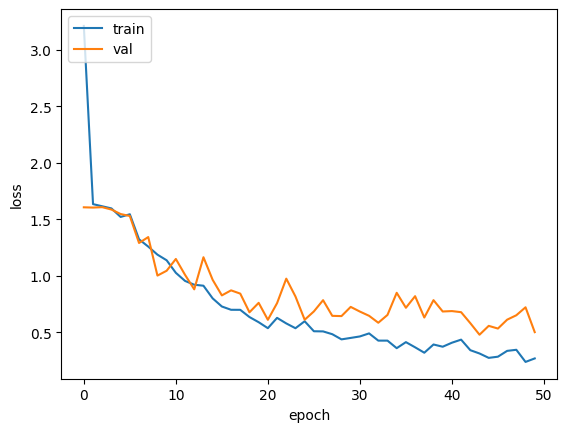
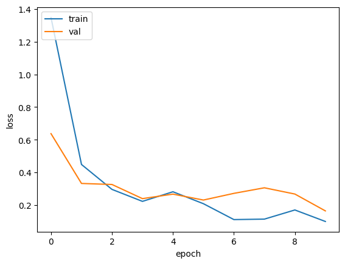

## PII Documents Classification using Transfer Learning

### GOAL

The goal of this project is to classify Personal Identifiable Information(PII) documents such as Aadhar Card, Pan Card and Voter ID. This model coupled with some OCR and NER models can help to automate the process of extracting information from various PII documents.

### DATASET

The dataset used for training the model has been picked from kaggle. Check the dataset [here](https://www.kaggle.com/datasets/mehaksingal/personal-identification-image-dataset-for-india).

### DESCRIPTION

This project is a simple image classification project. Image classification is one of the simplest yet powerful task in computer vision. As the name suggests, it is used to classify images. In this project, I tried to train an efficient image classification model using transfer learning.

### WHAT I HAD DONE

- The dataset needed some cleaning. First, it was cleaned by removing corrupt files and the utility class.
- Then a simple CNN based model was tried. But it's performance was not that good so a transfer learning model based on VGG16 architecture was tried.

### MODELS USED

Two models have been used. The first model is a simple CNN based model having 3 convolutional layers and the second model is a transfer learning based model.

**Architecture of the first model**

- The first layer is a convolution layer that has 32 filters of size 3x3, relu activation, same padding and accepts input of shape (224, 224, 3).
- The second layer is again a convolution layer having 64 filters of size 3x3, relu activation, same padding and max-pooling with filter size of 2x2 and strides 2.
- The third and the final convolution layer has 128 filters of size 3x3, relu activation, same padding and max-pooling with filter size of 2x2 and strides 2. Finally, there is a flatten layer to flatten the output.
- The final layer of the model is again a dense layer with 5 units and linear activation to get the unnormalized outputs.

**Architecture of the second model**

- The initial layers of this model is same as that of VGG16 as this is a transfer learning based model.
- Then, there are 3 dense layers having 128, 64 and 5 units respectively.

### LIBRARIES NEEDED

To train the models, following libraries are needed:
- Matplotlib
- NumPy
- Pillow
- TensorFlow

### ACCURACIES

**Model 1: Simple CNN model**

The training and validation accuracies after 50 epochs are 90.62% and 84.85% respectively.

The training and validation losses after 50 epochs are 0.26 and 0.50 respectively.

**Model 2: Transfer learning based model**

The training and validation accuracies after 10 epochs are 96.54% and 94.95% respectively.

The training and validation losses after 10 epochs are 0.10 and 0.16 respectively.

### CONCLUSION

Transfer learning can be a boon if there is not much data and the resources are also limited. In this project, several CNN models were tried but none of them worked well because there were not many samples to train an efficient model. Finally, a simple transfer learning model was used and the performance of the model went up like a charm!

**Nidhish Kumar**

