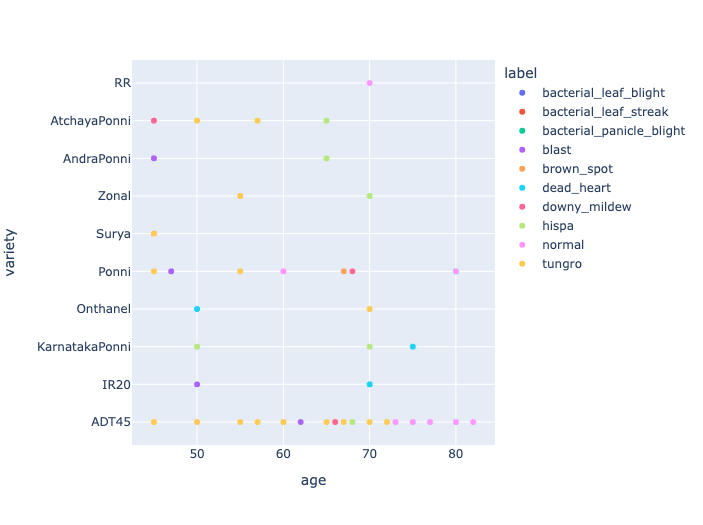
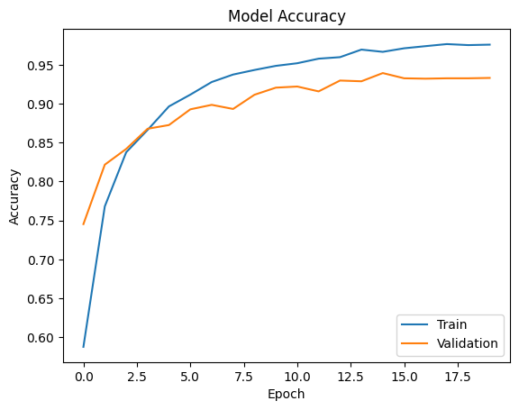
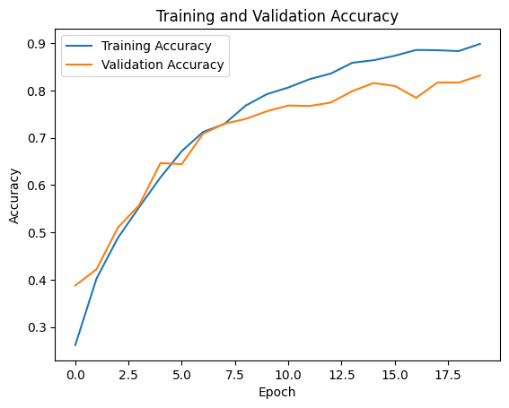
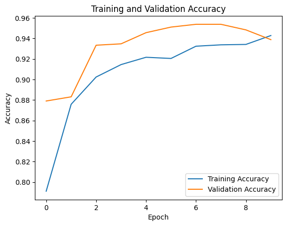

# Paddy Disease Recognition

## AIM
The primary objective of this project is to develop a deep learning model to accurately classify paddy diseases using images of paddy leaves.

## DATASET LINK
- [Dataset](https://www.kaggle.com/datasets/ikkiocean/paddy-disease-dataset)

## MY NOTEBOOK LINK
- In the models Directory

## DESCRIPTION
Paddy Disease Recognition using a CNN, MobileNetV2 and EfficientNetB4 model is aimed at detecting diseases in paddy crops by analyzing images of leaves. Early detection of crop diseases is crucial to ensure better yield and prevent significant loss for farmers. This project seeks to automate the process of recognizing paddy leaf diseases by employing deep learning models, offering a faster and more reliable approach than manual inspection.

### Why is it necessary?
Paddy crops are susceptible to various diseases that can devastate crop yields. Manual inspection is time-consuming, error-prone, and requires expert knowledge. This project provides a solution by automating disease recognition, making it accessible even to farmers with limited resources.

### How is it beneficial?
By automating disease detection, farmers can get real-time feedback on the health of their crops, allowing them to take preventive measures and mitigate losses. This model can be integrated into mobile applications or deployed on drones for large-scale field monitoring.

### How did you start approaching this project?
I began by exploring the dataset, understanding the different disease categories, and then implemented a CNN model to tackle the image classification task. As the project progressed, I integrated EfficientNetB4 and MobileNetV2 to improve performance and achieve better accuracy.

## EXPLANATION

### DETAILS OF THE DIFFERENT FEATURES
1. **Disease Classification**: The model classifies paddy diseases based on leaf images.
2. **Deep Learning Models**: The project uses CNN, MobileNetV2 and EfficientNetB4 architectures.
3. **Data Augmentation**: Techniques like flipping, rotation, and zooming were applied to enhance model generalization.
4. **Evaluation Metrics**: Used accuracy to evaluate model performance.

### WHAT I HAVE DONE
1. Step 1: Initial exploration of the dataset.
2. Step 2: Data preprocessing, including resizing and normalizing images.
3. Step 3: Data augmentation to increase dataset diversity.
4. Step 4: Training the CNN model for disease classification.
5. Step 5: Implementing EfficientNetB4 for better accuracy.
6. Step 6: Evaluating and comparing models based on accuracy and other metrics.

### PROJECT TRADE-OFFS AND SOLUTIONS
1. **Trade-off 1**: Balancing accuracy with training time for large models.
   - **Solution**: Used EfficientNetB4 to reduce training time while maintaining high accuracy.
2. **Trade-off 2**: Overfitting due to a limited dataset.
   - **Solution**: Applied data augmentation and dropout layers to regularize the model.

### LIBRARIES NEEDED
- pandas
- numpy
- scikit-learn
- tensorflow
- keras
- matplotlib
- seaborn

### SCREENSHOTS

- 
- 
- 
- 

### MODELS USED AND THEIR ACCURACIES
| Model           | Accuracy 
|-----------------|----------
| CNN             | 89.5%      
| EfficientNetB4  | 97.6%   
| MobileNetV2     | 94.2%

### MODELS COMPARISON GRAPHS 
- Include accuracy and loss graphs for CNN , MobileNetV2 and EfficientNetB4 models.

## CONCLUSION

- Insights on how data augmentation improves model performance.
- Gained a deeper understanding of EfficientNet architecture and its effectiveness in image classification tasks.
- Overcame the challenge of overfitting by using proper regularization techniques.

### USE CASES OF THIS MODEL
1. **Agriculture Monitoring**: Early detection of diseases in paddy fields to prevent crop loss.
2. **Mobile Applications**: Farmers can take a picture of a leaf to get real-time disease feedback.

### HOW TO INTEGRATE THIS MODEL IN REAL WORLD
1. Prepare a data pipeline to collect leaf images in real-time.
2. Deploy the model using Flask or FastAPI.
3. Integrate the model into mobile applications or drones for automated field monitoring.

### FEATURES PLANNED BUT NOT IMPLEMENTED
- **Drone Integration**: Automating image capture using drones for large-scale fields.
- **Multilingual Interface**: A user interface that supports local languages for better farmer accessibility.

### Signature
Vivek Prakash

[LinkedIn](https://www.linkedin.com/in/vivek-prakash-b46830283/)