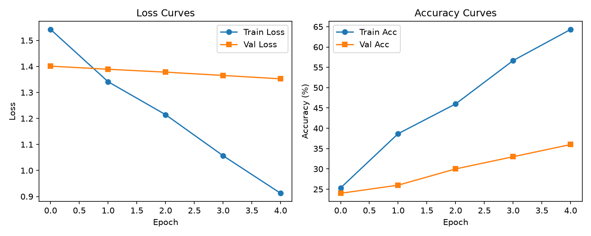
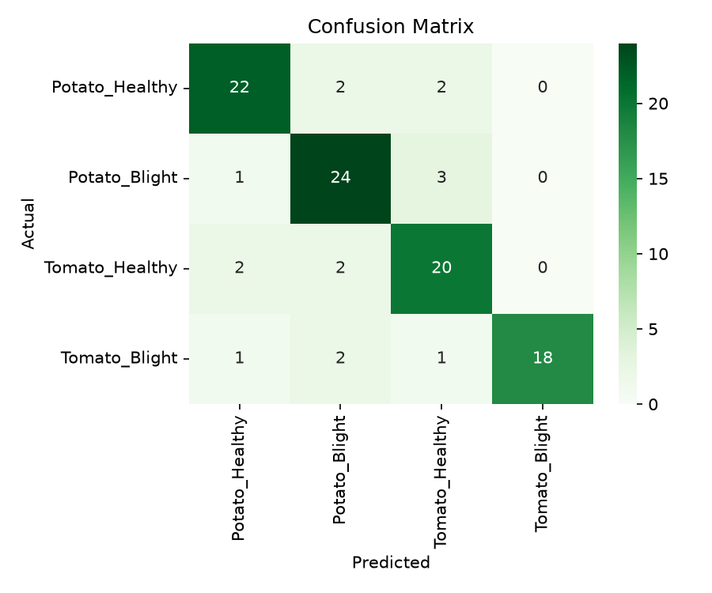

# Plant Disease Detection using CNN and PyTorch

This project implements a Deep Learning model utilizing a Convolutional Neural Network (CNN) built with PyTorch to classify plant leaf images into healthy and diseased categories (focusing on Potato and Tomato leaves).

## Project Structure
```text
Plant Disease Detection/
├── Dataset/
│   └── README.md
├── Images/
│   ├── loss_accuracy_curves.png
│   └── confusion_matrix.png
├── Models/
│   └── Plant Disease Detection.ipynb
└── README.md
```

## Features
- **Data Augmentation**: Normalization, random resizing, and rotation to prevent overfitting.
- **Custom CNN Architecture**: Multi-layer CNN with Batch Normalization and Dropout for regularization.
- **Visualizations**: Plots for Training/Validation Loss and Accuracy, along with a Confusion Matrix.

## Model Summary
- **Framework**: PyTorch
- **Optimizer**: Adam
- **Loss Function**: Cross-Entropy Loss
- **Evaluation Metrics**: Accuracy, Precision, Recall, F1-Score

## Results & Visualizations

### Loss & Accuracy Curves


### Confusion Matrix

