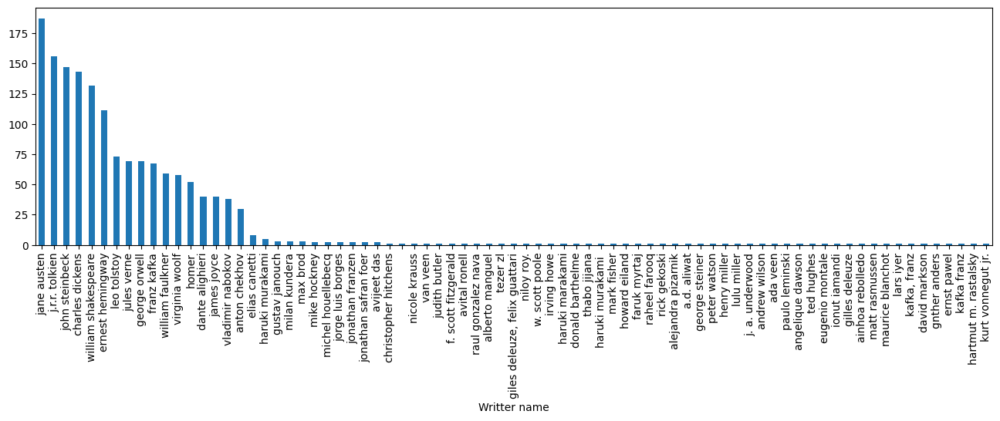
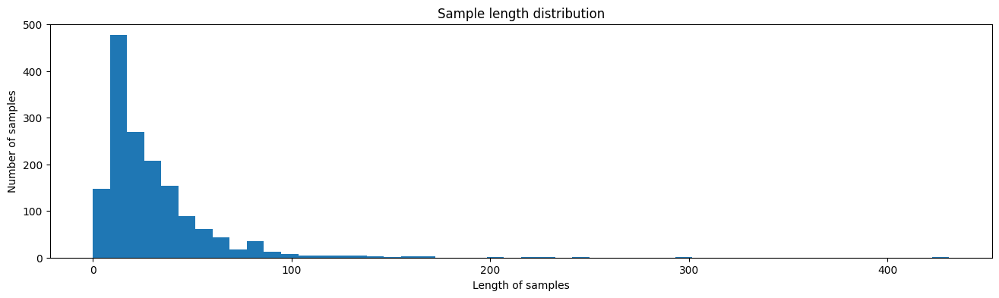
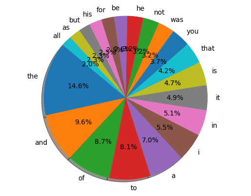

# Popular Quotes Author Classifier Using NLP

# Goal

The main goal of the project is to use NLP techniques to predict what is the name of an author from his quotes.

# Dataset

Link : https://www.kaggle.com/datasets/rafsunahmad/popular-quotes-author-classifier

# Description

This project consists of code that uses NLP techniques for author name prediction from the specific author's quotes. The dataset consists of two columns, one for Quotes and the other for the name of the author.

# What I Had Done

1. Extract the data from the csv file using pandas
2. Apply the preprocessing steps that include missing values removal, duplicate removal, data augmentation and a few other minor steps
3. Use the DL Models to make the predictions

# Models Used

1. BERT
2. Word2Vec + RNN(LSTM)
3. TF-IDF + Softmax Regression

# Libraries Needed

1. tensorflow
2. pandas
3. nlpaug
4. numpy
5. transformers
6. scikit-learn
7. gensim
8. matplotlib
9. nltk

# Visualization

## All the authors and their corresponding number of quotes in the dataset

## Length Distribution of Words

## Pie Chart of top 20 Words

# Accuracies

1. BERT - 91.32%
2. Word2Vec + RNN(LSTM) - 50.00%
3. TF-IDF + Softmax Regression - 86.57%

# Conclusion

From the above accuracies, we conclude that BERT is the model with the best performance.

# Your Name

Hi, I am Iman Kalyan Chakraborty, a passionate ML and DL developer from Kolkata. Here are my socials :

Twitter / X - https://twitter.com/ikc1975

LinkedIn - https://www.linkedin.com/in/imankalyanchakraborty/