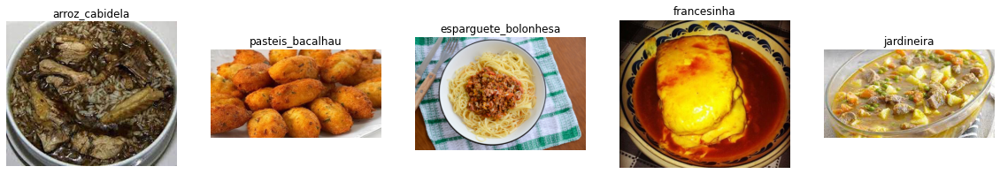
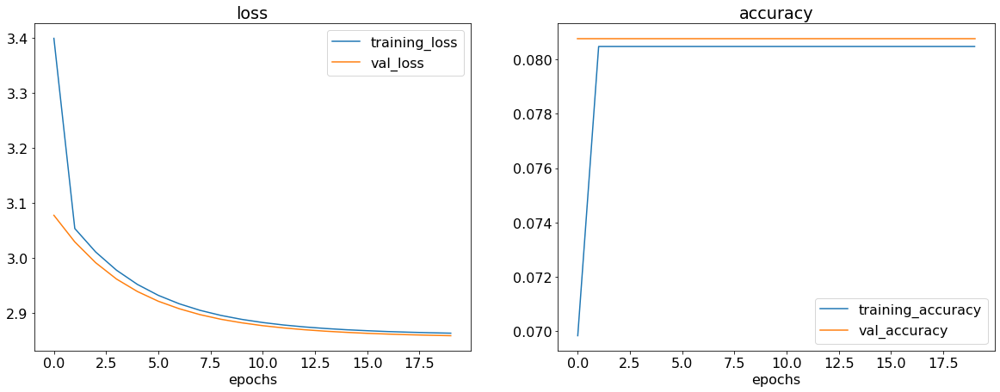
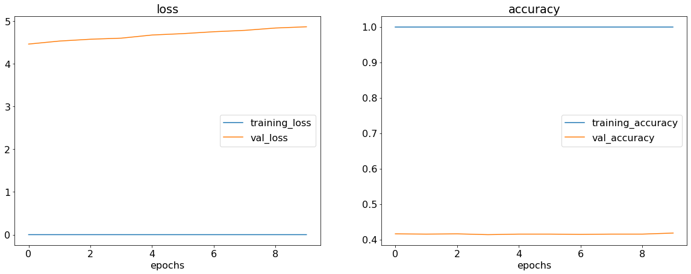
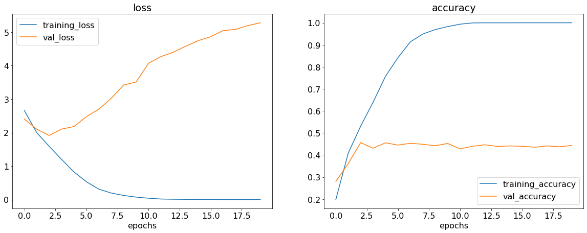
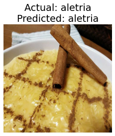

# Portuguese Meals Classification

🔴 Project Title : Portuguese Meals Classification

🔴 Aim : Aim is to identify and recognize the meals images from the given dataset using a DL approach.

🔴 Dataset : https://www.kaggle.com/datasets/catarinaantelo/portuguese-meals

**DESCRIPTION**

The dataset contains images of 23 different types of food. There are 100 - 500 images of each type. The task is to classify the images by using a deep learning architecture.

**WHAT I HAD DONE**

First I imported all the required libraries and dataset for this project. Then I imported the dataset and split it into training, validation and testing sets in the ratio 70:20:10. Then I proceeded to build the model. I have developed  deep learning model to classify the images.I used a CNN with MaxPooling layers and got a satisfactory accuracy score.
But as there is lack of data in the dataset the validation accuracy is quite low.

**MODELS USED**

The models are:

1. Artificial Neural Network (ANN)
2. Convolutional Neural Network (CNN)
3. Convolutional Neural Network (CNN) with MaxPooling layer

**LIBRARIES NEEDED**

* kaggle
* tensorflow
* split-folders
* matplotlib

### Images of different Rice classes
**VISUALIZATION**

### Model 1 (ANN Model) performance graphs

### Model 2 (Basic CNN Model) performance graphs

By viewing the graphs, we can conclude that the model is not performing well. It is overfitting on the training data.

### Model 3 (CNN Model with MaxPooling layer) performance graphs

By adding the MaxPooling layer, the model is now performing better than before.
### Prediction

Prediction on a random image from the testing dataset.

**ACCURACIES**

| Model         | Architecture              | Accuracy in % (on testing data) |
| ------------- |:-------------------------:|:-------------:|
| Model 1       | ANN Model                 |7.95          |
| Model 2       | Basic CNN Model           |42.6          |
| Model 3       | CNN Model with MaxPooling |45.1          |

### Accuracy can be increased by doing the following:
- Add more data or images
- Train the model for higher number of Epochs
- Augment the images

## CONCLUSION

I was successfully able to develop a Deep Learning model that can classify images from the given Portuguese Meals dataset which has 23 different variation

## Contributor - Adithya S Kolavi

Connect with me on Linkedin: https://www.linkedin.com/in/adithya-s-kolavi-127a561a8/
\
Check out my Github profile: https://github.com/adithya-s-k