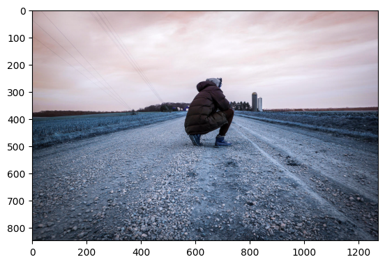
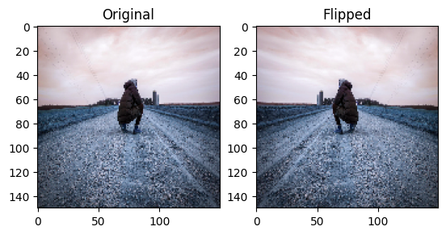
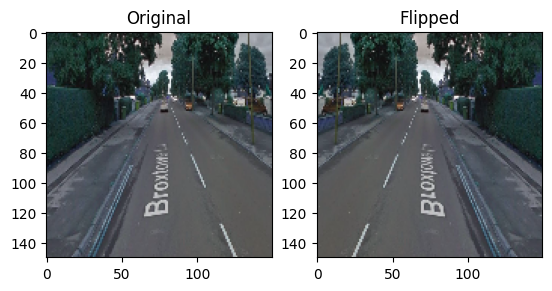
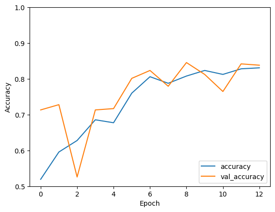
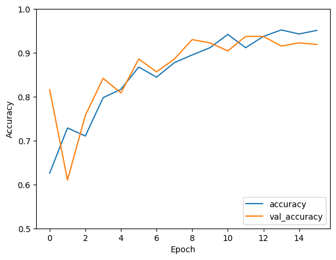
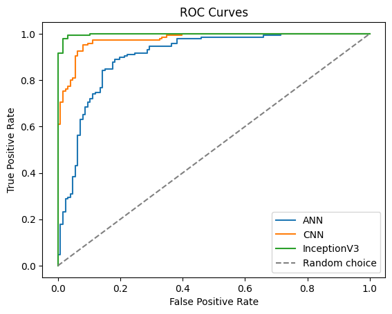

# Pothole Detection System

## Goal

The goal of the project is creating a Deep Learning model that can be used to detect potholes in a street.

## Dataset
The dataset used for training the pothole detection system can be found on Kaggle: 
https://www.kaggle.com/datasets/atulyakumar98/pothole-detection-dataset

## Description

Because of the dataset nature, the detection task is treated as a classification problem: the DL models are trained to classify photos of streets depending on whether they contain a pothole or not.

## What I had done
The project involved the following steps:

1. **Data exploration**: understanding the dataset by visualizing some images and calculating class distribution.
2. **Data preprocessing**: resizing the images to the same 150x150x3 size.
3. **Data augmentation**: adding the flipped version of each image to the dataset to increase the training data.
4. **Model creation and training**: Choice of three types of Deep Learning models and their training.
5. **Model evaluation**: Evaluation of the trained models based on accuracy and AUC.

## Models used

The following models where used in the project:
- **Artficial Neural Network**: Although ANNs aren't specificlly meant for tasks involving images, they can still perform well and be used as benchmarks to evaluate  other models.
- **Convolutional Neural Network**: CNNs are a type of deep neural network architecture designed for tasks such as image recognition, computer vision, and pattern recognition. They are highly effective in these domains due to their ability to automatically learn hierarchical representations of features from input data.
- **InceptionV3**: InceptionV3 is a pre-trained CNN model designed for image classification and object recognition tasks. It was trained on the ImageNet dataset (14 million images). I have fine-tuned it for the potholes detection task.

## Libraries needed

The following libraries are required to run this project:
- keras==2.13.1
- matplotlib==3.7.4
- numpy==1.24.3
- tensorflow==2.13.0

## Visualization

Some of the dataset images:

  
  
  

Results of data preprocessing and augmentation:

  
  

Training histories (ANN, CNN, InceptionV3):

  
  
  

Models' AUCs:

  

## Accuracies

| Model         | Accuracy              | AUC       |
| --------------|:---------------------:|:---------:|
| ANN           | 84.56%                |0.904      |
| CNN           |    93.75%             |0.976      |
| InceptionV3   | 98.16%                |0.998      |

## Conclusion

- Despite not being specifically designed for image analysis, the ANN model still manages to perform relatively well (85% accuracy) in this classification task.
- The CNN architecture and ability to learn hierarchical representations of features allow it to outperfom the ANN model and achieve a 94% accuracy.
- The particular architecture of InceptionV3 combined with its large-scale training on the ImageNet dataset makes the model capable of more accurate image analysis. Fine-tuning it thus results in the highest accuracy: 98%.

## Author
This project was done by Mattia Ferrarini (https://github.com/MattiaFerrarini).