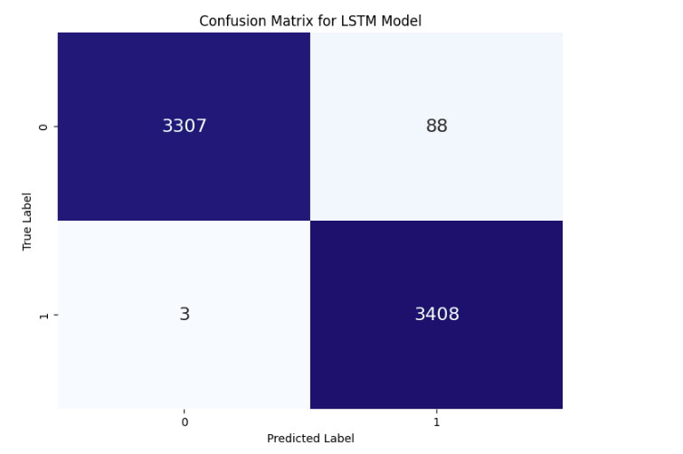

# Real or Fake Job Posting Prediction

**GOAL**

The aim of this project is to detect fraudulent job postings using machine learning models.

**DATASET**

[Real or Fake Job Posting Prediction
](https://www.kaggle.com/datasets/shivamb/real-or-fake-fake-jobposting-prediction)

**DESCRIPTION**

The dataset consists of job postings labeled as either real or fake. It includes various features such as job title, location, company profile, description, requirements, benefits, and more.

**WHAT I DID**

I conducted extensive data preprocessing tasks, including text cleaning, tokenization, and feature extraction using Word2Vec. The dataset was split into training and testing sets, and both Artificial Neural Network (ANN) and Long Short-Term Memory (LSTM) models were constructed for classification.

**MODELS USED**

The models developed are:

1. Artificial Neural Network (ANN)
2. Long Short-Term Memory (LSTM)

**LIBRARIES NEEDED**

- pandas
- numpy
- matplotlib
- seaborn
- re
- nltk
- gensim
- keras
- imblearn
- wordcloud

**Exploratory Data Analysis (EDA)**

### Distribution of Employment Type

### Distribution of Required Education

### Distribution of Job Function

### Distribution of Required Experience

### Distribution of Telecommuting

### Distribution of Has Company Logo

### Distribution of Has Questions

### Distribution of Fraudulent Job Postings

### Word Cloud for Real Job Postings

### Word Cloud for Fake Job Postings

### Conclusions from EDA

#### Imbalanced Dataset
- The dataset has a significant imbalance between real and fake job postings, which could impact model performance and requires handling (e.g., through resampling techniques like SMOTE).

#### Distinct Patterns in Fake Job Postings
Fake job postings tend to have:
- Less specific employment types and required experiences.
- Lower educational requirements.
- Higher likelihood of lacking a company logo.
- Different word usage patterns in job descriptions, often focusing on more generic terms.

#### Feature Importance for Classification
- The presence of a company logo and specific job functions/experience/education levels are important indicators of job posting authenticity.
- Text analysis of job descriptions reveals distinct patterns in fake job postings that can be leveraged for classification.

**Model Training**

### ANN Model Training Performance

### BiLSTM Model Training Performance

**Confusion Matrix**

### ANN Model Confusion Matrix

### BiLSTM Model Confusion Matrix

**CONCLUSION**

Both ANN and LSTM models were successfully built and trained to classify job postings as real or fake. The LSTM model exhibited slightly better performance with an accuracy of around 98% on the test dataset. 

### Overall Findings
- **Imbalanced Dataset:** The dataset had a significant imbalance between real and fake job postings, which was addressed using SMOTE.
- **Feature Importance:** Features such as the presence of a company logo, specific job functions, experience, and education levels were important indicators of job posting authenticity.
- **Text Analysis:** Text analysis revealed distinct patterns in fake job postings, which were leveraged for classification.

Both models provide a robust foundation for detecting fraudulent job postings, and the insights gained from EDA can be used to further refine and improve model performance.

**Connect with Me**

- [LinkedIn](https://www.linkedin.com/in/barrenkala-veera-venkata-karthik-b58b9a285/)
- [GitHub](https://github.com/Karthik110505)
