# Real or Fake Job Posting Prediction

**GOAL**

The aim of this project is to detect fraudulent job postings using machine learning models.

**DATASET**

[Real or Fake Job Posting Prediction
](https://www.kaggle.com/datasets/shivamb/real-or-fake-fake-jobposting-prediction)

**DESCRIPTION**

The dataset consists of job postings labeled as either real or fake. It includes various features such as job title, location, company profile, description, requirements, benefits, and more.

**WHAT I DID**

I conducted extensive data preprocessing tasks, including text cleaning, tokenization, and feature extraction using Word2Vec. The dataset was split into training and testing sets, and  ANN , LSTM , CNN and BiLSTM models were constructed for classification.

**MODELS USED**

The models developed are:

1. Artificial Neural Network (ANN)
2. Long Short-Term Memory (LSTM)
3. Convolutional Neural Network (CNN)
4. Bidirectional Long Short-Term Memory (BiLSTM)

**LIBRARIES NEEDED**

- pandas
- numpy
- matplotlib
- seaborn
- re
- nltk
- gensim
- keras
- imblearn
- wordcloud

**Exploratory Data Analysis (EDA)**

### Distribution of Employment Type
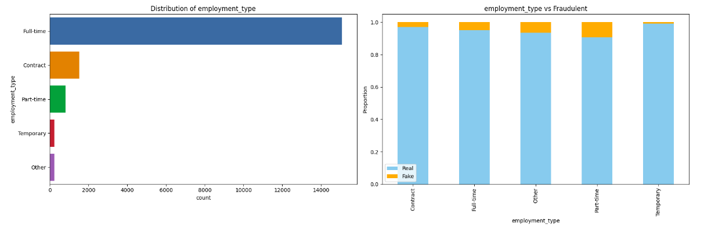

### Distribution of Required Education
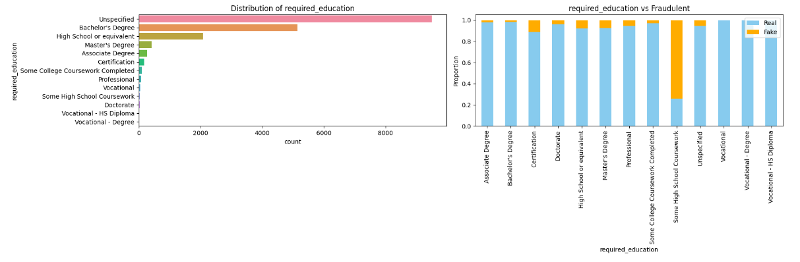

### Distribution of Job Function
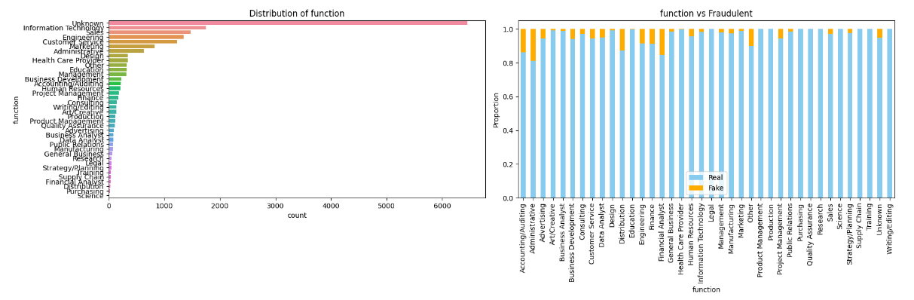

### Distribution of Required Experience
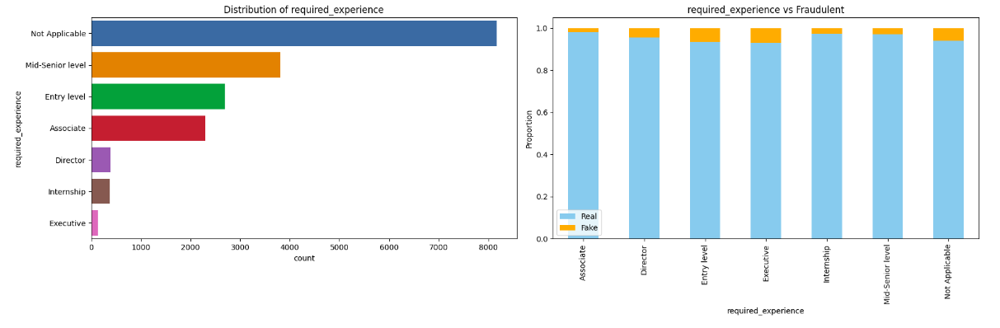

### Distribution of Telecommuting
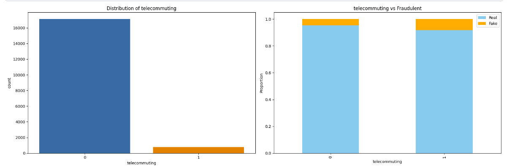

### Distribution of Has Company Logo
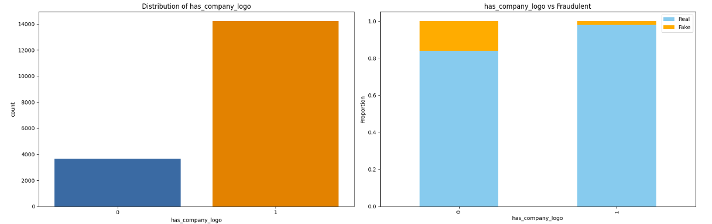

### Distribution of Has Questions
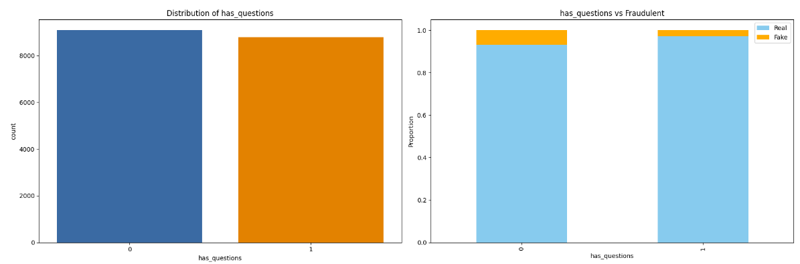

### Distribution of Fraudulent Job Postings
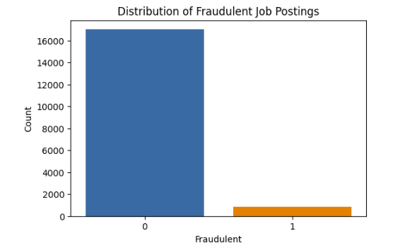

### Word Cloud for Real Job Postings

### Word Cloud for Fake Job Postings

### Conclusions from EDA

#### Imbalanced Dataset
- The dataset has a significant imbalance between real and fake job postings, which could impact model performance and requires handling (e.g., through resampling techniques like SMOTE).

#### Distinct Patterns in Fake Job Postings
Fake job postings tend to have:
- Less specific employment types and required experiences.
- Lower educational requirements.
- Higher likelihood of lacking a company logo.
- Different word usage patterns in job descriptions, often focusing on more generic terms.

#### Feature Importance for Classification
- The presence of a company logo and specific job functions/experience/education levels are important indicators of job posting authenticity.
- Text analysis of job descriptions reveals distinct patterns in fake job postings that can be leveraged for classification.

**Model Training**

### ANN Model Training Performance
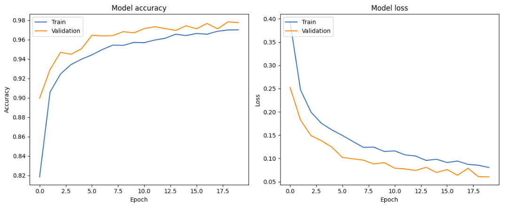

### LSTM Model Training Performance
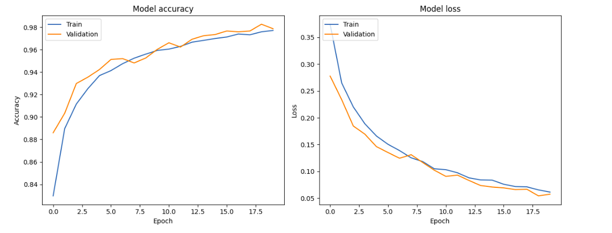

### CNN Model Training Performance
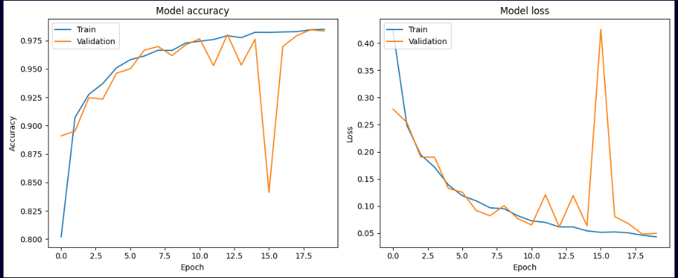

### BiLSTM Model Training Performance
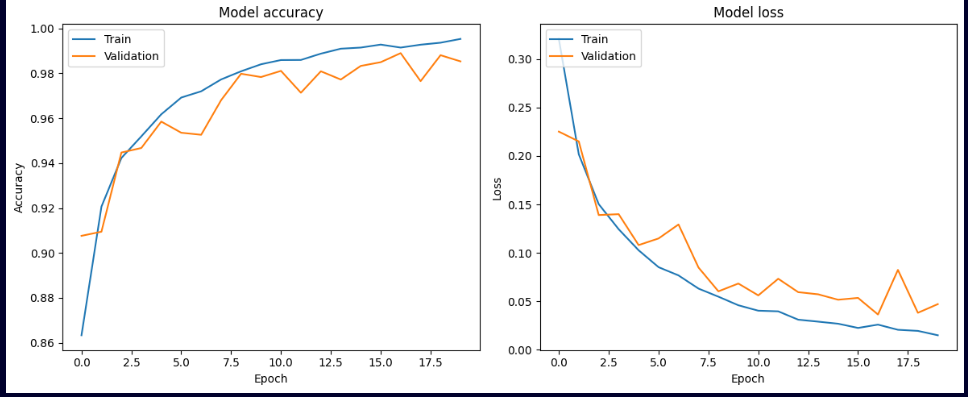

**Confusion Matrix**

### ANN Model Confusion Matrix
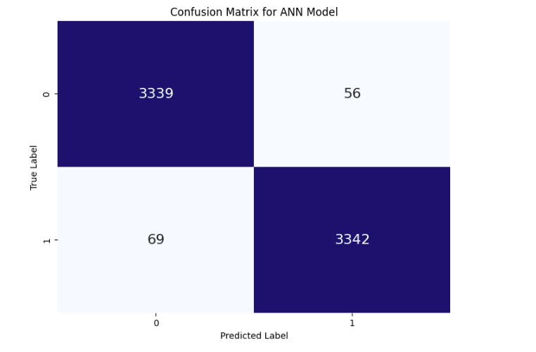

### LSTM Model Confusion Matrix

### CNN Model Confusion Matrix
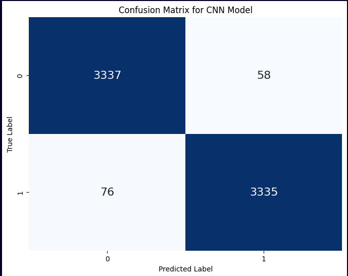

### BiLSTM Model Confusion Matrix
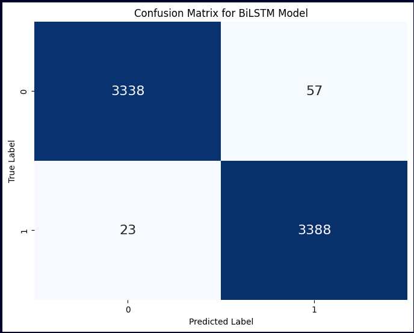

### Overall Findings
- **Imbalanced Dataset:** The dataset had a significant imbalance between real and fake job postings, which was addressed using SMOTE.
- **Feature Importance:** Features such as the presence of a company logo, specific job functions, experience, and education levels were important indicators of job posting authenticity.
- **Text Analysis:** Text analysis revealed distinct patterns in fake job postings, which were leveraged for classification.
- **Model Comparison:** All models performed exceptionally well, with the BiLSTM model slightly outperforming the others. This can be attributed to its ability to capture bidirectional sequential dependencies in the data.
- **Accuracy:** The BiLSTM model achieved the highest accuracy at 98.82%, followed by the LSTM model at 98.77%, CNN at 98.03%, and ANN at 97.96%.
- **Loss:** The BiLSTM model had the lowest loss at 0.0487, indicating better model convergence.
- **Classification Report:** All models showed high precision, recall, and F1-scores, indicating effective classification of both classes.

**CONCLUSION**

All models provide a robust foundation for detecting fraudulent job postings, and the insights gained from EDA can be used to further refine and improve model performance. While all models demonstrated strong performance in detecting patterns within the data, the BiLSTM model's superior ability to capture and leverage bidirectional dependencies resulted in the highest accuracy and best overall performance. This suggests that for this particular dataset and task, models that can capture sequential patterns in both forward and backward directions offer a significant advantage.

**Connect with Me**

- [LinkedIn](https://www.linkedin.com/in/barrenkala-veera-venkata-karthik-b58b9a285/)
- [GitHub](https://github.com/Karthik110505)
