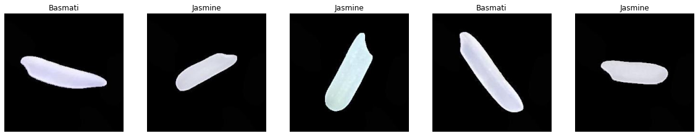
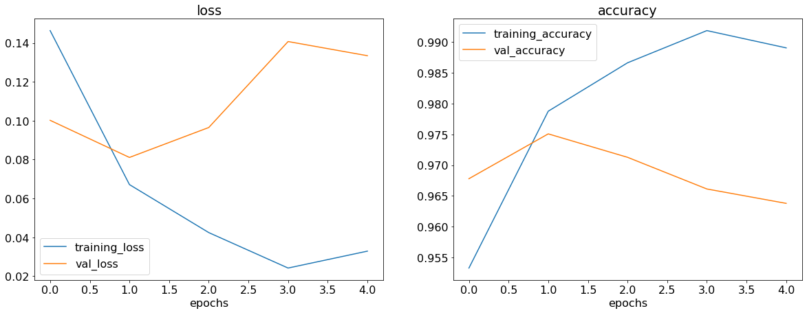
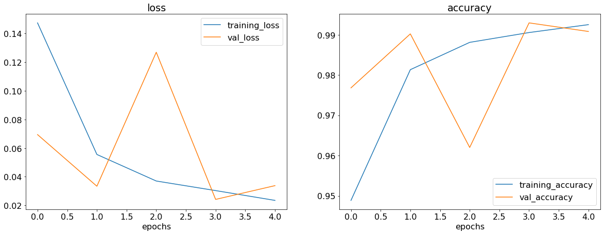
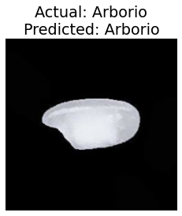

# Rice Image Classification

**GOAL**

To classify the images from the rice dataset using a Deep Learning approach.

**DATASET**

https://www.kaggle.com/datasets/muratkokludataset/rice-image-dataset

**DESCRIPTION**

The dataset contains images of 5 different types of rice. There are 15,000 images of each type. The task is to classify the images by using a deep learning architecture.

**WHAT I HAD DONE**

First I imported all the required libraries and dataset for this project. Then I imported the dataset and split it into training, validation and testing sets in the ratio 70:20:10. Then I proceeded to build the model. I have developed 3 deep learning models to classify the images. First I used a ANN to classify the images. But I didn't get a good accuracy. Secondly I used a CNN to classify the images, but the model was overfitting on the training data. Lastly, I used a CNN with MaxPooling layers and got a satisfactory accuracy score.

**MODELS USED**

The models are:

1. Artificial Neural Network (ANN)
2. Convolutional Neural Network (CNN)
3. Convolutional Neural Network (CNN) with MaxPooling layer

**LIBRARIES NEEDED**

* kaggle
* tensorflow
* split-folders
* matplotlib

**VISUALIZATION**

### Images of different Rice classes

### Model 1 (ANN Model) performance graphs

### Model 2 (Basic CNN Model) performance graphs

By viewing the graphs, we can conclude that the model is not performing well. It is overfitting on the training data.

### Model 3 (CNN Model with MaxPooling layer) performance graphs

By adding the MaxPooling layer, the model is now performing better than before.

### Prediction

Prediction on a random image from the testing dataset.

**ACCURACIES**

| Model         | Architecture              | Accuracy in % (on testing data) |
| ------------- |:-------------------------:|:-------------:|
| Model 1       | ANN Model                 |78.50          |
| Model 2       | Basic CNN Model           |96.33          |
| Model 3       | CNN Model with MaxPooling |99.21          |

**CONCLUSION**

I was successfully able to develop a Deep Learning model that can classify images from the given rice dataset of 5 classes.

**Omkar Jahagirdar**

Connect with me on Linkedin: https://www.linkedin.com/in/omkar-jahagirdar/
Check out my Github profile: https://github.com/omkar3602